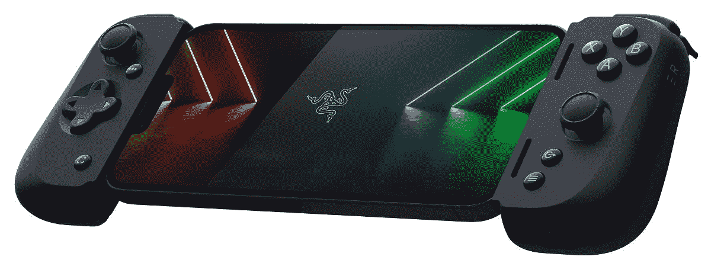

# Razer Kishi v2 现在可用于苹果 iPhones

> 原文：<https://www.xda-developers.com/the-razer-kishi-v2-is-now-available-for-apple-iphones/>

Razer Kishi v2 于几个月前发布，但当时仅面向 Android 智能手机用户。现在，Razer 已经宣布了用于 iPhones 的设备，让 iOS 用户有机会体验一款优秀的移动游戏控制器。雷蛇 Kishi v2 是 2020 年首次亮相的原雷蛇 Kishi 的继任者。它是一个坚固的控制器，可以将您的智能手机转变为具有出色物理控制的便携式游戏机。它的前身有几处改进，比如它的滑动支撑桥、微动开关输入，以及对机箱中手机的扩展支持。

至于物理控制，Kishi v2 有两个模拟可点击拇指棒，一个 d-pad，四个输入按钮，两个触发器，两个缓冲器和两个可编程多功能按钮。还有菜单，选项，分享，还有 Razer Nexus 按钮。如前所述，控制器具有可扩展的桥，允许与大多数现代 iPhones 兼容。它很容易插入和移除，但同时，该桥保持连接的 iPhone 安全。由于控制器创建了与 iPhone 的直接连接，因此消除了输入延迟，让用户在玩游戏时可以无缝控制。如果你担心手机的电池，控制器提供直通充电，让你在 iPhone 充满电的情况下玩几个小时。Razer 还通过自己的 Razer Nexus 应用程序提供深度支持。该应用程序可以下载固件更新，也可以通过重新映射控制器的多功能按钮来定制体验。你也可以使用该应用通过脸书和 YouTube 直播流媒体。

Razer Kishi v2 不仅可以在 iPhone 上玩游戏，还可以利用 Xbox Game Pass、Nvidia GeForce Now、Google Stadia 和其他远程流媒体平台等在线游戏服务。如果你对手机游戏控制器不太确定，看看我们对安卓版本的[深度评论](https://www.xda-developers.com/razer-kishi-v2-review/)可能是个好主意。该控制器与运行 iOS 15.4 或更高版本的 iPhones 兼容。控制器可以购买，也可以从下面的零售商那里买到。

 <picture></picture> 

Razer Kishi v2 for iPhone

##### 雷蛇岸信介 V2

适用于 iPhone 的 Razer Kishi v2 移动游戏控制器

 <picture></picture> 

Razer Kishi v2 for iPhone

##### 雷蛇岸信介 V2

适用于 iPhone 的 Razer Kishi v2 移动游戏控制器

 <picture></picture> 

Razer Kishi v2 for iPhone

##### 雷蛇岸信介 V2

适用于 iPhone 的 Razer Kishi v2 移动游戏控制器