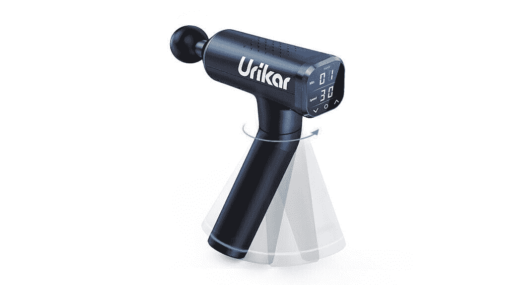
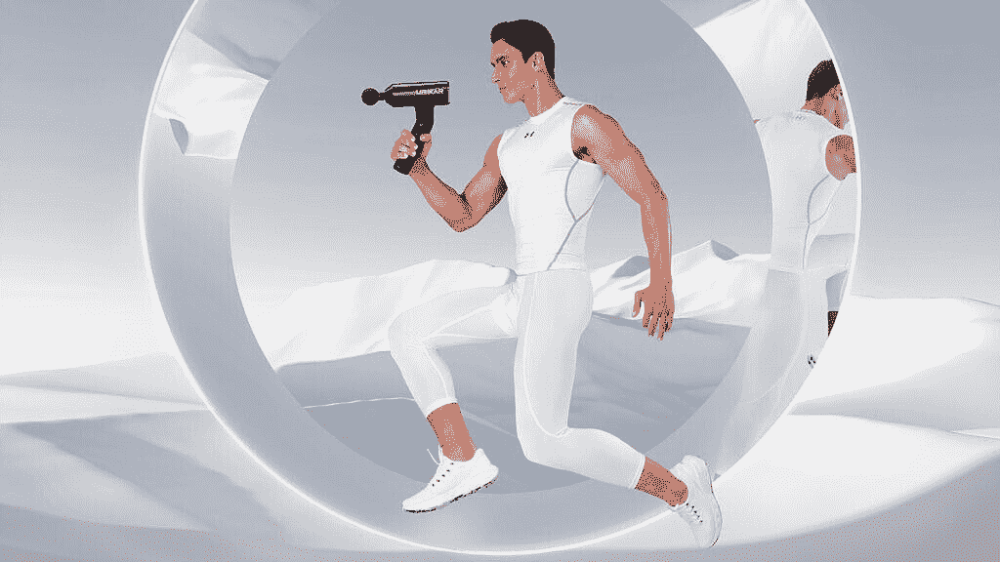

# 在家工作会对你的身体造成伤害。Urikar Pro 3 是您的最佳解决方案。

> 原文：<https://www.xda-developers.com/the-urikar-pro-3/>

在新冠肺炎疫情期间，我们很多人发现自己在电脑前花了更多的时间。这会导致关节疼痛、压力、疲劳和其他各种不健康的问题。如果你发现自己需要一次良好的按摩，你可以使用 [Urikar 按摩枪 Pro 3](https://www.amazon.com/dp/B08SVRZ84R?tag=xda-1l34dlk-20&ascsubtag=UUxdaUeUpU1821&asc_refurl=https%3A%2F%2Fwww.xda-developers.com%2Fthe-urikar-pro-3%2F&asc_campaign=Short-Term) 在自己家里安全地进行深层组织按摩。这种功能强大的按摩枪可以瞄准难以触及的区域，因为您可以利用多个附件和强大的电机。

Urikar 已经生产高质量的按摩产品有一段时间了，Pro 3 型号是市场上最好的敲击按摩枪之一。这是一种动力驱动的设备，使用无刷电机进行冲击治疗，可提供高达 45 磅的无失速力，14 毫米的振幅，以及高达每分钟 3400 次冲击的速度。Urikar Pro 3 配有可充电的 2600mAh 锂电池，充满电后可持续使用 600 分钟。使用这款 Urikar 按摩枪的多种不同功能，提供前所未有的最佳按摩，并通过 180°旋转臂轻松到达您的背部。由于 42dB 的超低噪音水平，您可以使用 Urikar Pro 3 而不会产生太多噪音。这使得它比其他品牌更安静，更强大，比如 theragun。

 <picture></picture> 

Urikar Pro 3

为了测试你可以从 Urikar Pro 3 中获得的不同按摩类型，他们在汽水瓶上使用了该产品，向你展示它的工作原理。你可以在下面的视频中看到这个演示。

Pro 3 提供 1800-3400 转/分之间的 30 个速度等级。使用 LCD 触摸屏可以轻松控制 Urikar Pro 3 的速度设置。你可以使用不同的可互换按摩头来改变你的按摩程序。

使用高清液晶触摸屏可以轻松控制 Urikar Pro 3 上的所有不同设置。你可以使用不同的可互换按摩头来改变你的按摩程序。

*   气塞头:适用于按摩骨骼和敏感部位。
*   球头:适合按摩手臂、大腿、小腿等大肌肉群。
*   铲头:适用于背部、颈部和腰部按摩。
*   子弹头:适用于冲击经络、关节、手掌、脚底等深层组织。
*   平头:适合放松和塑造不同的肌肉群。
*   u 型头:适合按摩颈部和脊柱两侧，以及跟腱。

 <picture></picture> 

Urikar Pro 3

由于极简设计，清洁您的 Urikar Pro 3 非常简单。手柄是一种柔软的硅橡胶，当电机启动时，握起来非常舒适。由于产品设计中没有缝隙或孔洞，您可以轻松擦拭，保持清洁。

除了 Pro 3 之外，Urikar 还制造了许多高质量的按摩枪。Urikar Pro 2 是他们产品线中的另一款产品，面向想要加热按摩枪的人。使用 3+1 智能模式，您可以选择连续、间歇或梯形模式。您还会发现 180°旋转臂、八个独立附件和一个 65W 电机。

要了解更多关于 Urikar 产品的信息，请访问以下网站。

[**乌里卡网站**](https://www.urikar.com/)

###### 我们感谢 Urikar 赞助了这篇文章。我们的赞助商帮助我们支付与运行 XDA 相关的许多费用，包括服务器成本、全职开发人员、新闻撰稿人等等。虽然您可能会在门户内容旁边看到赞助内容(这些内容将始终被标记为赞助内容),但门户团队对这些帖子不承担任何责任。赞助内容、广告和 XDA 仓库完全由一个独立的团队管理。XDA 绝不会通过接受金钱来赞扬一家公司，或以任何方式改变我们的观点或看法，从而损害其新闻诚信。我们的意见不能被收买。