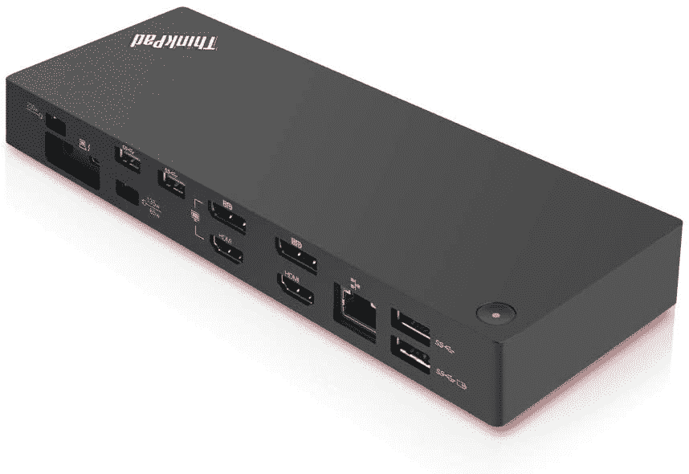
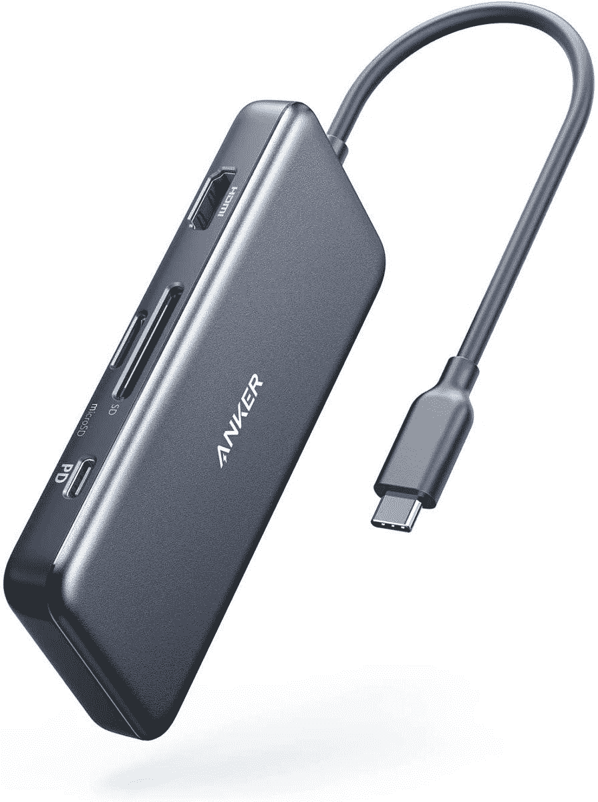

# 2023 年最佳联想 ThinkPad X1 碳坞

> 原文：<https://www.xda-developers.com/thinkpad-x1-carbon-docks/>

# 2023 年最佳联想 ThinkPad X1 碳坞

我们列出了联想 ThinkPad X1 Carbon 的一些最佳坞站，可以帮助您扩展其 I/O 连接选项！

联想 ThinkPad X1 Carbon 是你今天能买到的最好的商务笔记本之一。这家笔记本电脑制造商最近推出了由最新的英特尔[第 11 代老虎湖处理器](https://www.xda-developers.com/intel-tiger-lake-11th-gen-core-i3-i5-i7-xe/)驱动的第 9 代机型，以及其他改进，包括更高的 16:10 显示屏和更大的触摸板。虽然笔记本电脑没有提供最差的 I/O 端口，但对 Thunderbolt 4 的支持确实提供了挂接外部坞站的机会，以进一步扩展您的连接选项。

今天，我们来看看一些最好的 ThinkPad X1 Carbon 坞站，帮助您为笔记本电脑添加各种 I/O 端口。

 <picture></picture> 

Anker PowerExpand 5-in-1 Thunderbolt 4 Mini Dock

##### Anker PowerExpand 5 合 1 雷电 4 迷你坞站

Anker 是一个可靠的名称，它提供了 PowerExpand 5 合 1 Thunderbolt 4 迷你坞站，该坞站具有一个 85W Thunderbolt 4 上游端口、三个 Thunderbolt 4 下游端口和一个 USB-A 端口。Thunderbolt 4 下游端口支持 15W 功率传输和 30Hz 的单个 8K 显示器，或高达 60Hz 的 4K 的双显示器。

 <picture></picture> 

Kensington SD5700T Thunderbolt 4 Docking Station

##### Kensington SD5700T Thunderbolt 4 扩展坞

你总共有 11 个端口，包括一个 SD 读卡器，四个 Thunderbolt 4 端口，四个 USB-A 端口，一个千兆以太网端口和一个 3.5 毫米音频组合插孔。该坞站还支持 90W 功率传输，这意味着您可以通过坞站本身为您的 ThinkPad X1 Carbon 充电。此坞站上没有 DisplayPort 或 HDMI 端口，因此您只能连接支持 USB-C 的显示器，或者使用附加适配器。

 <picture></picture> 

Razer Thunderbolt 4 Dock

##### 雷蛇雷电 4 码头色度

想把一些 RGB 带到你的办公桌上吗？你需要雷蛇的雷电 4 坞。它带有与 Kensington SD5700T 相同的一组端口。这意味着你有一个 SD 读卡器，一个 3.5 毫米音频插孔，三个 Thunderbolt 4 下游端口，一个 Thunderbolt 4 上游端口，千兆以太网和三个 USB-A 3.2 Gen 2 端口。你可以使用 Razer 的专有软件完全定制 dock 上的 RGB 照明。

 <picture></picture> 

Lenovo ThinkPad Thunderbolt 3 Dock

##### 联想 ThinkPad 雷电 3 坞站

联想提供了自己的 ThinkPad 品牌雷电 3 坞站，如果您想要广泛的连接端口，包括以太网、HDMI、DisplayPort、全尺寸 USB Type-C 等，这是 ThinkPad X1 Carbon 的绝佳选择。

 <picture></picture> 

CalDigit TS3 Plus

##### 加州 TS3 雷电 3 码头

这是一个完全加载的雷电 3 坞站，提供一套可靠的连接选项，包括 2 个 Thunderbolt、5 个 USB 3.2 Type-A、1 个 USB 3.2 Type-C、1 个 USB 3.2 Gen 2 Type-C、1 个 DisplayPort 1.2、3.5 毫米音频输入、3.5 毫米音频输出、千兆以太网、光学音频、UHS-II SD 卡插槽，并支持 87W 功率传输。

 <picture></picture> 

Anker PowerExpand+ USB-C Hub

##### Anker PowerExpand 5 合 1 雷电 4 迷你坞站

这是一个简单的 USB-C 集线器，可以帮助您扩展笔记本电脑的 I/O 连接，包括通过 HDMI 端口支持 30Hz 的 4K 视频输出。对于那些想要一个简单的便携式集线器在移动时连接笔记本电脑的人来说，这是一个很好的选择。

如果你正在寻找一种无缝的体验，我们的建议是[联想 ThinkPad 雷电 3 坞站](https://www.amazon.com/Lenovo-ThinkPad-Thunderbolt-40AN0135US-Capability/dp/B07M6S81CM/?tag=xda-63gg3jt-20&ascsubtag=UUxdaUeUpU2901&asc_refurl=https%3A%2F%2Fwww.xda-developers.com%2Fthinkpad-x1-carbon-docks%2F&asc_campaign=Short-Term)，因为它应该完全向后兼容 ThinkPad X1 Carbon 上的 Thunderbolt 4 端口，而且你也可以获得联想的熟悉感。然而，如果你不想错过任何东西，请选择 [CalDigit TS3 加](https://www.amazon.com/CalDigit-TS3-Plus-Thunderbolt-Dock/dp/B08F7CR49N?tag=xda-63gg3jt-20&ascsubtag=UUxdaUeUpU2901&asc_refurl=https%3A%2F%2Fwww.xda-developers.com%2Fthinkpad-x1-carbon-docks%2F&asc_campaign=Short-Term)，因为它装载了你能想到的每一个端口，包括专用音频端口，甚至是 SD 读卡器。

为你的 ThinkPad X1 Carbon 增加更多端口的最便宜的解决方案是一个标准的 USB-C 集线器。Anker 是个可靠的名字， [PowerExpand+ USB-C Hub](https://www.amazon.com/Anker-Upgraded-Delivery-Pixelbook-A83460A2/dp/B07ZVKTP53?tag=xda-63gg3jt-20&ascsubtag=UUxdaUeUpU2901&asc_refurl=https%3A%2F%2Fwww.xda-developers.com%2Fthinkpad-x1-carbon-docks%2F&asc_campaign=Short-Term) 应该能很好的服务大多数用户。它不像 Thunderbolt 那样提供宽带宽，但它可以通过高达 100W 的功率为您的笔记本电脑充电，而且由于它非常紧凑，您可以轻松地将它放在背包中。

寻找更多的坞站，特别是支持 Thunderbolt 的坞站？请务必仔细阅读我们列出的[最佳 Thunderbolt 坞站](https://www.xda-developers.com/best-thunderbolt-docks/)，其中包括适用于配有雷电 3 或 Thunderbolt 4 的笔记本电脑和个人电脑的各种选项。说到这里，我们也有一个列表的[最好的雷电 4 笔记本电脑](https://www.xda-developers.com/best-thunderbolt-4-laptops/)可供购买。