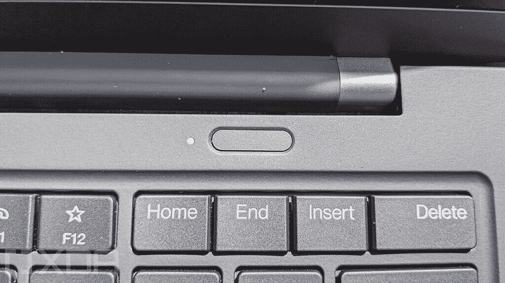

# 联想 ThinkPad X1 Carbon 支持 Windows Hello 吗？

> 原文：<https://www.xda-developers.com/thinkpad-x1-carbon-windows-hello/>

# 联想 ThinkPad X1 Carbon 支持 Windows Hello 吗？

可以在新款联想 ThinkPad X1 Carbon 上使用 Windows Hello 生物识别认证吗？请继续阅读，了解更多信息。

ThinkPad 系列是一个受欢迎的商务笔记本电脑系列，目前由联想设计、开发和营销。安全性是任何现代 ThinkPad 笔记本电脑的关键方面之一，这在面向企业和商业用户进行营销时是有意义的。新推出的 [ThinkPad X1 Carbon Gen 9](https://www.xda-developers.com/lenovo-thinkpad-x1-carbon-review/) 也带有一堆安全机制；然而，保护笔记本电脑最简单的方法是通过 Windows Hello。

是的，ThinkPad X1 Carbon 确实支持 Windows Hello。对于那些不知道的人， [Windows Hello](https://support.microsoft.com/en-us/windows/windows-10-sign-in-options-and-account-protection-7b34d4cf-794f-f6bd-ddcc-e73cdf1a6fbf) 是一种基于生物特征的技术，允许 Windows 10 用户使用指纹、虹膜或面部识别来验证对其设备、应用程序和其他服务的安全访问。本质上，这种登录机制是密码的替代方案。除了更加安全可靠之外，它比使用密码的传统登录方式更加个性化和用户友好。

[ThinkPad X1 Carbon](https://www.xda-developers.com/lenovo-thinkpad-x1-carbon-review/) 配备了内置在电源按钮中的指纹扫描仪，可用于配置 Windows Hello。联想还销售带有可选红外摄像头的笔记本电脑，该摄像头也可以通过面部识别功能启用 Windows Hello。

 <picture></picture> 

The power button on the ThinkPad X1 Carbon features an inbuilt fingerprint scanner

## 如何设置 Windows Hello

最初的 Windows 安装程序通常要求用户设置 Windows Hello。如果你还没有做过，以下是你可以设置它的方法:

1.  选择开始>设置>帐户>登录选项。
2.  在*管理如何登录到您的设备*下，您将看到三个选择来登录 Windows Hello:

*   选择 Windows Hello Face 以使用电脑的红外摄像机或外部红外摄像机设置面部识别登录。
*   选择 Windows Hello Fingerprint 以设置指纹识别器登录。
*   选择 Windows Hello PIN 以设置 PIN 登录。

1.  按照屏幕上的说明设置您的指纹/面部识别。此外，还建议增加一个 PIN，以防笔记本电脑无法识别任何一个生物特征选项。

你打算买一台新的笔记本电脑吗？查看我们推荐的 2021 年[最佳笔记本电脑](https://www.xda-developers.com/best-laptops/)。此外，我们还编辑了一份支持 Windows Hello 身份验证的[笔记本电脑列表。](https://www.xda-developers.com/best-laptops-with-windows-hello/)

 <picture></picture> 

Lenovo ThinkPad X1 Carbon Gen 9

##### 联想 ThinkPad X1 Carbon Gen 9

新款 ThinkPad X1 Carbon 通过内置指纹扫描仪或可选的红外网络摄像头支持 Windows Hello。