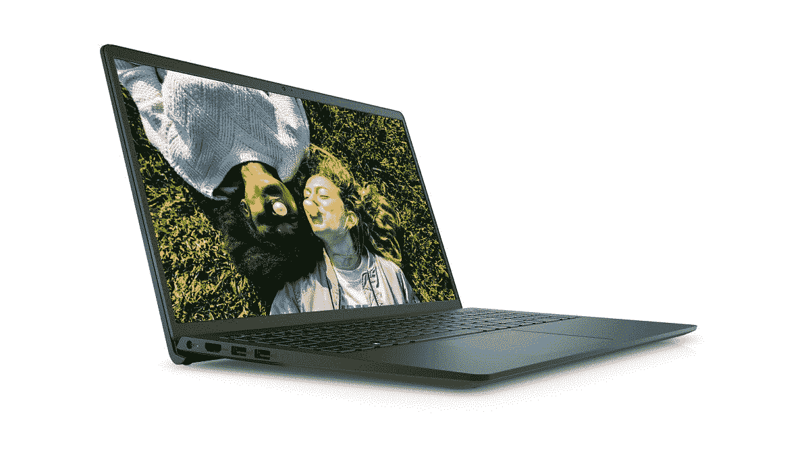
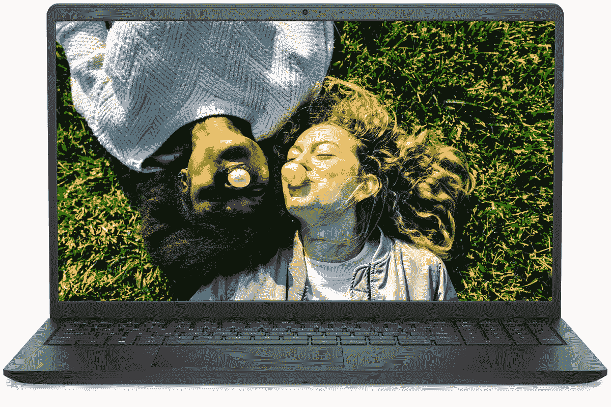

# 这款戴尔 Inspiron 灵越 15 是一款非常高效的笔记本电脑，售价 640 美元(优惠 149 美元)

> 原文：<https://www.xda-developers.com/this-dell-inspiron-15-is-a-great-productivity-laptop-for-640-149-off/>

# 这款戴尔 Inspiron 灵越 15 是一款非常高效的笔记本电脑，售价 640 美元(优惠 149 美元)

这款笔记本电脑价格为 640 美元，非常划算，它采用了第 11 代英特尔处理器、12GB 内存和 1080p 大屏幕。

 <picture></picture> 

Processed By eBay with ImageMagick, z1.1.0\. ||B2

持续的硅短缺导致许多电子产品供应短缺，但以折扣价购买一台新笔记本电脑仍然不是太难。三星的高端 Galaxy Book Pro 刚刚降至 900 美元(T1)，中档笔记本电脑也有一些有价值的销售。现在，您可以从戴尔易贝商店以 639.99 美元的价格获得一台配备第 11 代英特尔酷睿 i5 处理器和 12GB 内存的戴尔 Inspiron 灵越 15 笔记本电脑，比通常价格节省 149 美元。

在售的具体配置有 15.6 英寸 1080p LED 屏幕，512GB NVMe SSD，12GB RAM(一个 8GB 模块和一个 4GB 模块)，以及带数字键盘的全尺寸键盘。你得到了第 11 代英特尔酷睿 i5-1135G7 处理器，这是一个 4 核/8 线程芯片，最高速度为 4.2GHz。这是一个不错的价格，特别是考虑到一些笔记本电脑的价格是这个价格的两倍(如 [2020 MacBook Pro](https://www.amazon.com/Apple-MacBook-13-inch-256GB-Storage/dp/B08N5N6RSS?tag=xda-31d3oa0-20&ascsubtag=UUxdaUeUpU4504&asc_refurl=https%3A%2F%2Fwww.xda-developers.com%2Fthis-dell-inspiron-15-is-a-great-productivity-laptop-for-640-149-off%2F&asc_campaign=Short-Term) )，但仍然只有 8GB 内存。

 <picture></picture> 

Dell Inspiron 15 3511

##### 戴尔 Inspiron 灵越 15

这款电脑的硬件非常棒，售价 640 美元，包括新的第 11 代英特尔处理器和 12GB 内存。

15.6 英寸大屏幕、Core i5 CPU 和相当大的内存容量使这款笔记本电脑成为高效工作的绝佳选择。然而，没有专用显卡，所以不要指望有很好的游戏体验。