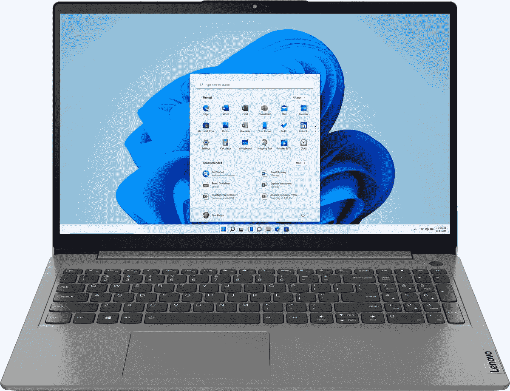

# 这款联想 Ideapad 是一款非常高效的笔记本电脑，售价 430 美元(优惠 190 美元)

> 原文：<https://www.xda-developers.com/this-lenovo-ideapad-is-a-great-productivity-laptop-for-430-190-off/>

# 这款联想 Ideapad 是一款非常高效的笔记本电脑，售价 430 美元(优惠 190 美元)

这款经济型笔记本电脑配备了 12GB 内存、256GB 固态硬盘和英特尔酷睿 i5 处理器。仅售 430 美元，一点也不差。

现在我们终于进入了 11 月，零售商们开始了他们的黑色星期五促销。我们开始看到从智能手机到视频游戏的各种商品都有不错的折扣，一款值得购买的联想 Ideapad 3 刚刚出现在百思买。这款笔记本电脑配有英特尔酷睿 i5 处理器和 12GB 内存，现在你可以以 429.99 美元的价格买到它，比原价低 190 美元。

联想出售许多不同配置的 Ideapad 3，但出售的型号有第 11 代英特尔酷睿 i5-1135G7 处理器，15.6 英寸 1080p IPS 屏幕，12GB 内存，256GB NVMe 固态硬盘，Wi-Fi 6，背光键盘和带物理隐私快门的网络摄像头。整个笔记本电脑重 3.74 磅，厚度为 0.78 英寸。

 <picture></picture> 

Lenovo Ideapad 3

##### 联想 IdeaPad 3

这款经济型笔记本电脑是学校、典型工作任务和网络浏览的绝佳选择。

对于一台中档生产力笔记本电脑来说，这是一笔很大的交易，特别是有这么大的可用内存——在这个价格范围内，许多其他[电脑](https://shop-links.co/1756427100271298504?u1=157fdbb4-8818-4d80-991b-8024fc5d13b1)只有 8GB 内存。Ideapad 3 不是二合一笔记本电脑，但你仍然可以获得大屏幕、背光键盘和大量端口。Windows 10 是开箱安装的，但你可以随时升级到 Windows 11，无需额外费用。

如果这款笔记本电脑不是你想要的，我们有一份你能买到的[最好的笔记本电脑](https://www.xda-developers.com/best-laptops/)的综述。然而，这份名单主要集中在高端笔记本电脑上，而这款联想 Ideapad 3 是一款预算机型。