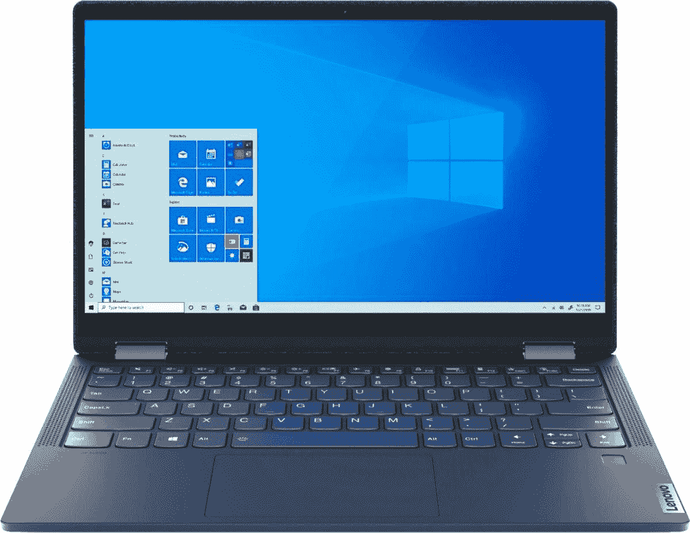

# 这款联想 Yoga 6 是一款出色的生产力笔记本电脑，售价 750 美元(优惠 200 美元)

> 原文：<https://www.xda-developers.com/this-lenovo-yoga-6-is-a-fantastic-productivity-laptop-at-750-200-off/>

联想生产一些最好的笔记本电脑，该公司更受欢迎的产品系列之一是二合一 Yoga 系列。最近，联想开始销售搭载英特尔或 AMD 处理器的 Yoga 笔记本电脑，让买家在硬件选择上有了更多选择。现在，你可以在百思买以 750 美元的价格买到一台最新的基于 AMD 的 Yoga 笔记本电脑，比正常零售价格节省 200 美元。此次销售在百思买和百思买的易贝店都有直播。

在售的型号由 AMD 锐龙 7 5700U 驱动，这是一款 8 核/16 线程处理器，最大提升时钟为 4.3GHz。你还可以获得 512GB 固态硬盘，16GB 内存，两个 USB 3.2 Type-A 端口，两个 USB 3.0 Type-C 连接器，两个 1W 扬声器，Wi-Fi 6，蓝牙 5.0 和内置指纹读取器。屏幕是 13.3 英寸 1920 x 1080 IPS 显示屏，你可以翻转它来使用 Yoga 笔记本电脑，就像一个巨型平板电脑一样。

 <picture></picture> 

Lenovo Yoga 6 13 2-in-1

##### 联想 Yoga 6

这是一款非常高效的笔记本电脑，售价为 750 美元(优惠 200 美元)。它可以在百思买和百思买的易贝商店买到。

对于一台生产力笔记本电脑来说，这是一个很好的选择，特别是它的 16GB RAM(许多低于 1000 美元的笔记本电脑仍然只有 8GB)和 USB Type-A 端口(所以你不必一直使用加密狗)。最新的 MacBook Air[仍然在售，售价 850 美元](https://www.xda-developers.com/get-the-m1-macbook-air-for-850-150-off-or-the-m1-mac-mini-for-600-100-off/)，但并不是所有人都想使用 macOS，入门级的 MacBook Air 只有这款 Yoga 笔记本电脑一半的存储空间和 RAM。