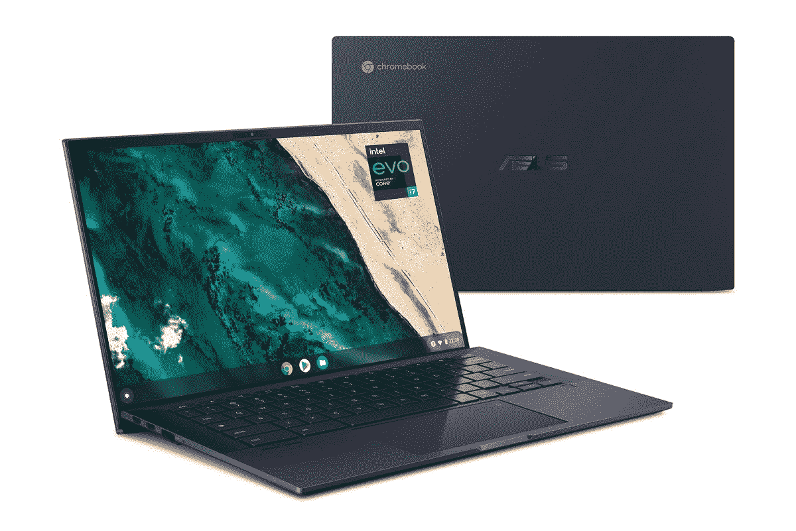

# 本周的 Chrome 操作系统:Ampersands 和华硕 CX9

> 原文：<https://www.xda-developers.com/this-week-in-chrome-os-ampersands-asus/>

欢迎来到 Chrome OS 的本周，这是一个致力于铬和铬的每周专栏。每周我们都会追踪最大的硬件发布，即将到来的软件特性，以及网上最有趣的谣言。随着所有令人兴奋的 Chrome book 在 2021 年下半年发布，以及游戏 Chrome book 的出现，这是一个使用 Chrome OS 的令人兴奋的时刻。让我们开始看本周的新闻。

## 谷歌因为一个错别字让数百万用户瘫痪了 Chrome 操作系统

本周最大的新闻是 [谷歌在刚刚过去的周一将数百万用户锁定在 Chromebook](https://www.xda-developers.com/cant-login-chromebook-google-readying-fix/) 之外。特别是，Chrome OS91 . 0 . 4472 . 165包含一个错误，不允许用户使用正确的帐户凭据登录他们的 Chromebook。后来有报道称，条件语句中省略的一个“&”是这个特殊错误的罪魁祸首。

从网上论坛来看，许多用户在试图访问机器时丢失了宝贵的文件。谷歌在本周晚些时候推出了一个更新来解决这个问题，但这是一个非常严重的问题。就在几周前， [谷歌在 Chrome OS 91.0.4472.147 中推出了一个同样命运多舛的更新](https://www.xda-developers.com/chrome-os-91-high-cpu-bug-fixed/) 。这些漏洞百出的版本对于 Chrome 在今年晚些时候进入更快的更新周期来说并不是一个好兆头。希望谷歌能在他们进入更快的发布时间表之前解决这个问题，减少调试时间。

## 三星 Galaxy Chromebook 开始向客户发货

上周，三星发布了 Chromebook 系列的最新设备。三星 Galaxy Chromebook Go 是一款针对教育市场的有吸引力的设备。它肯定不是一个狂热的 Chromebook，但它似乎是返校学生的一个不错的选择。如果你有兴趣购买这些设备中的一款，Chromebook Go 现在可以在三星的网站上以 299 美元的价格购买，并且已经开始向买家发货。

 <picture></picture> 

Samsung Galaxy Chromebook Go

##### 三星 Galaxy Chromebook Go

三星最近发布了 Galaxy Chromebook Go，这是一款漂亮的设备。黑底白字的对比使它成为 300 美元以下最好看的 Chromebooks 之一。您还可以获得高质量的显示器和更新的英特尔赛扬处理器。

## 华硕发布 Chromebook CX9

对我来说，本周最令人兴奋的消息是华硕 Chromebook CX9 的 [发布。回到 CES 2021，华硕宣布了这一系列超高端 Chromebooks。2021 年的半年过去了，没有太多关于发布日期或确切价格的信息。本周初，华硕在其网站上发布了两款 CX9 的预订列表。](https://www.xda-developers.com/asus-launches-chromebook-cx9-and-cx5-with-intel-tiger-lake-cpus/)

有一个基本型号，配有酷睿 i3 Tiger Lake 处理器、8GB 内存和 128GB 存储空间。这款机型是经典的翻盖式 Chromebook，没有触摸屏。这款笔记本电脑采用优质的镁合金机身。基本款的零售价为 749 美元。老实说，这是我们在市场上见过的最好的 Chromebooks 之一。

更高端的 CX9 型号将处理器提升到酷睿 i7、16GB 内存和 512GB 固态硬盘存储，并添加了触摸屏。不仅如此，你还可以在触摸板上安装指纹传感器和背光数字键盘。这款更高端的型号零售价为 1149 美元，声称一次使用可续航 14 小时。我非常喜欢这款 Chromebook，所以我自己也买了一台。事实上，我现在正在用我的新 CX9 打这篇专栏。我很快就会对这款 Chromebook 进行全面的评测，但我现在可以说，它绝对是一款设备中的瑰宝。

 <picture></picture> 

ASUS Chromebook CX9

##### 华硕 Chromebook CX9

华硕 Chromebook CX9 是一款超便携、超高端的 Chromebook。这款机器采用了镁合金机箱、指纹传感器、Tiger Lake 处理器和出色的电池续航时间。

## 谷歌助手在 Chrome OS 上进入黑暗模式

黑暗模式所有的东西！谷歌一直在为 Chrome 操作系统慢慢开发明暗主题，但谷歌助手终于加入了这个行列。由[Android Police](https://www.androidpolice.com/2021/07/20/google-assistant-is-going-goth-with-dark-mode-coming-to-a-future-chrome-os-update/)揭露，这个最近的 Chromium commit 显示，Assistant 将与 shelf、launcher 和 system tray 一起主题化。你可以通过启用 Chrome 标志来预览这个变化:

**`chrome://flags/#dark-light-mode`**

希望谷歌能快点为 Chrome OS 正式推出明暗模式。在这一点上，这些特性似乎已经被测试了很长时间。

## 更好的截图即将登陆 Chrome OS

Chrome OS 不出名的一点是高质量的屏幕截图。Chromebooks 截图的方式一直存在问题。在 Android Police 发现的另一个 Chromium commit [中，我们现在知道谷歌正在努力在 Chrome OS 的未来版本中解决这个问题。 进行中的代码改变了 Chrome OS 从捕获区域内计算像素的方式。](https://www.androidpolice.com/2021/07/22/soon-your-chromebook-wont-record-your-screen-like-a-potato/)

到目前为止，记录服务(用于执行视频记录)通过其倾角或密度无关像素来处理捕获的区域。因为倾角测量与捕获的实际像素不成正比，所以会导致素材按比例缩小，从而导致质量下降和视频帧模糊。使用更新的逻辑，您的 Chromebook 将通过计算倾角和设备比例因子的值，以其原始像素大小捕捉该区域。

这是一件相当大的事情，因为每个 Chromebook 用户都不时需要截图。你可能会认为 Google 早就应该解决这个问题了，但是仍然很高兴看到在日常基础上改善用户体验的进展。

## 你很快就可以给你的 Chromebook 命名了

为你的 PC 或 Mac 电脑更改主机名相当简单。这一功能直到现在才在 Chrome OS 上提供，这有点令人惊讶。幸运的是，在未来的 Chrome OS 更新中，你可以给你的 Chromebook 起任何你喜欢的傻名字。一个 [系列的 Chromium commits](https://chromium-review.googlesource.com/q/hashtag:cros-device-name+(status:open%20OR%20status:merged)) 暗示谷歌目前正在测试这个功能。

这项功能目前还没有上线，所以目前没有办法自己测试。然而，当它出现时，你将能够通过“关于 Chrome OS”下的设置应用程序直接更改设备的名称 。在页面底部附近，最终会有一个“设备名称”选项。一旦它完全展开，点击它会显示“ChromeOS”作为默认名称，你可以输入任何你想输入的内容。

这就是本周的全部内容。总的来说，对于 Chrome news 来说，这是非常忙碌的一年。我真的很期待未来在 Chrome OS 上推出黑暗模式。拆开华硕 CX9 的包装真是超级刺激。测试已经在进行中了，所以我很快就会开始做那个评论。请继续关注 XDA 每日最新的 Chrome 操作系统新闻。下周我会回来把所有的事情都整理好。