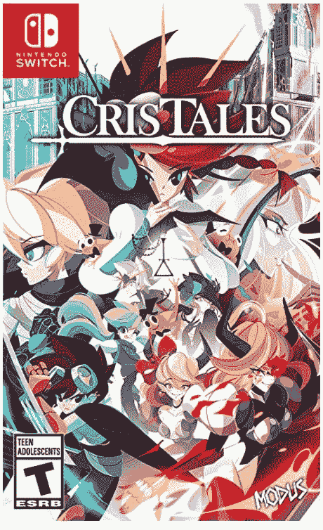
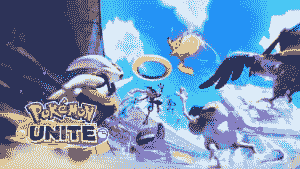

# 本周在游戏方面:动视暴雪的诉讼，一个新的汤姆·克兰西游戏，和一个死亡空间的翻拍

> 原文：<https://www.xda-developers.com/this-week-in-gaming-activision-blizzard-lawsuit-tom-clancy-game-dead-space-remake/>

本周有一些充满希望的时刻，最引人注目的是育碧和电子艺界发布的新游戏。然而，它也被一家大型视频游戏开发商的性骚扰争议所掩盖——不幸的是，这只是名单上的又一个新成员。

## 育碧揭示了汤姆克兰西的 XDefiant，F2P 竞技场射击

育碧在本周初举行了一场令人惊讶的直播秀，并透露它正在开发一款新的多人游戏:*汤姆·克兰西的《XDefiant》*。这款游戏是一款免费的多人 PvP 竞技场射击游戏，玩家扮演的角色，或者更确切地说是派系，出现在[之前的*汤姆·克兰西*游戏](https://news.ubisoft.com/en-us/article/P0TCi0Q4ENHftn2QfKMTB/tom-clancys-xdefiant-brings-universes-together-in-a-competitive-shooter)中。这些角色，或者说反抗者，将会在 6v6 的战斗中互相战斗。每个派别或挑衅者都可以在比赛前定制。

这款游戏与暴雪的 *Overwatch* 非常相似——这是一款英雄竞技场射击游戏，拥有彩色地图和护送、统治等模式。相似之处显而易见。不用说，有些粉丝会问，为什么育碧要制作这款游戏，而不是《汤姆·克兰克》( Tom Clanc)y 系列中的其他游戏——比如新的《分裂细胞》( Splinter Cell )( T11)。还要注意的是，就在宣布这一消息后，育碧透露将关闭汤姆·克兰西的《精英小队》的服务器，这是另一部由去年在手机上发布的《汤姆·克兰西英雄》主演的彩色射击游戏……但这可能只是一个巧合。

## 《死亡空间》以原版的全面翻拍版回归

在本周的 EA Play Live 活动中，艺电展示了大部分预期的游戏:*战地 2042* 、 *Apex 传奇*，以及其他内容的零碎片段。但在节目的最后，主持人奥斯汀·克里德介绍了最后一个预告片:空间站上黑暗的走廊，墙上沾满了鲜血，被某种未知的力量摧毁。一个半藏在黑暗中尖叫的生物。最后，一个穿着动力盔甲的人，他的脊柱开始发光，看着墙上的信息:“砍掉他们的四肢。”原版*死亡空间*正在接受重拍。

关于一部*死亡空间*翻拍的传闻已经流传了一段时间。一段时间以来，太空恐怖系列的粉丝们一直希望该系列中有一款新游戏，尽管这款重拍游戏并不完全是“新的”，但开发商表示，这将是一款*生化危机 2* 风格的重拍游戏。这可能意味着它会有原来的精神，但可能会改变游戏的几个关键部分。预告片的内容不足以让我们判断。这款游戏将在 PC、Xbox 系列和 PS5 上推出。

## 育碧头骨与骨头的持续问题

育碧的*骷髅会&骨头*是一款已经陷入开发地狱一段时间的游戏。最初设想作为*刺客信条 IV:黑旗*的衍生，只专注于海盗船战斗，它在 2017 年 E3 的预告片中公布。从那以后，它变得如此短暂，以至于你认为它被取消了也情有可原。只有来自育碧的零星确认给了我们一个想法，通常是以不断推迟发布日期的形式。[本周的一份 Kotaku 报告](https://kotaku.com/first-it-was-an-assassins-creed-expansion-now-its-ubis-1847326742)揭示了这款游戏的开发周期是多么的漫长和令人沮丧。

这并不奇怪*头骨&骨骼*有幕后问题——这是任何人都会从它被推迟的次数中得出的结论，再加上视觉上的进展是如此之少。但是听到育碧新加坡的开发团队似乎陷入了一个噩梦般的仓鼠轮子中，因为游戏的开发一直在重新开始，这仍然令人恼火。该报告还暗示育碧不能因为与新加坡政府的交易而彻底取消游戏，但至少《骷髅》*《骨头》*显然已经达到了开发的 alpha 阶段。

## 加州起诉动视暴雪猖獗的性别歧视和骚扰

现在是疯狂的时候了:加州公平就业和住房部(DFEH) [对动视暴雪](https://news.bloomberglaw.com/daily-labor-report/activision-blizzard-sued-by-california-over-frat-boy-culture)提起诉讼，指控其在工作场所广泛存在性别歧视和性骚扰。具体来说，该公司提倡“兄弟会”文化，女性仅占员工总数的 20%。女性不仅不太可能在公司内获得领导职位，而且她们的薪酬也经常低于男性同事，并受到这些同事的性骚扰，而这些同事从未因其行为受到惩罚。

DFEH 报告中的指控太恶心了，无法在此重复——如果你最近没有吃任何东西，你可以在这里阅读整个投诉。如果其中的四分之一有任何事实根据，那么动视暴雪已经参与了一些真正应受谴责的行为。该公司对诉讼做出回应，声称 DFEH 的报告是“扭曲的”，公司文化不再是那样了(暗示它可能是在过去)，并补充说，“正是这种不负责任的州官僚的不负责任行为，将该州许多最好的企业赶出了加州。”你想怎么做就怎么做。

## 本周发布的游戏:

 <picture></picture> 

Cris Tales

##### 危机故事

作为经典 JRPGs 的回归，Cris Tales 有一个独特的游戏机制，玩家可以操纵时间并立刻看到过去、现在和未来。Xbox Game Pass 上也有。

 <picture></picture> 

Pokemon Unite

##### 神奇宝贝联合

一个免费的口袋妖怪品牌的 MOBA，Unite 看到玩家在 5v5 竞技场战斗中互相战斗。