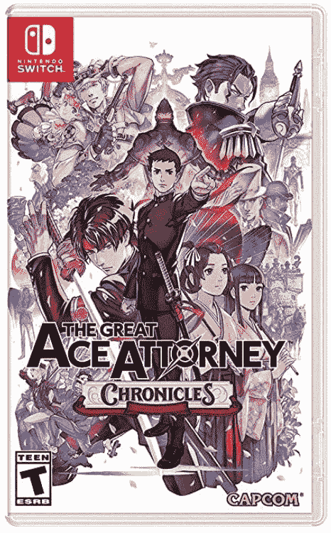
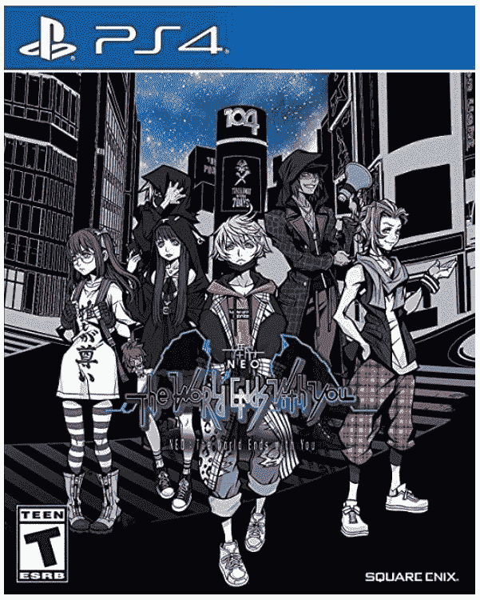
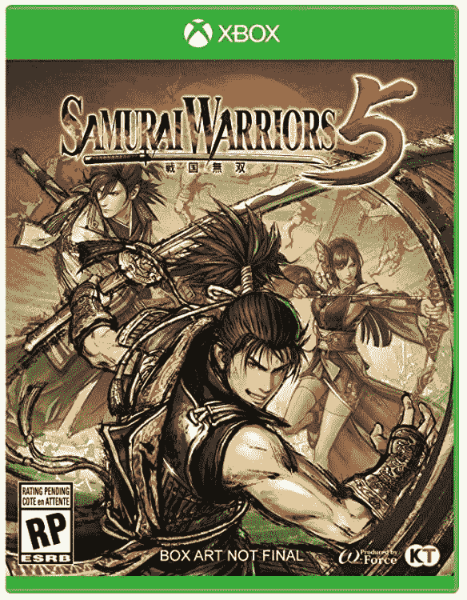

# 本周在游戏方面:动视暴雪员工的罢工，安娜普娜的展示，甚至更多的游戏延迟

> 原文：<https://www.xda-developers.com/this-week-in-gaming-activision-blizzard-walk-out-annapurna-more-game-delays/>

对于游戏新闻来说，这是相对平静的一周，至少在重大游戏披露或延迟方面。相反，我们一直在关注业内最大的丑闻，以及来自安纳普尔纳的新消息。好消息是，本周有几款不错的游戏发布，让游戏玩家们忙个不停。

## 动视暴雪丑闻越来越多，因为员工说出来

继上周加州公平就业和住房部提起诉讼——动视暴雪被指控在幕后存在“兄弟会”文化，导致其许多员工面临骚扰、性别歧视和不公平的薪酬——这家主要游戏发行商的员工站出来讲述他们自己为暴雪工作的故事，他们并不比最初诉讼中的指控更漂亮。

动视对诉讼的最初反应是防御性的，称其“扭曲”，并声称该公司的文化与诉讼描述的完全不同。此后，员工们举行了罢工，抗议公司的政策，要求变革。此后，动视聘请了以破坏工会而闻名的 WilmerHale 公司来审查其政策。请继续关注事态的发展。

## PlayStation 5 和 Xbox 系列 X/S 销量不错

对于那些找不到下一代游戏机的人来说，这可能会让你感到惊讶，但他们已经卖出了数百万台。在上市一年内，PlayStation 5 已经售出 1000 万台游戏机。微软还没有公布 Xbox 系列 X/S 的销售数据(这并不新鲜；他们在 Xbox One 推出后不久就停止发布数据了)，但估计游戏机的销量约为 600 万至 700 万台。这两款游戏机几乎在所有地方都已售罄。

如果你把这两款游戏机看作是打成一片，就像这两家公司自古以来一样，那么 PS5 似乎会赢。然而，我不会把系列游戏机排除在外。目前，我们还没有看到购买贝塞斯达的效果，因为独家游戏还没有发布。但更有建设性的做法可能是，将此视为整个游戏行业的胜利，而非竞争。顺便说一句，最近报道的任天堂 Switch 的硬件销量为 8400 万台。

## 然而，更多的游戏被推迟…但并不都是因为同样的原因

如果有一件事是关于 2020/2021 游戏新闻的一致特征，那就是游戏延迟。这周我们收到了很多，有些比其他的更令人失望。Ember Lab 即将推出的 Pixaresque 冒险游戏《Kena:精神之桥》仅推迟了一个月，从 8 月 23 日推迟到 9 月 21 日。*由《黑色沙漠》的创作者创作的开放世界奇幻游戏《深红沙漠*》已经被推迟，具体日期尚未确定。在许多情况下，开发商将持续的疫情作为问题的一部分，因为他们希望保护员工的健康。

然而，这远不是唯一的原因。*看起来像《光晕遇上传送门》的突破性独立游戏《分裂之门*,由于当前的服务器无法处理游戏的流行，被推迟到 8 月下旬。其他深砍的还有延迟到 2022 年的*流浪*和正在推至 9 月的*滑板鸟*。*《地平线禁忌之西》*没有被证实会被推迟，但随着时间的推移，这是一个看起来越来越真实的传言。

## 安娜普娜举行了一个完全可以接受的展示

让我们以积极的方式结束本周:游戏发行商 Annapurna Interactive 以《伊迪丝·芬奇的残骸》和《荒野大镖客》等游戏而闻名，该公司举办了一场直播秀，展示了其即将推出的游戏。其中有几款是我们之前看过的游戏，比如*流浪*，很高兴终于能得到更多关于它们的信息。这是一个非常好的事件，尤其是考虑到本周的整体动荡。

除了前面提到的 *Stray* 之外，展会上展示的几款游戏预计将于今年发布(不过，考虑到延迟的次数——见上文——我不一定指望它们都能在年底前发布)。其中包括*太阳灰*、*霓虹白*、*巧逃*，以及向*外荒野的扩展*。其他没有确定发售日期的游戏还有*说书人*、*皮相*、*回忆录蓝色*。

### 八月份通过订阅服务提供的免费游戏

在每周更新的这一部分，我们将提到已经添加到订阅和流媒体游戏服务中的游戏。这通常在月初集体发生。以下是本周公布的。

Xbox 游戏与黄金:

*   *暗黑使者 III*
*   *失落的星球 3*
*   *狼人:狼之印记*
*   *Yooka-Laylee*

PlayStation Plus 免费游戏:

*   *猎人竞技场:传奇* (PS4，PS5)
*   *植物大战僵尸:邻里之战* (PS4)
*   *网球世界巡回赛 2* (PS4)

### 本周发布的游戏:

 <picture></picture> 

The Great Ace Attorney Chronicles

##### 伟大的王牌律师编年史

《编年史》是菲尼克斯·莱特系列的前传，讲述了一名日本法律系学生卷入维多利亚时代英格兰最大的神秘事件的故事。

 <picture></picture> 

NEO: The World Ends With You

##### 尼奥:世界随着你而终结

作为经典游戏*的续集，这个角色扮演游戏继承了 3D 系列游戏，并启用了必须在死神游戏中生存的新角色。*

 <picture></picture> 

Samurai Warriors 5

##### 武士战士 5

《T2》武士系列的最新作品重启了新一代格斗游戏系列。