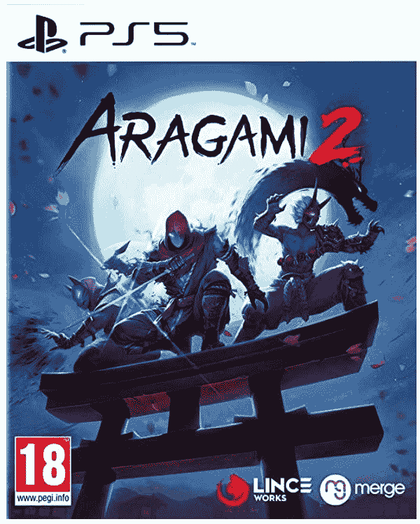

# 本周游戏:苹果诉 Epic 余波，PS5 获得固态硬盘，还有更多延迟

> 原文：<https://www.xda-developers.com/this-week-in-gaming-apple-vs-epic-ps5-ssd-more-delays/>

虽然游戏世界仍未从上周索尼的展示中恢复过来，但大多数消息都有点低调。幸运的是，我们终于可以解决房间里的大象，即苹果与史诗法律战，这似乎终于达成了某种解决方案，双方都没有真正的赢家。

## 联邦法官宣布苹果诉 Epic 法律案的判决

从技术上讲，这是上周的新闻，但我们不妨现在就谈论它，因为我怀疑这是我们最后一次听到这个案件。在这种情况下，判决是由联邦法官伊冯娜·冈萨雷斯·罗杰斯宣布的，他听到了两家大公司的一些相当痛苦和愚蠢的论点。如果你还没有听到这个案件的要点，Epic 推出了一个手机版*堡垒之夜*的补丁，增加了一个绕过苹果支付的 IAP 直接购买机制。当苹果公司禁止这款游戏作为回应时，Epic 提起诉讼，声称苹果公司是垄断者，他们滥用的市场是 iOS 应用商店。这是我能做到的最简单的了。

法官冈萨雷斯·罗杰斯宣布了一项裁决，苹果公司不是反垄断垄断者，但其反操纵行为是反竞争的。现在，苹果必须允许应用程序通过一个按钮或外部链接来引导用户使用外部支付方式。就这样，这是唯一的变化。法官并没有强迫苹果向替代应用商店或侧装开放 iOS，她的荣誉也没有强迫苹果恢复堡垒之夜或 Epic 的开发者账户。

正如你可能想象的那样，Epic 对这一结论并不高兴，但[引用她的荣誉](https://www.documentcloud.org/documents/21060631-apple-epic-judgement):“法院不同意双方对相关市场的定义……法院发现，这里的相关市场是数字移动游戏交易，而不是一般的游戏，也不是苹果自己的内部操作系统……在渗透了所有其他视频游戏市场之后，移动游戏市场是 Epic Games 的下一个目标，它认为苹果是一个障碍。”

## 那么，任天堂是怎么回事？

任天堂是一家恶名昭彰的公司，因为无论推出游戏多长时间，它都不会降低游戏价格。因此，在同一个句子中看到“任天堂”和“折扣”可能会有点不和谐。然而，任天堂确实削减了基本型号 Switch 的价格…至少在欧洲是这样。显然，我们美国人没有同样的休息时间。折扣应该是为更昂贵的 [Switch 有机发光二极管型号](https://www.xda-developers.com/nintendo-introduces-an-oled-model-of-the-switch/)扫清道路，最初的 Switch 更像是有机发光二极管和 Switch Lite 之间的中档选项。

在其他与任天堂 Switch 相关的新闻中，任天堂似乎终于推出了一个更新，带来了期待已久的功能:[通过耳机，耳塞，扬声器等支持蓝牙音频](https://www.xda-developers.com/nintendo-switch-finally-supports-bluetooth-audio-with-new-update/)。也有迹象表明，任天堂可能会给 Switch 带来更多复古游戏，因为[一份神秘的 FCC 清单](https://fccid.io/BKEHAC043)(通过 [*Vooks*](https://www.vooks.net/nintendo-files-fcc-listing-for-new-mystery-controller/) )暗示，大 N 已经有了一个新的控制器，新的证据表明，它最终可能会给 Switch 在线平台带来 N64 游戏，但只有[一个更高价格的订阅层](https://www.nintendolife.com/news/2021/09/rumour_insider_says_n64_is_coming_to_switch_online_believes_it_will_introduce_a_higher-priced_subscription_tier)。

## 索尼推出 PlayStation 5 的大型固态硬盘更新

PlayStation 5 更有前途的功能之一是能够通过安装在控制台内部的一个托架中的 M.2 SSD 来扩展其内部存储。索尼终于推出了更新，允许用户升级他们的存储，[在 7 月份提供测试版后](https://www.xda-developers.com/ps5-update-storage-expansion-m2-ssd/)。当然，只有当问题中的 SSD 符合一组非常特定的尺寸并自带散热器时，这才会起作用，但市场上已经有一些型号被宣传为 PS5 的完美产品。

这将升级 PlayStation 5 的内部存储，让用户有更多的空间玩 PS5 游戏。虽然 PS4 游戏可以在外部存储驱动器上存储和播放，但 PS5 游戏却不能。过去几周，索尼在 PlayStation 5 上受到了一些批评，因为一款新的略轻的型号推出了，许多人认为在一些早期测试后没有有效的冷却系统。在 *Gamers Nexus* 和 *Digital Foundry* 的人进行了更严格的测试之后，新的共识是，你不应该关心你得到的是什么型号。我们建议观看他们的视频，以更全面地了解这两种型号之间的差异。

## 几场比赛的延期结束了这一年

我们之前的游戏延迟很低，那么在旅途中多延迟几分钟怎么样？虽然我们没有像今年早些时候那样有太多的延迟，但有几个非常重要的游戏将在稍后推出。最大的延迟可能是*战地 2042* ，它已经从 10 月 22 日推迟到 11 月 19 日发布——巧合的是，它与*使命召唤:先锋*在同一个月。这两个特许经营权陷入了一场永恒的拉锯战，这种延迟是会伤害还是有助于战场，还有待观察。

本周我们听到的另一个大的延迟是《死亡之光 2》。最初是仅有的在 12 月发布的游戏之一，现在看来*光环无限*将不得不在 12 月承担让我们有事可做的重任。*濒死之光 2* 已经开发了相当一段时间，这已经不是第一次被推迟了。至少在这一点上我们已经看到了很多游戏，这意味着我们可以相当有信心它还在发展中。这款游戏现在将于 2 月 4 日推出，为发行繁重的 Q1 2022 年窗口增加了又一款游戏。

### 九月份通过订阅服务提供的免费游戏

[Xbox 游戏通行证 9 月新增内容](https://www.xda-developers.com/xbox-game-pass-games-september-2021-2/):

*   弗林:深红之子
*   *我是鱼*
*   *滑板鸟*
*   *超级犯罪*
*   *Aragami 2*
*   *失落的文字:超越页面*
*   *貂*
*   *Subnautica:低于零度*
*   被污染的圣杯:征服
*   莱姆尼斯门
*   *阿斯特里亚上升*
*   *未预见的*
*   *凤凰穴*

### 本周发布的游戏:

 <picture></picture> 

Deathloop

##### 死亡循环

这种扭曲的冒险让玩家探索一个享乐主义的岛屿，并解决其时间循环的奥秘。

 <picture></picture> 

Aragami 2

##### Aragami 2

在这个第三人称隐身称号中加入暗影战队，扮演一个可以操纵黑暗的忍者。