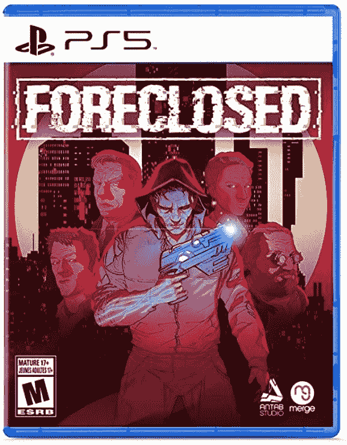

# 这个星期在游戏:再见麦克里，任天堂和游戏通过印度，和摇滚明星 remasters

> 原文：<https://www.xda-developers.com/this-week-in-gaming-bye-mccree-nintendo-game-pass-indies-rockstar-remasters/>

这是 8 月份游戏低迷中又一个平静的一周，因为我们在为本月晚些时候的大发布做准备。动视暴雪的丑闻仍在继续，这并不太好。另一方面，任天堂 Switch 得到了一些印度群岛，这很好。Xbox 游戏通行证继续变得更好，我们可能会得到一些摇滚明星重制。

## 动视暴雪在丑闻时期损失更多人员

让我们接受这样一个事实:这个故事不会消失，也不应该消失，考虑到这个公司的规模和重要性。在另一轮“辞职”中，一些主要人物在上周离开了公司。本周，我们听说《暗黑破坏神 4》的导演路易斯·巴里加、《T2》、《魔兽世界》的设计师乔纳森·勒克拉夫特和首席设计师杰西·麦克雷已经离开了公司。虽然该公司没有给出他们离开的原因，但麦克里和勒克拉夫特都在一系列照片中，这些照片显示了臭名昭著的“考斯比套房”，该诉讼引发了这一切。

虽然从表面上看，这些离职似乎表明该公司正在采取行动，但许多人呼吁该公司采取更明确的行动。至少有一位股东谴责了这种“不充分的反应”另一个稍微不同的消息是，这一丑闻似乎至少有一个不寻常的受害者:玩家要求暴雪将*的看守*角色杰西·麦克雷改名，他的名字取自暴雪员工。这并不能缓解前面提到的不充分的反应，但暴雪现在肯定可以使用良好的光学系统。

## 任天堂在其最新的展示中展示了美丽的印度

任天堂本周举行了一场小型的独立世界展示活动，展示了今年即将上市的所有独立游戏。开关的一些东西吸引了非常棒的印度人，几乎所有的印度人看起来都非常漂亮。今年晚些时候的热门游戏包括*铲子骑士:口袋地牢*，这是一款由独立海报男孩铲子骑士主演的第三场比赛游戏，以及 *TOEM* ，这是一款黑白卡通冒险游戏，玩家必须拍摄一切。

该活动的一个亮点是节目一结束就有大量游戏可供选择。其中包括*男朋友地牢*，一部关于与有感觉的武器约会的约会模拟片(相信我，比听起来要好得多)*公理边缘 2* 和*尸鬼:最后的倾倒*，一部关于死人与活人社交的视觉小说的再版。定于明年上市的游戏包括 *Far:变化的潮汐*、 *Far 的续集:孤独的帆*和 *Bomb Rush Cyberfunk* ，老实说，除了名字之外，它们看起来都像 *Jet Set Radio* 。

## 摇滚明星可能会制作 GTA 重制版三部曲

《侠盗猎车手》给游戏行业留下了巨大的印记，而 PS2 时代的三部曲更是如此:*《侠盗猎车手 3》*、*《侠盗猎车手:副城》*和*《侠盗猎车手:圣安地列斯》*。现在有传言说，摇滚明星可能正在为现代游戏机重新制作这些游戏。这也不仅仅是盲目的假设。Rockstar 母公司 Take-Two 发布了他们即将到来的财年的计划，他们列出了过去游戏的三个未经宣布的迭代。

三场未公布的比赛？这正好符合我们将得到一个重制三部曲的想法。管道细节提到，在 2023-24 财年，有相同数量的未宣布的改造商/港口正在建设中。有可能计划中的重制游戏是为来自开发者的非 *GTA* 游戏设计的，因为也有*红色死亡救赎*重制游戏和可能*恶霸*或*马克思·佩恩*游戏的传言。Take-Two 首席执行官施特劳斯·泽尔尼克最近谈到该公司的翻拍版时说:“我们不只是将标题移植过来，我们实际上花时间尽最大努力让新版本的标题与众不同。”

## 宣布增加新的 Xbox 游戏通行证

就在你认为 Xbox Game Pass 已经没有世界可以征服的时候，它却给这项服务增加了更多的游戏。本周在 ID@Xbox 活动上宣布了几款即将推出的游戏，其中几款是公认的独立游戏。我个人最喜欢的补充是*星光谷*。我已经在小小的独立农场 sim 卡上浪费了比我愿意承认的更多的时间，一旦它在今年秋天的 Game Pass 上推出，我绝对没有问题增加这个数字。

名单上的其他游戏包括潜行标题 *Aragami 2* ，将于 9 月 17 日推出；《巧妙逃脱》，一款将于 9 月 9 日发售的平台游戏； *Pupperazzi* ，一个*神奇宝贝抓拍*般的带狗摄影 sim 以及将于今年晚些时候推出的战略游戏续作《邪恶天才 2:统治世界》。游戏通行证也在展会之外增加了一些其他内容，包括 4X 战略游戏*人类*，将于本月晚些时候在游戏通行证上发布，以及*外科医生模拟器 2:访问所有区域*，另一个为期一天的游戏通行证内容将于 9 月 2 日发布。

### 八月份通过订阅服务提供的免费游戏

对于每周更新的这一部分，我们将添加已经添加到订阅和流媒体服务的游戏。我们上周忽略了添加 Stadia Pro 标题，所以我们将在这里添加它们，以确保您知道您可以获得什么。

Stadia Pro August 免费游戏:

*   *它来自太空&吃了我们的大脑*
*   *书信:打字编年史*
*   *杀手皇后黑*
*   *女武神编年史 4*
*   *尘垢*

Xbox 游戏通行证新增内容:

*   *人类*(八月十七日)
*   *瑞纳图书馆*(8 月 10 日)
*   *拉力赛艺术*(8 月 11 日)

[NVIDIA GeForce Now](https://www.xda-developers.com/geforce-now-august-2021-games/) :

*   *瘟疫传说:天真*(史诗游戏商店)
*   *死亡垃圾*(蒸汽)
*   星芒师(蒸汽)
*   *赛博出租车* (Steam)
*   *长魂*(蒸汽)
*   *Elex* (Epic 游戏商店)
*   *洪水中的火焰*(蒸汽)
*   *尘垢*(蒸汽)
*   京都风(蒸汽)
*   变形:地牢生物(蒸汽)
*   *超级皇家动物*(蒸汽)
*   霓虹灯海的故事(蒸汽)
*   *零时*(蒸汽)
*   *草坪修剪模拟器*(蒸汽)
*   *Naraka:blade point*(Steam 和 Epic 游戏商店)
*   *虚空列车*(史诗游戏商店)

### 本周发布的游戏:

 <picture></picture> 

Hades on Console

##### 地狱

2020 年的独立热门电影*哈迪斯*，希腊-罗格列式终于走向了控制台。如果你现在还没有玩过，抓住这个机会。

 <picture></picture> 

Foreclosed

##### 排除

这是一款叙事动作冒险游戏，玩家扮演埃文，他必须在一个赛博朋克世界中发现自己被盗身份背后的真相。