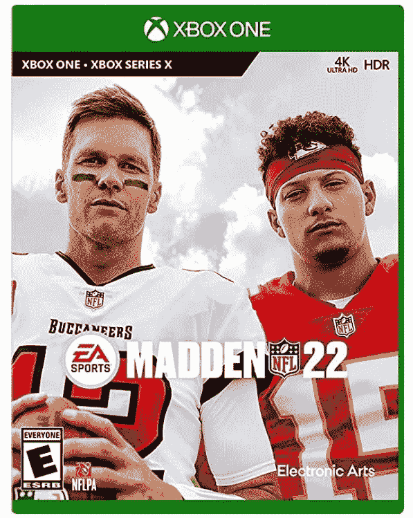
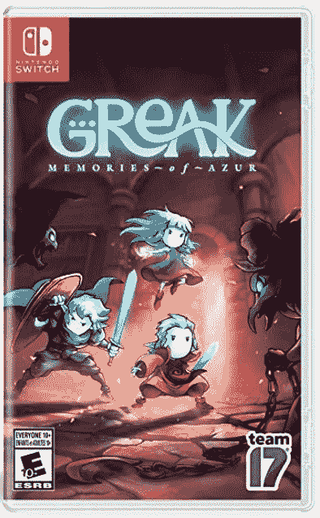

# 本周在游戏方面:使命召唤(又一次)，Skyrim(又一次)，以及如此多的神奇宝贝

> 原文：<https://www.xda-developers.com/this-week-in-gaming-call-of-duty-skyrim-pokemon/>

本周游戏界发布了一些伟大的游戏，其中大部分都围绕着神奇宝贝。我们还得到了期待已久的*使命召唤:先锋*，就在动视的大混乱中，以及*堡垒之夜*在我们中偷窃*的诡计。最后，如果你错过了， *Skyrim* 即将推出...又来了。*

## 神奇宝贝，神奇宝贝，还有更多神奇宝贝

周三，神奇宝贝公司举行了神奇宝贝礼物直播，其中[透露了该公司即将推出的游戏的更多细节](https://www.pokemon.com/us/pokemon-news/news-from-the-august-2021-pokemon-presents/):翻拍*辉煌钻石*和*闪亮珍珠*以及*神奇宝贝传奇:阿尔宙斯*。BD 和 *SP* 很可爱，我们终于可以在新的预告片中看到更多游戏的样子了。这款游戏通常与原版非常相似，几款迷你游戏保持不变，但玩家也可以定制他们教练的装备。

与此同时,《神奇宝贝传奇:阿尔宙斯》看起来与该系列中的大多数其他游戏非常不同。这是一个开放世界的动作 RPG 游戏，设定在古代翡翠地区(后来称为辛诺)。你扮演银河队的一名成员，他研究该地区的神奇宝贝。你可以实时进入与神奇宝贝的战斗，并将你自己捕获的神奇宝贝部署到战场上，以便开始回合制战斗。它看起来与我迄今为止玩过的任何神奇宝贝都非常不同，但仍然非常有趣，就像是*神奇宝贝*、*野性之息*和*怪物猎人*的组合。除了上述游戏，神奇宝贝公司已经宣布免费的 MOBA *神奇宝贝联合*将于 9 月 22 日在 iOS 和 Android 上推出[。](https://www.xda-developers.com/pokemon-unite-coming-android-ios-september-22/)

## 动视宣布使命召唤先锋

又到了一年的这个时候:[又一款*使命召唤*游戏已经公布](https://www.callofduty.com/blog/2021/08/Announcing-Call-of-Duty-Vanguard)。这款游戏的大部分细节都在官方公布之前泄露了，但简单来说就是:这款新游戏名为*使命召唤:先锋*，故事发生在二战期间。该活动以包括太平洋和北非在内的多个战区的故事为特色。还将有多人游戏，交叉游戏和交叉进展，第一天有 20 个地图可用，还有一个由 Treyarch 开发的僵尸模式。

动视暴雪仍然没有解决围绕其几名员工性骚扰和歧视的持续争议，但我们都知道他们最终会宣布新的*使命召唤*——尽管持续的丑闻可能是他们从预告片中删除动视品牌的原因。主要开发商 Sledgehammer Games 的负责人甚至直接谈到了这种情况，工作室负责人亚伦·哈龙(Aaron Halon)说:“虽然我们不能对诉讼发表评论，但我可以说的是，作为一个团队，我们致力于确保所有团队成员感到安全、受欢迎和受尊重。”

## 堡垒之夜在美国游戏中刷出新模式

*堡垒之夜*，在不断努力小心翼翼地保护游戏玩家的注意力的过程中，决定从一个独立游戏中窃取游戏性，这个独立游戏甚至敢有点像《皇家战役》标题一样受欢迎(在某个地方 *PUBG* 的开发者正在痛苦地笑)。Epic Games 最近推出了一种名为“冒名顶替者”的新模式，在这种模式下，一个由八名特工组成的团队必须在完成一系列任务并在特工被杀时召开会议的同时，发现隐藏在他们中间的两名冒名顶替者。是啊，是我们中间的*。我们之间是如此的相似，甚至连地图都是相似的。*

 *这种游戏模式在发布前被泄露，但它被认为是一种官方的跨界车，因为*堡垒之夜*的目标是最终的跨界车。我们当中的开发者 Innersloth 否认了这一点，但是说如果这真的发生了，那会很酷。不用说，他们对这种公然剽窃他们完善并普及的游戏一点也不觉得好笑。工作室的联合创始人之一马库斯·布罗曼德[在推特](https://twitter.com/PuffballsUnited/status/1427781760692068355)上说:“我们并没有为我们这些技工申请专利。我不认为这会导致一个健康的游戏产业。不过，多付出 10%的努力来融入自己的想法真的有那么难吗？”

## Skyrim 又出来了(哦，地震也是)

*上古卷轴 V:天际*即将发行第五十版(据我统计)[这一次是一个“权威”版本](https://bethesda.net/en/article/REybYU3Gy2InVlHmus4UC/skyrim-10th-anniversary-fan-celebration)叫做*上古卷轴 V:天际周年纪念版*。这个版本包含了基础游戏，所有的 DLC，以及来自创造俱乐部的 500 多条内容，其中包括“现有的和新的任务，地下城，老板，武器，法术，等等！”哦，如果你还没有感到困惑，那些已经拥有特别版的人将获得免费的下一代升级，但它不会是完整的周年纪念版。

但是我们都习惯于听到又一个 *Skyrim* 发布，所以听到*地震*已经为所有游戏机重新制作更令人惊喜。没错，OG FPSes 中的一款现在已经可以在 Xbox One、PS4、PC 和任天堂 Switch 上使用，PS5 和 Xbox Series X/S 的下一代免费升级正在进行中。它包括两个原始资料片，以及两个来自机器游戏的资料片:“过去的的*维度”和机器*的全新*维度。”它还将提供在线和本地合作，以及交叉播放。我们喜欢看它！*

### 八月份通过订阅服务提供的免费游戏

对于每周游戏更新的这一部分，我们将添加已经添加或宣布用于订阅和流媒体服务的游戏。

Xbox Game Pass 新增游戏内容:

*   *人类*(PC)—8 月 17 日
*   *极速热需求*(云)—8 月 17 日
*   《星球大战前线 II》8 月 17 日
*   *《星球大战:绝地归来》*(云)——8 月 17 日
*   *重新编译*(云、PC、Xbox 系列 X/S)——8 月 19 日
*   火车模拟世界 2 (云，控制台，PC)——8 月 19 日
*   *十二分钟*(云、控制台、PC)—8 月 19 日
*   8 月 25 日
*   8 月 26 日

### 本周发布的游戏:

 <picture></picture> 

Ghost of Tsushima's Director's Cut

##### 对马导演剪的鬼

对马岛的神奇幽灵的更新增加了 Iki 岛资料片以及对次世代的一些改进。

 <picture></picture> 

Madden NFL 22

##### 劲爆橄榄球 22

Madden 足球游戏系列的最新迭代包括一个早该更新的特许经营模式。

 <picture></picture> 

Greak: Memories of Azur

##### 格雷克:蓝色的记忆

这款单人侧滚益智游戏以美丽的手绘艺术为特色，讲述了三个兄弟姐妹的故事。*