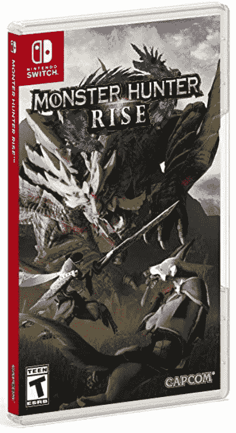
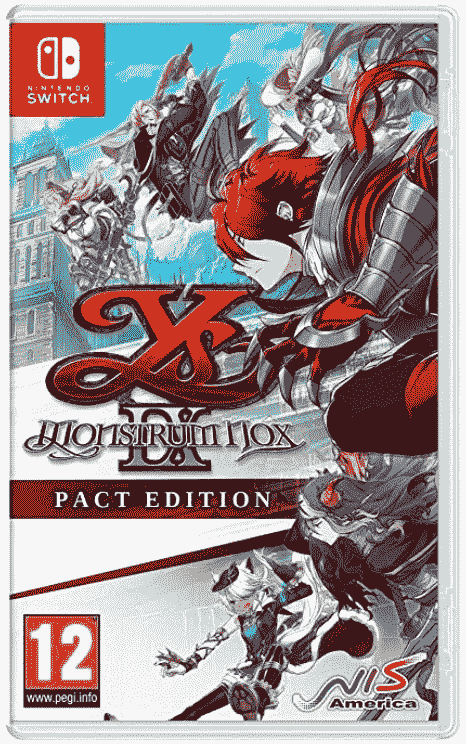

# 本周游戏:非职业开关有机发光二极管，刺客信条无限，和 GTA 6

> 原文：<https://www.xda-developers.com/this-week-in-gaming-july-2021/>

游戏行业本周的消息有些两极分化。我们将迎来一个新的任天堂 Switch……但不是我们想象中的那个。育碧正在开发一款新的*刺客信条*游戏……但这是一款即时服务的进化世界游戏，不同于之前的单人游戏。甚至关于下一款*侠盗猎车手*正在研发的传言也是“好消息和坏消息”的混合。

但本周的消息总体来说相当积极，我们并不是每天都有新的任天堂游戏机发布。以下是本周游戏界最有趣的一些故事。

## 任天堂揭示了开关有机发光二极管模型

任天堂周二宣布[一款新型号的 Switch](https://www.xda-developers.com/nintendo-introduces-an-oled-model-of-the-switch/) 。名为 Switch 有机发光二极管，它提供了一个升级的开关手持设备，配有 7 英寸有机发光二极管显示屏，以及 64GB 的内部存储和新坞站上的 LAN 端口。它还有一种新的白色配色。这是对 vanilla Switch 的渐进式升级，但对于想要更好屏幕的玩家来说是一个受欢迎的升级。

这可能是被称为“Switch Pro”的主机，并且已经传闻了一段时间。不幸的是，Switch Pro 也被认为是 Switch 的一个重大功率升级(无论如何，根据流行的报道)，所以 Switch 有机发光二极管得到了相当不温不火的接受，因为它没有那种性能提升。有人猜测，任天堂仍在开发“Switch Pro ”,但如果有的话，它可能还要过一段时间才会宣布。

## 索尼举行首次夏季状态游戏

本周，我们迎来了后 E3 时代的第一个事件，索尼举行了自大会(它没有参加)结束以来的首次活动状态。该公司提前警告说，我们不会看到*战神*、*地平线禁忌西方*，或任何其他即将推出的游戏。相反，该剧主要聚焦于即将上映的《阿尔凯恩》动作片名*死亡循环*。我们得到了一个很长的游戏演示，以及英雄柯尔特和他的对手朱莉安娜之间戏谑的预览。

除了 *Deathloop* ，索尼还展示了一些第三方游戏和印度游戏的预告片。最大的游戏可能是 9 月 24 日即将登陆 PS5 的*死亡搁浅导演剪辑*。我们也将得到 PSVR 游戏*莫斯*的续集，名为*莫斯:第二部*。不太令人高兴的消息是，武侠动作游戏*私服*已经推迟到 2022 年。

## 育碧正在制作一款名为 Infinity 的真人服务刺客信条游戏

本周，来自彭博 T3*的[报道称育碧正在制作一个新的*刺客信条*项目。代号为“Infinity”，这款游戏将是一个实况服务，不断发展的世界平台，类似于*堡垒之夜*或*战争地带*。无限将会同时发生在多个时间和场景中，而不是像到目前为止的游戏一般都停留在一个单一的历史场景中。根据这份报告，“平台上的单个游戏可能看起来和感觉上不同，但它们都是相互关联的。”](https://www.bloomberg.com/news/articles/2021-07-07/assassin-s-creed-infinity-to-offer-live-online-game-service)*

这份报告发表后不久，[育碧证实它正在研发 Infinity](https://news.ubisoft.com/en-us/article/GZi5hT4dBeM8YITOsJeCn/an-update-on-assassins-creed-infinity-and-the-future-of-the-assassins-creed-franchise) 。除了育碧蒙特利尔公司和魁北克公司联合资源开发这款游戏之外，它没有透露任何关于这款游戏的细节。Nathalie Bouchard 和 Christophe Derennes 的声明说:“我们深信，这是育碧最受欢迎的系列之一以更加整合和协作的方式发展的机会，而不是继续在游戏之间传递接力棒……”这可能意味着我们在 *AC* 宇宙中获得更小的故事，也许会减少该系列近年来变得臭名昭著的臃肿。

## 持续的谣言说，GTA 6 不会来，直到 2025 年

这本身算不上什么新闻，但仍然值得一谈。有多个传言正在流传——主要传播者是 YouTuber Tom Henderson——《侠盗猎车手》系列的下一部作品正在制作中，很可能要到 2025 年或 2026 年才会发布。这个谣言已经被多个消息来源证实，他们说这个游戏在 Rockstar 还处于相对早期的开发阶段。

谣言的另一部分是，游戏将设定在现代版的罪恶之城，地图将开始适度大小，只是后来被扩大。据称这是为了减少 Rockstar 员工的潜在压力。该系列的最后一款游戏*侠盗猎车手 V* 于 2013 年发布，该公司在此后的十年里一直在开发*侠盗猎车手 Online* 、*红色死亡救赎 2* 和*红色死亡 Online* 。

## 本周发布的游戏:

 <picture></picture> 

Monster Hunter Rise Stories 2: Wings of Ruin

##### 怪物猎人崛起故事 2:毁灭之翼

怪物猎人系列的最新版本将玩家带到一个与怪物和谐相处的村庄，并让他们解决消失的 Rathalos 之谜。

 <picture></picture> 

Ys IX: Monstrum Nox Pact Edition

##### Ys 九:Monstrum 氮氧化物公约版

动作 RPG 系列的最新作品，Ys IX 跟随 Monstrum，拥有力量的人，揭开 Balduq 的神秘面纱。