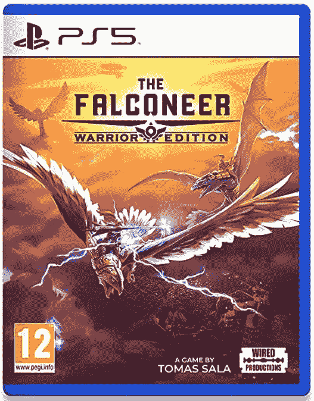

# 本周在游戏方面:次世代 PSVR，任天堂 Switch 的销售数字，和 Pokémon GO 抵制

> 原文：<https://www.xda-developers.com/this-week-in-gaming-next-gen-psvr-nintendo-switch-sales-figures-pokemon-go-boycott/>

这是业界平静的一周——除了正在进行的动视暴雪案件。我们发现任天堂 Switch 卖得很好…还有，另一个热点公告:水是湿的。最后，我们看到口袋妖怪 GO 社区正在反击，因为 COVID 时代的安全功能开始消失，就在玩家抗议他们仍然需要他们的时候。

## 随着丑闻的继续，暴雪的总裁和人力资源主管辞职

我并没有打算让这个故事成为本专栏的固定内容，但鉴于游戏行业最大的公司之一处于其中心，这些重大进展必须得到承认。最新的小道消息是，暴雪首席执行官 J. Allen Brack 在指控后辞职。该公司全球人力资源主管杰西·梅舒克(Jesse Meschuk)也即将离职。员工一直认为人力资源团队是公司问题的一部分。

如果你没有阅读诉讼，布拉克是少数几个被指名道姓的人之一，因为他被指控驳回了对工作场所骚扰和性别歧视待遇的持续投诉，对违法者只是轻微处罚。他将由詹·奥尼尔和迈克·伊巴拉接替担任“联合领导人”。关于这个正在进行的故事的其他新闻，监视联盟赞助商开始从事件中撤出。据称，在可口可乐和国营农场“重新评估”他们与 ActiBlizz 的关系时，T-Mobile 已经撤回了它的品牌。

## 关于 PlayStation 5 下一代 VR 的细节泄露

我们已经知道索尼正在开发下一代 PS5 的 PlayStation VR 耳机。我们已经看到了控制器的外观，这里和那里也有零星的细节发布，但我们对这款新版本的耳机了解不多。然而，一个新的 YouTube 视频突然出现，声称索尼举行了一次私人会议，展示了面向潜在虚拟现实开发者的新耳机。

该视频由 PSVR 发布，不得假释，该会议的存在后来被 UploadVR 证实。根据泄露的细节——我鼓励用户半信半疑地接受——新耳机将有 4000×2040 像素，眼球追踪支持，110 度 FOV 和 HDR 有机发光二极管显示屏。据称，索尼也在寻找 AAA 游戏，以吸引更多人对下一代 VR 系统的关注。

## 任天堂 Switch 已经卖出了 8900 万台

任天堂发布了 2021 年 Q2 的季度报告，虽然利润在下降，但数字相当令人鼓舞。任天堂 Switch 的销售数字有所放缓，但考虑到去年疫情推动的爆炸性销售数字，这并不意外。总体而言，销量下降了 21.7%，但 Switch 现在的销量已超过 8900 万台。这意味着游戏机的销量已经正式超过了 Xbox 360 和 PlayStation 3。

除了硬件销售，任天堂还透露了上个季度哪些游戏卖得最好。这可能是一个惊喜，或者对精明的任天堂粉丝来说可能不是，但最大的卖家仍然是马里奥赛车 8，仅售出 3700 多万台。亚军是《动物穿越:新视野》，票房接近 3400 万。我们将不得不看看任天堂 Switch·有机发光二极管车型的推出是否会增加销售数字。

## Pokémon GO 粉丝抗议安全功能的回滚

精灵宝可梦 GO 的创造者 Niantic 最近开始恢复游戏的一些功能，这些功能是在新冠肺炎疫情期间作为安全措施引入的。有助于安全的大变化是社交距离功能，将健身房和扑克台的互动半径从 40 米扩大到 80 米。现在半径缩小到原来的大小。诚然，这一变化目前只在新西兰和美国推出，但玩家对这一变化并不满意，有些人甚至考虑抵制。

虽然对这些回滚的大多数担忧——除了交互半径之外，还包括其他一些变化——是不社交距离不安全，特别是在美国，但这不是游戏玩家唯一的担忧。他们抗议说，这些变化使游戏更容易被那些不像大多数人那样移动的玩家，或者那些由于各种原因不能走很远的玩家所接受。Niantic 随后对这些请求做出了相当于“我们会考虑一下”的回应，但补充说，他们仍然希望鼓励玩家走出去，去一些地方。

## 八月份通过订阅服务提供的免费游戏

对于每周更新的这一部分，我们将添加已经添加到订阅和流媒体服务的游戏。这通常在月初集体发生。以下是本周公布的。

[亚马逊 Luna+八月游戏](https://www.xda-developers.com/amazon-luna-plus-games-august-2021/):

*   *Hokko 生活*
*   *野外*
*   *桥梁施工方:行尸走肉*

[PlayStation Now 八月游戏](https://www.xda-developers.com/playstation-now-new-games-august-2021/):

*   *尼尔自动机*
*   *幽灵特工*
*   *下层*

[Xbox Game Pass 八月新增内容](https://www.xda-developers.com/games-coming-xbox-game-pass-august-2021/):

*   *亡灵的诅咒*
*   *躲避球学术界*
*   *卡塔玛丽·达马西·雷罗尔*
*   *Lumines 重制*
*   *溜冰鞋*
*   *滑板 3*
*   *星际争霸*
*   *拉力赛艺术*
*   *哈迪斯*
*   *微软纸牌合集:高级版*

## 本周发布的游戏:

 <picture></picture> 

The Falconeer: Warrior Edition

##### 猎鹰者:战士版

这款第三人称空战模拟游戏中，玩家控制一只巨大的鸟并与其他战机战斗，这与 2021 年迄今为止发布的大多数游戏都不一样。

 <picture></picture> 

Spiritfarer Physical Release

##### 精神释放

这个美丽的动作平台/资源管理模拟解决了死亡和同情的话题。这是第一次以物理形式发布。