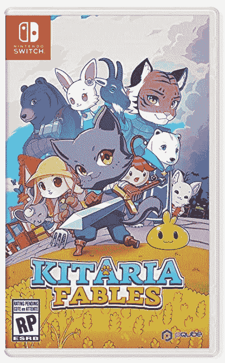
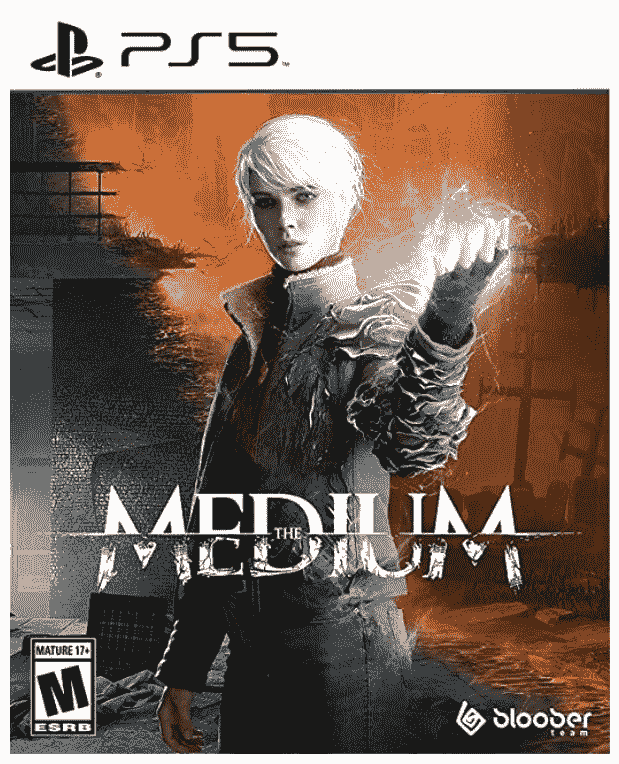
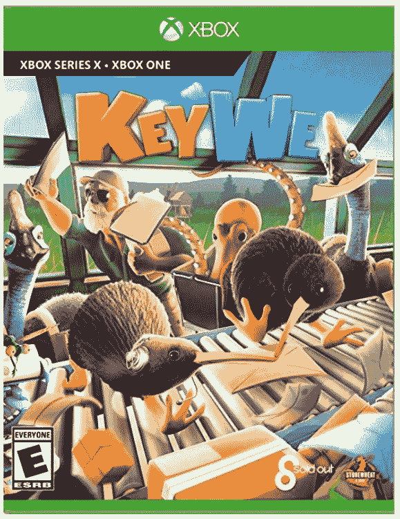

# 本周游戏:PlayStation 的未来、死亡空间和休息一天

> 原文：<https://www.xda-developers.com/this-week-in-gaming-playstation-dead-space-twitch-protest/>

本周游戏行业发生了一些有趣的故事，包括新的*死亡空间*的镜头，以及抗议频道持续突袭的 Twitch 横幅。最近有一个关于[任天堂 Switch 在线获得 Game Boy](https://www.xda-developers.com/nintendo-switch-online-game-boy-games-rumor/) 和 Game Boy Color games 的传闻，但这些尚未得到证实。

## 索尼宣布下周展示

索尼似乎终于准备好开始发布一些新游戏了，或者至少我们可以希望如此。他们宣布下周将举行夏季展览。索尼表示，该展会将[展示即将推出的游戏的新闻](https://blog.playstation.com/2021/09/02/youre-invited-playstation-showcase-2021-broadcast-next-thursday/):“展会将持续约 40 分钟，包括 PlayStation 工作室和业内一些最具想象力的开发者对今年假期及以后发布的游戏的更新。”

至于在活动中具体会有什么，我们唯一知道肯定不会在那里的是下一代 PSVR，索尼说它还没有准备好展示。有许多可能的游戏会出现，包括*战神:仙境传说*，*地平线禁忌西方*，可能还有我们还没有看到的游戏。随着“释放这个假期”的增加，我们也知道有几个游戏可以显示，包括*死亡搁浅导演剪辑*。

## 动机让我们第一次看到了死亡空间的翻拍

本周早些时候，新死亡空间游戏的开发者展示了游戏早期版本的一些镜头，这款游戏是原版的完整翻拍。它不仅看起来令人惊叹，而且《动机》在重拍中加入了肢体切割，现在还包括撕裂肉体，从而增加了血量。艾萨克·克拉克也将在重拍中有一个声音，但开发人员说，他只会在游戏中说话。

考虑到游戏在孤立状态下看起来仍然相当不错，看到原版*死亡空间*的图形老化确实令人惊讶。但是当你把它与流中显示的游戏的早期版本相比，它看起来几乎是原始的。新游戏还将增加一些在*死亡空间 2* 中增加的功能，包括艾萨克的飞行靴。布丁和所有这些的证明，只有当我们拿到它时，我们才能知道这是不是一个*生化危机 2* 风格的翻拍，但迄今为止，它看起来不错。

## 中国限制儿童每周只能玩 3 个小时的网络游戏

中国国家新闻出版总署正在推出更严格的限制，限制儿童在线游戏的数量:从现在开始，那些提供在线游戏的公司只能在周五、周末和公共假期的晚上 8 点到 9 点开放服务器。这意味着，在大多数星期，中国儿童只能在这三个小时里玩网络游戏。我只能想象他们的服务器会有多拥挤。

以前，这些限制规定孩子们每天只能睡 1.5 个小时，所以这是非常极端的。自然，业内的主要公司，如腾讯，对此感到恼怒。据称，这是为了解决中国儿童日益严重的游戏成瘾问题，而这个国家一直与游戏有着复杂的关系——一家国有新闻媒体最近的一篇文章(由《纽约时报》翻译)称游戏为“精神鸦片”

## Twitch 观众放假一天，抗议骚扰突袭

Twitch 横幅面临骚扰是该网站的一个长期问题，许多横幅通过举行名为#ADayOffTwitch 的虚拟罢工来解决问题。一些少数民族内容创作者成为仇恨袭击的目标，这些袭击用旨在逃避仇恨言论自动检测的消息淹没了流聊天。streamers 希望 Twitch 采取更强有力的措施来防止这种骚扰，包括拒绝突袭的能力(老实说，这真的应该是一个功能)。

这显然对[的 Twitch 收视率](https://www.theverge.com/2021/9/2/22654534/streamers-twitch-walkout-viewership-drop)产生了影响，因为它在罢工当天有所下降。Twitch 对抗议做出了回应，声明称:“任何人都不应该因为他们是谁或他们代表什么而遭受恶意和仇恨的攻击，我们正在努力改进频道级的禁令规避检测和额外的帐户改进，以帮助 Twitch 成为创作者更安全的地方。”

### 九月份通过订阅服务提供的免费游戏

[Xbox 游戏通行证 9 月新增内容](https://www.xda-developers.com/xbox-game-pass-games-september-2021/):

*   *手工艺*
*   *最终幻想十三*
*   *寄居者的迹象*
*   *外科医生模拟器 2*
*   *皇冠绝招*
*   *呼吸边缘*
*   *核王座*
*   *巧逃*

[PlayStation Plus 九月游戏:](https://www.xda-developers.com/ps-plus-games-september-2021/)

*   *煮过头:能吃多少就吃多少*
*   *杀手 2*
*   *捕食者:猎场*

### 本周发布的游戏:

 <picture></picture> 

Kitaria Fables

##### Kitaria 寓言

这个可爱的由动物人主演的角色扮演游戏也有农业和手工艺元素，因为玩家必须安抚自然。

 <picture></picture> 

The Medium (PS5)

##### 媒介

这款大气的恐怖游戏以前是 Xbox 独占，现在 PS5 玩家也可以玩了。

 <picture></picture> 

KeyWe

##### 基韦

这个可爱的小 sim 卡游戏是关于几维鸟分拣邮件，可以在本地或在线合作。