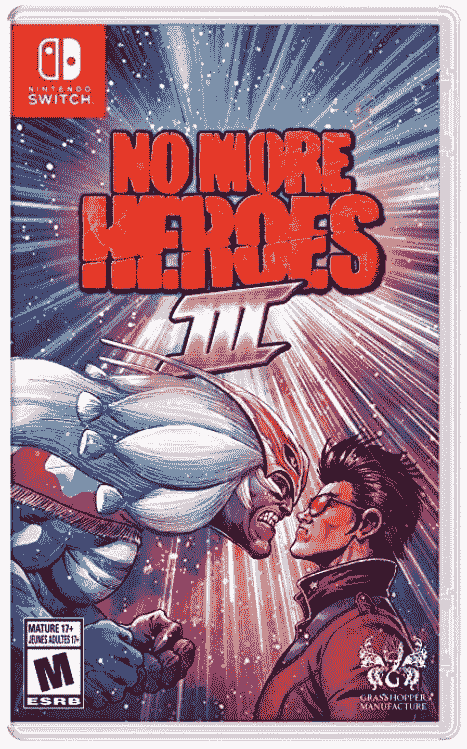
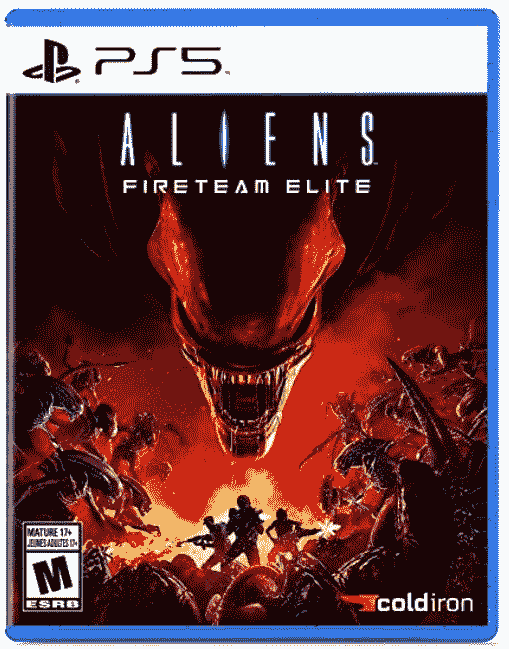
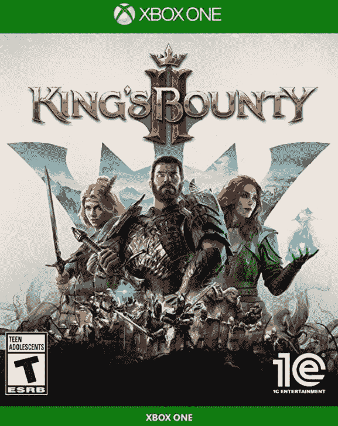

# 本周在游戏中:圣徒行，光环无限，以及 Gamescom 的其他公告

> 原文：<https://www.xda-developers.com/this-week-in-gaming-saints-row-halo-infinite-gamescoms-announcements/>

本周适合印刷的大部分新闻都是在欧洲游戏盛会 Gamescom 上首次亮相的，在那里我们看到了一些以前从未见过的主要游戏的玩法，包括新的*圣徒行*、*使命召唤:先锋*和*光环无限*。我不能包含来自 Gamescom 的每一条新闻，但我会尽量涵盖展会上所有最重要的公告。

## 新圣徒行和漫威游戏在 Gamescom 宣布

Gamescom 上最大的游戏之一是一个新的*圣徒行列*标题。自 2015 年的*Gat out the Hell*以来，该系列一直处于休眠状态，所以关于 Volition 正在开发该系列新游戏的消息特别受欢迎。该游戏的预告片透露，这是一个由一群新的圣人主演的重新启动，并设置在一个新的位置。范对第一部预告片的接受度是褒贬不一，但后续的素材已经比较符合这个系列的精神。这款游戏将于 2022 年 2 月 25 日推出。

展会上展示的另一款新游戏是漫威的午夜太阳。这个新游戏是一个战术角色扮演游戏，几个熟悉的漫威角色对抗一个恶魔实体。如果说*漫威的《复仇者联盟》*感觉像是试图捕捉 MCU 电影的精神，那么*午夜太阳*感觉像是试图捕捉其电视剧衍生剧的精神:黑暗、怪异、酷。这些角色包括刀锋战士、幽灵骑士、魔术师和尼科·米诺鲁。我们也有一个可定制的玩家角色，叫做猎人。

## 《光环无限》和《地平线禁忌西部》确定上映日期

除了新游戏，我们还得到了一些急需的即将到来的游戏的更新。具体来说，我们得到了一些发布日期。我们现在知道*光环无限*将于 12 月 8 日推出，正好赶上 2021 年的发布窗口。虽然我们没有在展会期间的任何时候看到这场战役，但我们知道它和多人模式将同时推出。微软还在同一活动上公布了 [*光环无限*限量版 Xbox 和控制器](https://www.xda-developers.com/halo-infinite-launch-date/)。

我们得到的另一个发布日期，比我们希望的稍微晚了一点，是*西部地平线*。有传言称，这款游戏将错过预计的 2021 年发布窗口——这不是正式的延迟，因为开发者尚未确定具体日期——但现在我们知道这款游戏将于 2 月 18 日发布。对于游戏来说，二月将会是一个重要的月份，因为我们也发现动作游戏 *Sifu* 将会在 2 月 22 日发布。

## 使命召唤:先锋，Forza 地平线 5 和命运 2 也在那里

很难在短短的几段话中包含 Gamescom 的所有新预告片和细节，所以这里有一些我还没有提到的更有趣的细节的快速概述:我们有《使命召唤:先锋》战役的游戏性展示，以及关于可玩角色 Polina Petrova 的更多细节。她是俄罗斯狙击手，能垂直导航到有利位置。我们还得到了一个大型的 *Forza Horizon 5* 的游戏展示，由游戏中许多漂亮的汽车和同样美丽的墨西哥风景主演。

最后，我们得到了一个巨大的*命运 2* 展柜，其中 Bungie 透露了新一季的细节，迷失的的*季，以及即将到来的资料片*女巫女王*。这两个新的游戏内容包将更深入地挖掘这个系列的知识，并揭示一些已经消失了一段时间或从未见过但被反复提及的角色。他们还会在游戏中加入新的机制，比如手工艺和新的难度。*

## ActiBlizz、Overwatch 和 Pokémon GO 的快速更新

由于 Gamescom 本周吸引了所有的注意力，我将把其他新闻限制在几个更新上。对《神奇宝贝 GO》玩家来说，有一些好消息:Niantic 听取了 fan 的要求，将健身房和扑克室的距离从疫情之前的 40 米恢复到了疫情的 80 米。粉丝们一直在抗议距离的缩短，因为这不仅危险(在美国距离缩短了，疫情仍在进行中)，而且使这些地方更难到达。Niantic 在 Twitter 上说:“我们已经听到了你的声音，并理解这对许多玩家来说是一个受欢迎的好处。”

动视暴雪不知何故在加州陷入了更大的麻烦。公平就业和住房部本周修改了对该公司的投诉，声称该公司通过销毁文件隐瞒了与诉讼有关的证据。DFEH 还表示，ActiBlizz 雇佣 WilmerHale 干扰了他们的调查，该公司正试图迫使员工与他们或 WilmerHale 交谈，而不是与 DFEH 交谈，声称员工需要披露与 DFEH 的任何通信。其他消息，暴雪已经确认将[更名为*看守*的杰西·麦克雷](https://twitter.com/PlayOverwatch/status/1430964453865046025)，他目前与一名现已被解雇的有问题的暴雪员工同名。

### 九月份通过订阅服务提供的免费游戏

对于每周更新的这一部分，我们将添加已经添加或宣布用于订阅和流媒体服务的游戏。Xbox 游戏与黄金:

**9 月 Xbox 游戏黄金版**

*   *战锤:Chaosbane*
*   *穆拉卡*
*   *恩德斯区*
*   *武士 shod down II*

### 本周发布的游戏:

 <picture></picture> 

No More Heroes 3

##### 不再有英雄 3

特拉维斯触地得分，不再有英雄 3 的最终冒险是邪教经典动作专营权的回归。

 <picture></picture> 

Aliens Fireteam Elite

##### 外星人精英消防队

在这部合作电影的后续电影中，一队海军陆战队与传奇的异形展开了较量。

 <picture></picture> 

King's Bounty 2

##### 国王的赏金 2

这款回合制战术 RPG 让你在一个拥有许多秘密的广阔开放世界中扮演三个不同的英雄。