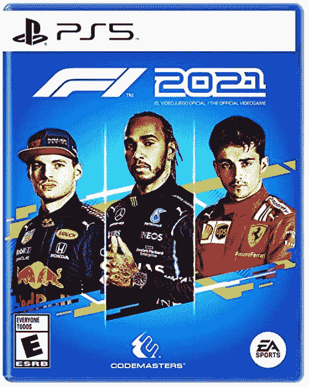
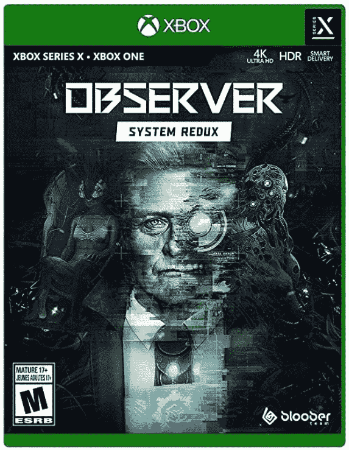

# 本周游戏:蒸汽甲板、网飞和超级马里奥 64

> 原文：<https://www.xda-developers.com/this-week-in-gaming-steam-deck-netflix-games-super-mario-64/>

这个星期开始得很慢，突然，Valve 向我们透露了一些非常重要的硬件消息。我们还了解到，网飞正试图打入游戏，拍卖热正在占领复古游戏世界，更多的游戏被推迟到明年。

## 阀门宣布手持蒸汽甲板

在任天堂 Switch·有机发光二极管预购开放的同一天——可能只是巧合——[Valve 发布了自己的手持设备:Steam Deck](https://www.xda-developers.com/valves-steamdeck-is-a-switch-like-gaming-pc-starting-at-399/) 。据报道，这款迷你电脑可以运行任何 AAA 游戏，也可以像传统电脑一样使用。 [Steam Deck](https://www.steamdeck.com/en/) 运行基于 Arch Linux 的 SteamOS 3.0，它具有 Valve 的质子兼容层，可以运行许多为 Windows 构建的游戏。它有一个内置的 720p 屏幕的 7 英寸显示器，但将伴随着一个坞站，让它可以连接到分辨率高达 8K 的外部显示器。这或多或少有点像 Switch Pro，而有机发光二极管的型号没有。

代替预购， [Valve 使用了一个名为预约](https://www.xda-developers.com/steam-deck-pre-order/)的系统，用户可以在 12 月发布之前以很少的费用预约一台游戏机。这是为了减少黄牛的批量购买，因为你只能通过 Steam 购买主机，需要有一个以前在平台上购买过的帐户，并且每个帐户只能购买一个甲板。这个系统出现了一些问题——黄牛党已经开始在易贝上发布房源了——但是看起来人们一般都能在这里预订到。

## 《超级马里奥 64》拍卖价超过 150 万美元

超级马里奥 64 的密封版在遗产拍卖会上以高达 156 万美元的价格售出，成为有史以来价格最高的游戏。这款游戏价值如此之高，主要是因为它近乎完美的状态——它获得了非常罕见的 9.8 分，这是复古游戏评分者 Wata Games 根据游戏及其包装的原始程度给出的分数。它打破了之前的纪录保持者，一份密封的*塞尔达传说*，在*超级马里奥 64* 前不久在同一家拍卖行以 87 万美元售出。

现在复古游戏界有一点拍卖热，因为旧游戏的新副本实际上是互相绊倒以创纪录的价格。《超级马里奥 64》的副本是遗产拍卖中获得巨大数字的最新宝藏。自从任天堂 PlayStation 去年在那里出售以来，这家拍卖行一直在定期处理游戏珍品。今年早些时候，它也是以 66 万美元售出《超级马里奥兄弟》密封版的地方。

## 据报道，网飞想加入视频游戏市场

本周来自彭博的一份报告暗示网飞对云游戏世界有 T2 的设计。流媒体服务有一个新的倡议，将云游戏添加到其平台上，该倡议由前 EA 高管迈克·维尔杜(Mike Verdu)负责。据称，这项新服务将免费提供给用户。这是一个有趣的想法，但我们仍然缺乏这将如何工作的细节。

对于正在寻找新的增长途径的网飞来说，游戏市场无疑具有吸引力。目前还没有确切的消息表明游戏将如何融入网飞的平台——是简单的游戏，适合移动设备，还是传输到网飞的 AAA 游戏机？据称，该公司正在开发一项云游戏服务，但我们不知道这项服务会是什么样子。

## 更多的比赛被推迟

不幸的是，本周有一些负面消息。然而，更多的比赛被推迟，要么推迟到今年晚些时候，要么推迟到 2022 年。最糟糕的延迟是那些只有模糊的新发布窗口的延迟。首先，我们听说*鬼城:东京*，两个即将到来的 Bethesda PlayStation 限时独占之一，将从 2021 年 10 月推迟到 2022 年初。卡普空公司还宣布将多人游戏《生化危机》从 2021 年 7 月推迟到 2022 年的某个时候。

在周末，育碧透露它将推迟本财年两个主要 tentpole 发布的 *Rainbow Six Extraction* 和 *Riders Republic* 在这两种情况下，它都表示游戏需要更多的开发时间。*提取*从 2021 年 9 月 16 日延迟至 2022 年 1 月。*车友共和国*从 9 月 2 日延迟到 10 月 28 日。这些远不是今年迄今为止唯一的延迟，但仍然令人失望。

## 本周发布的游戏

 <picture></picture> 

The Legend of Zelda: Skyward Sword HD

##### 塞尔达传说:天空之剑

经典的塞尔达标题在这个美丽的开关重制者中回归，跟随他在漂浮的岛屿之间翱翔的链接。

 <picture></picture> 

F1 2021

##### F1 2021

在一级方程式世界锦标赛的正式比赛中，与 20 名车手和 10 支球队一起比赛。

 <picture></picture> 

Observer: System Redux

##### 观察者:系统冗余

丹尼尔·拉扎尔斯基在这部赛博朋克黑色侦探小说中调查了一个令人毛骨悚然的秘密。