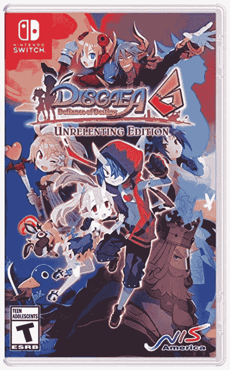

# 本周游戏:索尼收购，iOS 上的 Xbox 云游戏，以及控制权的回归

> 原文：<https://www.xda-developers.com/this-week-in-gaming-w1-july-2021/>

本周，游戏行业宣布了一些令人兴奋的 2019 年和 2020 年最受欢迎的游戏的新内容，以及一些行业重组。索尼收购了两家独立的工作室(可能还有一家)，我们得以一窥 PlayStation 商店的幕后，Xbox 云游戏终于来到了 ios。

## Xbox Game Pass 的云游戏选项在 iOS 上推出

微软最近宣布，Xbox Cloud Gaming 允许用户将 Xbox Game Pass 游戏传输到无法运行这些游戏的设备上，并通过浏览器向苹果设备和个人电脑推出。它也退出了仅限邀请的测试阶段，所有 Xbox Game Pass Ultimate 订户都可以访问云游戏选项。

为了让最终用户在例如 iPhone 上访问 Xbox 云游戏，他们将通过谷歌 Chrome、Safari 或 Edge 浏览器访问 Xbox 网站。Xbox 云游戏服务器是由 Xbox Series X 硬件支持的新[，这意味着通过该选项传输的游戏将加载更快，帧速率更高，并且通常会玩得更好。这标志着 iOS 用户首次可以使用该选项。](https://www.xda-developers.com/xbox-cloud-gaming-now-uses-the-series-x-for-faster-and-higher-quality-streaming/)

## 补救措施是制作两个新的控制游戏，包括一个多人游戏

*控制*是 Remedy 2019 年的成功故事，将艾伦·威克宇宙推向了新的高度，并向一些用户介绍了联邦控制局非常迷幻的视觉效果。也许并不奇怪，补救措施是[在 505 游戏的帮助下制作系列中的两款新游戏](https://www.remedygames.com/the-future-of-control-remedy-505-games/)。其中之一是一个潜在的续集，两家公司都不愿意透露太多——它还处于开发的早期阶段。

另一个可能更接近制作的游戏是*控制*多人游戏衍生游戏，如果只是因为两家公司愿意谈论更多的话。这个游戏代号为“秃鹰”，是一个 4 人合作游戏，玩家与环境或人工智能控制的敌人竞争。补救措施说，游戏将发布的 PC，PS5，和 Xbox 系列 X/S。

## 索尼收购 Housemarque 和 Nixxes(也许还有 Bluepoint)

索尼公司本周宣布收购两家过去合作密切的工作室。本周早些时候，*return*、[的开发者 Housemarque 加入了 PlayStation Studios 保护伞](https://blog.playstation.com/2021/06/29/welcoming-housemarque-to-the-playstation-studios-family/)。索尼后来透露，它还收购了 Nixxes Software，这是一家专门将主机游戏移植到 PC 的公司。自然，后一次收购有一些猜测，索尼计划在不久的将来将更多的 PS4 游戏移植到 PC 上。

奇怪的是，索尼透露了另一项尚未宣布的收购:蓝点游戏公司，该公司是《T4》恶魔之魂翻拍版等游戏的开发商。PlayStation 不小心在推特上发布了带有蓝点工作室标志的横幅图像，其中包括一张*恶魔之魂*的封面图像。Bluepoint 作为该公司的下一笔收购是有意义的，但迄今为止，该公司对这个失误保持沉默。

## 独立开发者说索尼很难合作

这个故事有点像游戏行业的幕后故事，也不是什么好故事。本周来自 Kotaku 的一份报告揭露了一名独立开发者对 PlayStation 商店可见性的担忧，以及索尼希望他们做些什么来获得这种可见性。它始于 Neon Doctrine 的 Iain Garner 关于“X 平台”的推文——Kotaku*报告*后来将其命名为 PlayStation——以及将他的游戏放在商店的特色位置是多么困难。他声称，这不仅要花费数千美元，而且开发者实际上不会因为他们的钱而受到太多关注，至少与 Xbox 和任天堂相比是如此，这两家公司为独立开发者提供了几个免费或较便宜的选择，以在其商店中展示。

其他独立开发者也站了出来(你可以在 Kotaku*阅读[一系列故事)来证实 PlayStation 是一个特别难营销的平台。正如他们所说，他们不仅要为知名度付出高昂的代价，而且出售他们的游戏也非常困难——加纳说折扣是“仅限受邀者”的，邀请是有限的——索尼的评估决定了他们对每款游戏的重视程度，这一评估是保密的。一些游戏玩家回应说，在如此高销量的游戏机上玩是要付出代价的。](https://kotaku.com/playstation-is-hard-to-work-with-devs-say-1847210060)*

 *## 本周的比赛

 <picture></picture> 

Disgaea 6: Defiance of Destiny for Nintendo Switch

##### Disgaea 6:挑战命运

Disgaea RPG 系列的最新作品于今年早些时候在日本发行，现在正在全球发行。

 <picture></picture> 

Greedfall: Gold Edition

##### Greedfall:黄金版

这款 RPG 正在进行下一代升级，包括新的 De Vespe 阴谋扩展包。*