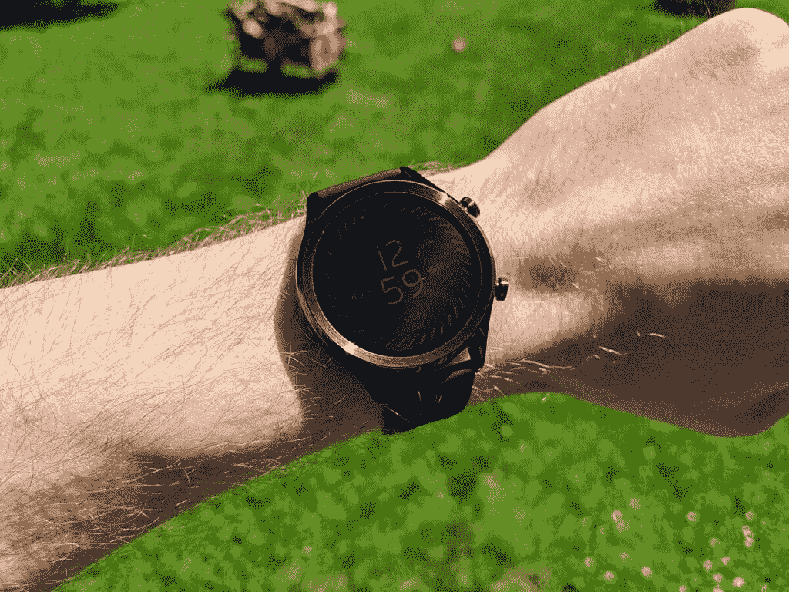

# TicWatch C2+评论:新的名称，旧的精神

> 原文：<https://www.xda-developers.com/ticwatch-c2-plus-review/>

Android 智能手机生态系统充满了家喻户晓的名字，如三星、LG、摩托罗拉和谷歌。然而，佩戴 OS 智能手表却没有同样的品牌认知度。当然，有像 [Fossil](https://www.xda-developers.com/fossil-gen-5-wear-3100-battery-modes/) 这样的知名品牌推出智能手表，但科技界的重量级人物大多缺席(或者就三星而言，[做自己的事](https://www.xda-developers.com/galaxy-watch-3-firmware-analysis-samsung-smartwatch-new-features/))。Mobvoi 是一家生产 Wear OS 设备的公司，它不是一个手表品牌，他们已经做了很长时间了。

[该公司最新的](https://www.xda-developers.com/ticwatch-c2-plus-1gb-ram-wear-os/) Wear OS 手表是 TicWatch C2+。这是两年前发布的第一代 TicWatch C2 的后续产品。众所周知，Mobvoi 会推出更新很少的新手表，而 TicWatch C2+肯定符合这种模式。与 2 年多前的型号相比，变化的数量可以用一只手来数。事实上，你只需要一根手指。这足以在 2020 年制造出引人注目的 Wear OS 手表吗？让我们找出答案。

|  | **TicWatch C2+** |
| **尺寸(毫米)** | 42.8 x 42.8 x 12.7 |
| **颜色** | 缟玛瑙、铂金、玫瑰金 |
| **表壳** | 不锈钢(正面) |
| **表带** | 真皮(可互换)，20 毫米和额外的黑色硅胶带 |
| **闸板** | 1GB |
| **操作系统** | 佩戴谷歌操作系统 |
| **兼容性** | 安卓、iPhone |
| **平台** | 高通骁龙威尔 2100 |
| **显示** | 1.3 英寸 AMOLED (360 x 360 像素) |
| **连通性** | 蓝牙 4.1 版，WiFi 802.11 b/g/n |
| **GPS** | GPS + GLONASS +北斗 |
| **传感器** | 加速度计、陀螺仪、心率传感器 |
| **NFC 支付** | 是(Google Pay) |
| **电池容量** | 400 毫安(1-1.5 天) |
| **防水等级** | IP68 |

## 这真的是新手表吗？

如前所述，Mobvoi 喜欢重新发布内部略有更新的旧手表。我们在 [TicWatch Pro 2020](https://www.xda-developers.com/ticwatch-pro-2020-review-upgrades-that-matter/) 上看到了这一点，它的设计与最初的 TicWatch Pro 完全相同。我的意思是相同的；它有完全相同的尺寸。Mobvoi 在 TicWatch C2+上做了同样的事情，我想谈谈这种方法。

一方面，智能手表制造商在一个系列中保持相同的设计并不罕见。三星正在用 [Galaxy Watch Active 系列](https://www.xda-developers.com/samsung-galaxy-watch-active-2-blood-pressure-monitoring-health-monitor-update-south-korea/)做这件事，Skagen Falster 2 和 3 看起来一样，等等。但它们只是一眼看上去一样。实际上，手表 Active 2 的显示屏比原来的更大。Falster 3 也是如此。另一方面，Mobvoi 根本没有改变物理设计。

看，那些其他制造商正在做的是非常普遍的。他们创造了一种设计语言，随后的设备也符合这种语言。然而，新设备是真正的*新*设备，具有不同的重量、尺寸、组件和功能。TicWatch C2+的设计不仅仅是为了看起来与 TicWatch C2 相似。它*就是*TIC watch C2。

公平地说，Mobvoi 并不意味着这些设备是全新的，甚至是原版的继承者。他们不叫它 C3 手表。尽管如此，继续推出本质上是回收旧手表的“新”手表确实让人感觉有点吃力。我很想看到 Mobvoi 带来一款全新的智能手表。

## TicWatch C2 设计

说完这些，让我们来谈谈设计本身。在我看来，TicWatch C2+是 Mobvoi 设计最好的手表。设计简洁明了，是我比较喜欢的。我知道不是每个人都喜欢我的设计，但与笨重的工业 TicWatch Pro 相比，TicWatch C2+是一股清新的空气。

表壳由不锈钢制成，底面是塑料。显示屏周围的边框经过倒角并略微凸起，以保护玻璃。直的金属边与塑料底相遇，并在下面弯曲。弧形底面让手表感觉就像高高地放在你的手腕上。边上的两个按钮相当突出，但它们并不碍事。他们也有非常好的旅行和令人满意的点击。

Mobvoi 为 TicWatch C2+提供了三种颜色:黑色(见本文图片)、银色和玫瑰金。黑色和银色型号相同，但玫瑰金型号的表带更窄(18 毫米对 20 毫米)。玫瑰金款上的按键也略有不同。它们是圆的，而其他型号是平的。最后一个设计注意事项是附带的表带。Mobvoi 为用户提供了一个配色的皮革带和一个额外的硅胶带。我真的很感激有两种选择。

正如我在之前的智能手表评论中所说，设计是非常主观的。就个人而言，这是我喜欢的手表设计类型。你可能不喜欢，没关系。

## 硬件和性能

 <picture></picture> 

Display in direct sunlight at full brightness

如果你还在阅读，你一定也是这个设计的粉丝，所以让我们来谈一点关于硬件的细节。首先是 1.3 英寸 AMOLED 显示屏。这是一款完美的显示器，具有深黑色和鲜艳的颜色，但有一个非常明显的缺点。TicWatch C2+没有用于自动亮度调节的环境光线传感器。

我花了一段时间才意识到这一点，因为我最初认为显示器的室外能见度真的很差。最终，我意识到显示屏不会自动调整，这是我开始依赖其他智能手表的地方。这意味着你可能会找到一个合适的中等亮度，并在大部分时间里保持这个亮度。我觉得在我所处的每种情况下手动改变亮度都不可行。电池寿命受到影响，因为在大多数情况下，你会希望相对明亮的设置是有用的。

我之前提到过，最初的 TicWatch C2 和 C2+之间只有一个区别。是拉姆。C2+有 1GB 的内存，而原来的有 512MB。正如我们在其他 Wear OS 设备中发现的那样，这在性能上产生了相当大的差异。C2+有相同的高通骁龙磨损 2100 作为原来的，这是令人失望的。Wear 3100 已经推出很长时间了，Mobvoi 仍然没有在任何智能手表上使用它。这并不像你预期的那样是一个大的升级，但是 Mobvoi 还没有采用它仍然很奇怪。然而，额外的 RAM 是一个很大的升级。性能和我用过的任何其他 Wear OS 设备一样好。也就是说*足够好*。

## TicWatch C2+电池寿命

TicWatch C2+配有 400 毫安时电池，电池寿命相当标准。我可以轻松度过一天，但试图延长到两天就很难了。如果你没有做任何认真的健康跟踪，这是可以做到的。我知道我们几乎都在夜间给手机充电，但我不喜欢每天给手表充电。三星 Galaxy 手表的电池续航时间似乎比 Wear OS 设备好得多。

很难谈论 Wear OS 设备的性能和电池寿命，因为它们通常都有相同的感觉。Wear 2100 和 Wear 3100 之间的区别并不明显，现在许多手表都有 1GB 的内存。这就是为什么人们说 Wear OS 是一个停滞不前的平台。谢天谢地，[一款新的骁龙耐磨芯片即将问世](https://www.xda-developers.com/qualcomm-snapdragon-4100-announcement-wear-os-smartwatches/)。

对于 TicWatch C2+的性能，我能说的是，它很好。我没有注意到任何相当大的滞后或口吃。即使在最初的设置过程中(这是 Wear OS 设备真正需要努力的地方)，我也没有遇到任何重大问题。它是市场上性能最好的智能手表吗？没有，它是否足以与其他 Wear OS 设备竞争？是的。

## 软件和健身

健康跟踪是智能手表可以做的很大一部分，TicWatch C2+在这方面有很多功能。除了标准的谷歌健身应用，Mobvoi 还包括了自己的健身应用套件。这个套件由 TicExcercise、TicPulse 和 TicMotion 组成。前两个和谷歌自带的健身应用差别不大，感觉有点没必要。另一方面，TicMotion 是一款人工智能应用，应该可以自动跟踪锻炼情况。可悲的是，它仍然不能很好地工作。

事实是，Wear OS 并不是一个很好的健身平台。如果你想把手机留在家里，一个只支持 Wi-Fi 的 Wear OS 设备本身能做的事情很少。这听起来可能是显而易见的，但在其他平台上并非如此。例如，通过我的三星手表，我可以在没有手机的情况下收听离线 Spotify 播放列表，并在 MapMyRun 中开始锻炼。Wear OS Spotify 应用程序没有离线功能，Wear OS MapMyRun 应用程序不能在没有手机的情况下启动任何东西。这非常令人沮丧，并且与其他操作系统相比，让 Wear OS 感觉极其不完整。

作为一个用过三星手表和 Wear OS 手表的人，我能看到的唯一真正吸引 Wear OS 的是谷歌的东西。在你的手腕上快速访问谷歌助手是很好的。Bixby 可以做基本的东西，但没那么有用。所有其他主要的谷歌应用在 Tizen 操作系统上都有可维护的替代品。仅仅为了谷歌助手而使用 Wear OS 值得吗？在我看来不是。

## 结论

TicWatch C2+是我在过去一年中使用的第三款 Wear OS 设备，我对这三款设备的结论基本相同:硬件不错，软件不错。如果我在评论一部智能手机，我会简单地建议从不同的制造商那里购买一部设备，以获得更好的软件。不过，有了 Wear OS，每款智能手表上的软件基本上都是一样的。一旦你决定使用 Wear 操作系统，它就只与硬件有关了。

这就是 TicWatch C2+的问题所在。对于 209.99 美元的价格，我认为你可以以更低或可比的价格找到更好的规格。例如， [Moto 360](https://www.xda-developers.com/new-moto-360-not-from-motorola/) 拥有更新的骁龙 Wear 3100 处理器、环境光线传感器、1GB 内存，价格降至 199 美元。这并不是说 TicWatch C2+是一个糟糕的交易。事实上，许多 Wear OS 设备的价格接近 300 美元。这完全取决于什么对你来说是重要的。

我真的很喜欢 TicWatch C2+的最小化和时尚的设计，但它最终不足以赢得我的心。Wear OS 的常见缺陷和一些小的硬件缺失使得整个软件包很难推荐。2018 年，TicWatch C2 是 Wear OS 粉丝的绝佳选择，但 RAM 的更新不足以将其延续到 2020 年。

**[从 Mobvoi](https://www.mobvoi.com/us/products/ticwatchc2plus) 购买 TIC watch C2+**