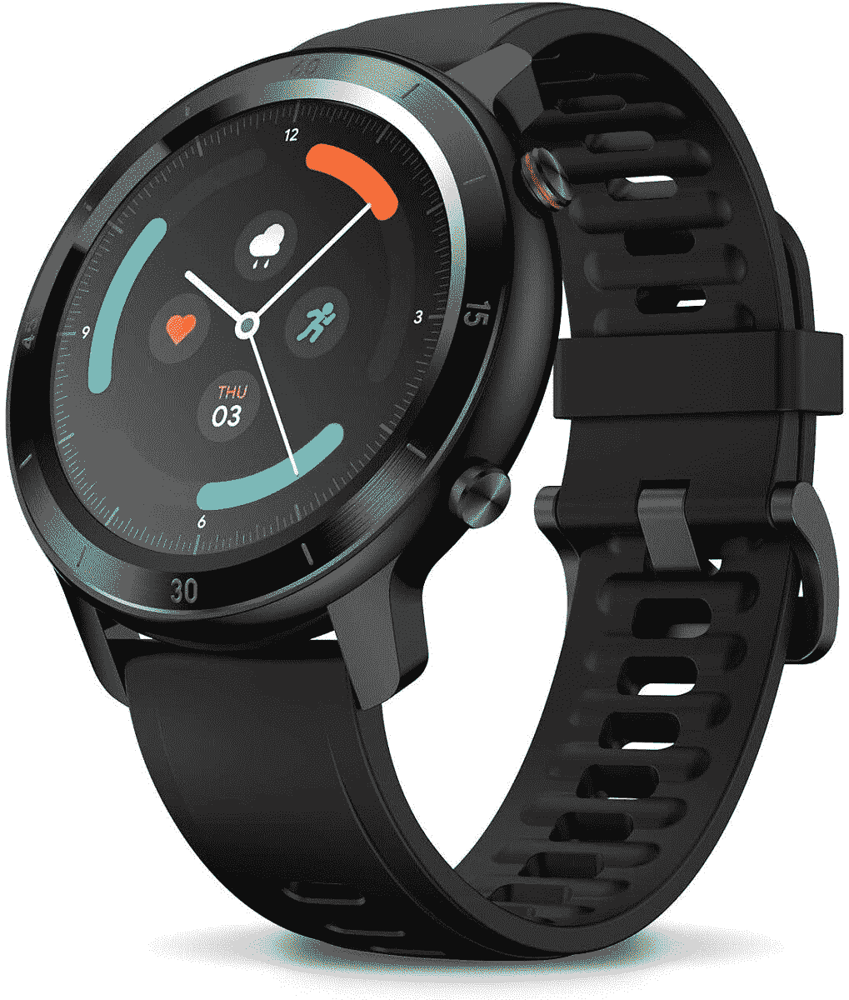

# TicWatch GTX 售价不到 50 美元，提供简单的跟踪功能

> 原文：<https://www.xda-developers.com/ticwatch-gtx-amazon/>

# 以不到 50 美元的价格购买一台 TicWatch GTX，享受追踪健康的简单

TicWatch GTX 可能没有更昂贵的智能手表的所有功能，但有时你想要一些简单的东西。

我不需要太多智能手表。见鬼，如果我必须诚实的话，我真的不想从我的智能手表得到太多。我大部分时间都带着智能手机，所以我真的不需要很多智能手表提供的大部分功能。当我的手机就在我的手表上时，我真的不需要像 Google Pay 和 Spotify 这样的东西。我在智能手表中寻找的是可以跟踪我的健康状况并激励我锻炼的东西。监控我的心率和睡眠也是很好的奖励。事实证明，TicWatch GTX 正是这么做的，你可以花不到 50 美元就买到一个！

因此，TicWatch GTX 提供了你期望智能手表具备的所有基本功能。它会计算你的步数，并通过 TicExercise 应用程序跟踪你的训练。你也可以在游泳池戴着它，因为这款手表的防护等级为 IP68，可以游泳。不过，你可能不应该把它带进海里。你会从手机上收到通知，GTX 能够智能地跟踪你的心率和睡眠，这有助于你的整体健康。

和...差不多就是这样！这款 TicWatch GTX 是一款非常简单的智能手表，老实说，这就是我喜欢它的原因。功能臃肿的智能手表真的不适合我，我敢肯定我不是唯一一个。虽然因为我的小手腕，我选择了 [Galaxy Fit 2](https://www.xda-developers.com/samsung-unveils-galaxy-a42-5g-galaxy-tab-a7-galaxy-fit-2-wireless-charger-trio-life-unstoppable-virtual-experience-event/) ，但就智能手表而言，TicWatch GTX 是我的第二选择，它能以低廉的价格做我需要它做的事情。

到底有多便宜？如果你在亚马逊页面上剪下 20%的优惠券，你就可以只花 48 美元买到这款智能手表。

 <picture></picture> 

TicWatch GTX

##### TicWatch GTX

如果你正在寻找一款能够完成基本工作的简单智能手表，那么你会想要 TicWatch GTX。通常是 60 美元，你可以在页面上剪下优惠券，只需 48 美元！

TicWatch GTX 也不是唯一在售的 Mobvoi 智能手表！前往他们的[亚马逊商店页面](https://www.amazon.com/stores/Ticwatch/page/9825633A-FB86-4185-B8E4-50779AC0E140?tag=xda-4tacero-20&ascsubtag=UUxdaUeUpU31108&asc_refurl=https%3A%2F%2Fwww.xda-developers.com%2Fticwatch-gtx-amazon%2F&asc_campaign=Short-Term)，获得更多优惠。