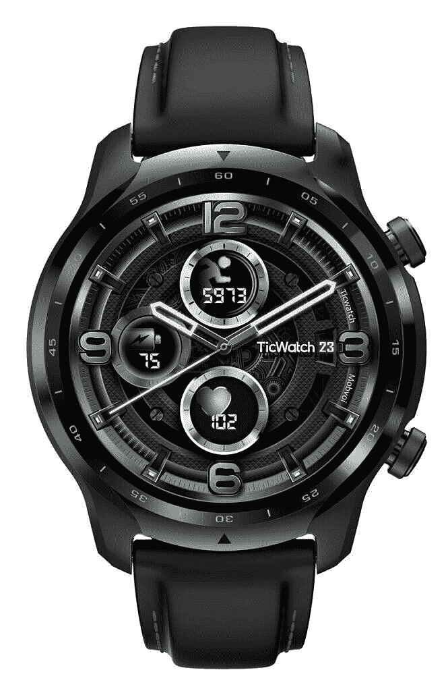

# 搭载 Snapdragon Wear 4100 的 TicWatch Pro 3 在印度面向₹27,999 推出

> 原文：<https://www.xda-developers.com/ticwatch-pro-3-snapdragon-wear-4100-launched-india/>

# 搭载 Snapdragon Wear 4100 的 TicWatch Pro 3 在印度面向₹27,999 推出

Mobvoi 在印度推出了 TicWatch Pro 3，并将搭载骁龙 Wear 4100 SoC 和 Wear OS 的智能手表带到了印度。

总部位于北京的 [Mobvoi 上个月推出了 TicWatch Pro 3](https://www.xda-developers.com/mobvoi-ticwatch-pro-3-smartwatch-google-wear-os-qualcomm-snapdragon-wear-4100-launch/) ，这是第一款采用[骁龙 Wear 4100 SoC](https://www.xda-developers.com/qualcomm-snapdragon-4100-announcement-wear-os-smartwatches/) 以及 [Wear OS 最新更新](https://www.xda-developers.com/google-announces-wear-os-based-on-android-11-new-version-snapdragon-wear-4100-support/)的智能手表。[我们对 TicWatch Pro 3](https://www.xda-developers.com/mobvoi-ticwatch-pro-3-review/) 的评论提到，它确实拥有出色的电池续航时间、出色的性能、出色的显示屏，以及一系列其他功能。如果你在印度，并且希望得到这款智能手表，你会很高兴知道 Mobvoi 现在已经在印度推出了 TicWatch Pro 3。

## TicWatch Pro 3:规格

| 规范 | TicWatch Pro 3 |
| --- | --- |
| **尺寸&重量** |  |
| **显示** |  |
| **表带尺寸** | 22 毫米，硅胶 |
| **SoC** | 高通骁龙 Wear 4100 |
| **内存** | 1GB 内存，8GB 存储空间 |
| **连接性&附加功能** |  |
| **GPS** |  |
| **传感器** |  |
| **NFC 支付** | 是的，Google Pay |
| **电池** | 577 毫安时 |
| **耐久性** | IP68 |
| **操作系统** | 佩戴操作系统 |
| **颜色** | 阴影黑色 |

除了新 SoC 和新 Wear OS 更新的头条功能之外，这款手表还有一些自己的技巧。该设备采用了双显示技术，包括覆盖在更智能的 AMOLED 显示屏上的模拟 FSTN LCD。智能手表上的智能模式可为您提供长达 72 小时的电池续航时间，而增强的基本模式可为您提供长达 45 天的电池续航时间。在两种模式之间切换就像轻弹手腕一样简单。对于传感器，智能手表配有一个气压计，用于测量海拔高度，并支持五个全球导航卫星系统，用于精确的位置跟踪。你还可以从该公司获得一系列用于健康跟踪的应用程序，如 TicPulse、TicHealth、TicMotion、TicExercise、TicSleep、TicOxygen、TicZen、TicBreathe 和 TicHearing。

## 定价和可用性

TicWatch Pro 3 将在印度₹27,999 发售(约 382 美元)。这款设备[在亚马逊](https://www.amazon.in/TicWatch-Smartwatch-Dual-Layer-Display-Battery/dp/B08BRFWGMC?tag=xdaportalin-21)有售，有单一的阴影黑色选项。