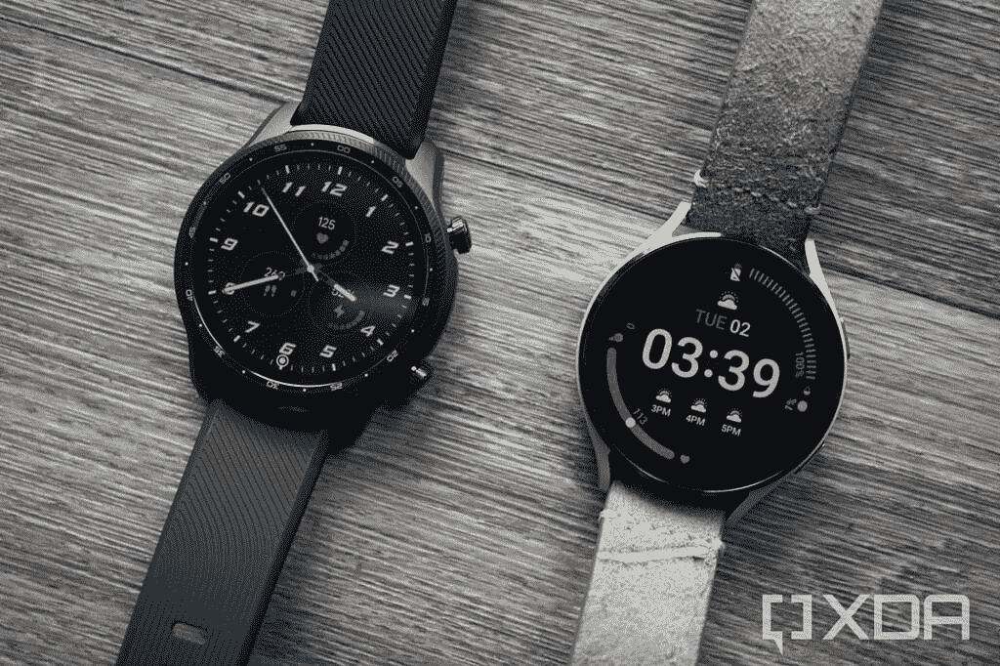
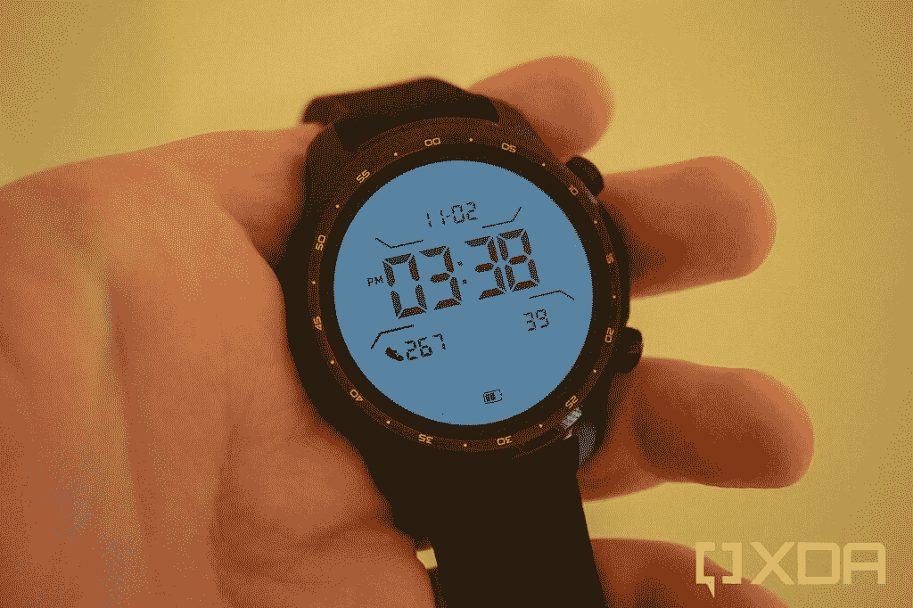
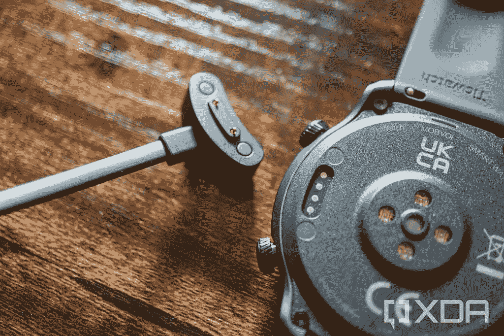
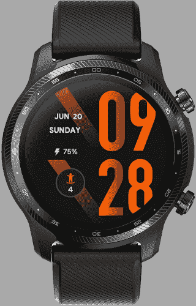

# TicWatch Pro 3 超 GPS 评论:智能手表的 G-Shock

> 原文：<https://www.xda-developers.com/ticwatch-pro-3-ultra-gps-review/>

过去几年来，Mobvoi 一直是谷歌 Wear OS 平台的主要火炬手之一，提供了从预算较低的 TicWatch 'E '系列到功能更丰富的 Pro 阵容的所有产品。该公司的 Pro 型号多年来一直采用相同的基本设计，双层显示屏在智能手表中仍然是独一无二的。

上个月，Mobvoi 发布了改进了健康跟踪功能和一些小的硬件调整的 TicWatch Pro 3 Ultra。这款新手表没有太多令人兴奋的地方，尤其是如果你拥有[最初的 TicWatch Pro 3](https://www.xda-developers.com/mobvoi-ticwatch-pro-3-review/) ，但它肯定仍然是你目前能买到的最好的兼容 Android 的智能手表之一。

| 

规格

 | 

Mobvoi TicWatch Pro 3 Ultra

 |
| --- | --- |
| **打造** | 聚碳酸酯和玻璃纤维 |
| **尺寸&重量** | 

*   44 x 47 x 12.6 毫米
*   32 克

 |
| **显示** | 

*   1.4 英寸 454 x 454 326ppi AMOLED
*   FSTN 单色屏幕

 |
| **SoC** | 

*   高通骁龙 Wear 4100
*   Mobvoi“双处理器系统”

 |
| **闸板&存放** |  |
| **电池&充电** | 

*   380 毫安时
*   专有 pin 充电器

 |
| **音频** | 内置扬声器和麦克风 |
| **连通性** | 

*   蓝牙 5.0
*   无线网络 4 (802.11b/g/n)
*   GPS，北斗，Glonass，伽利略，QZSS
*   用于 Google Pay 的 NFC

 |
| **软件** | 谷歌的 Wear OS 2(Wear OS 3 预计明年更新) |
| **其他特征** | 

*   IP68 防水/防尘等级
*   晴雨表
*   加速计
*   陀螺仪传感器
*   高清 PPG 心率传感器
*   血氧饱和度传感器

 |

***关于本次评测:** Mobvoi 为我们提供了一款 TicWatch Pro 3 Ultra 用于本次评测。Mobvoi 在上线之前没有看到这篇评论，该公司也没有对这篇评论进行任何编辑。*

## 设计和硬件

最新的 TicWatch Pro 3 Ultra 在设计上与之前的 [TicWatch Pro 3](https://www.xda-developers.com/mobvoi-ticwatch-pro-3-review/) 几乎一模一样。它肯定更笨重，与 [Fossil Gen 6](https://www.xda-developers.com/fossil-gen-6-smartwatches-with-snapdragon-wear-4100-go-on-sale-in-u-s-india-and-other-regions/) 和[三星 Galaxy Watch 4 Classic](https://www.xda-developers.com/samsung-galaxy-watch-4-classic-review/) 的构造相似。与其他一些大型智能手表不同，表圈没有在屏幕周围凸起，但它们的边缘仍然印有时间增量。我从来不喜欢在智能手表边框上蚀刻数字，但这在 TicWatch Pro 上似乎特别愚蠢，因为环境显示器只有一个数字表盘。

 <picture></picture> 

TIcWatch Pro 3 Ultra (left) next to 44mm Galaxy Watch 4 (right)

说到这里，TicWatch Pro 3 Ultra 保留了之前 Pro 机型使用的相同“双显示器”技术。有一个标准的 1.4 英寸圆形 AMOLED 触摸屏用于使用 Wear OS，但当手表不使用时，AMOLED 会关闭，手表会切换到单色时钟，看起来像任何标准的数字手表。你可以在设置中重新启用标准的 Wear OS 永远在线显示，但这样你就失去了 TicWatch 的一个主要功能。

就像去年一样，你也可以将 TicWatch 切换到低功耗模式，关闭 Wear OS，同时保持数字 LED 时钟和一些有限的健身跟踪。如果你的手表电池电量低，而且你离充电器还有几个小时(或几天)的时间，这是很有帮助的，但老实说，我没怎么用过。

 <picture></picture> 

Ambient display on TicWatch Pro 3 Ultra

手表的右侧有两个按钮——顶部的一个带你回家到钟面(或者打开应用程序启动器，如果你在钟面上)，底部的一个是快捷键。默认情况下，快捷按钮会显示您可以开始记录的健身程序列表，但您可以将其设置为打开任何已安装的应用程序。按住顶部按钮打开谷歌助手，按住底部按钮进入电源菜单。

Mobvoi 仍然拒绝在其手表上添加数字表冠

我的一个主要抱怨是 TicWatch Pro 3 Ultra 没有硬件滚动机制。侧面没有苹果和 Fossil 智能手表多年来一直有的“数字表冠”，也没有 Galaxy Watch 4 Classic 那样的旋转表圈。虽然侧面的按钮是旋转的，但这纯粹是为了装饰。在 1.4 英寸的屏幕上浏览应用程序并不是一种很好的体验，我不明白为什么 Mobvoi 仍然拒绝为其手表添加数字表冠。

手表背面有充电引脚，中央还有一系列健康传感器。与 Mobvoi 的其他可穿戴设备(以及几乎所有的 Wear OS 智能手表)一样，TicWatch Pro 3 Ultra 使用了一种专有的 pin 充电器，另一端带有 USB Type-A 连接器。盒子里没有墙上电源适配器。

 <picture></picture> 

Back of TicWatch with charger

## 软件

TicWatch Pro 3 Ultra 安装了几乎所有其他 Wear OS 智能手表目前都在运行的 Wear OS 2.x 软件，Galaxy Watch 4 是主要的例外(它安装了 Wear OS 3)。如果你在过去几年里使用过任何一款 Wear OS 手表，在这里你都不会发现任何惊喜。TicWatch 显示来自手机的通知，跟踪健康数据，并允许你从 Play Store 上的数千种定制手表外观中进行选择。一些佩戴 OS 3 的应用也逐渐开始佩戴 OS 2 手表，[比如 YouTube Music](https://www.xda-developers.com/youtube-music-rolling-out-to-some-wear-os-2-watches/) 。

不过，Mobvoi 对 Wear OS 做了一些改变。应用列表显示为网格，每行两个图标，而不是大多数其他 Wear OS 手表上的简单列表。最重要的是，Mobvoi 自己的 TicHealth 是主要的健康跟踪服务。TicHealth 是唯一一个可以记录手表不规则心跳(IHB)和 AFib 传感器数据的平台，但除此之外，Google Fit 的工作方式与其他所有 Wear OS 手表一样。

我没有注意到用 TicHealth 记录心跳数据有任何问题，但我也没有任何专业的医疗设备来比较结果，所以我不能肯定地说信息是否准确。TicHealth 的其他功能与 Google Fit 类似，但我确实注意到了一些问题——锻炼需要几分钟才能从手表同步到我的手机，手表永远无法自动检测某些类型的锻炼(特别是户外散步和骑自行车)。Mobvoi 显然已经做了大量的工作来创建自己的健康平台，但它似乎并不比其他所有 Wear OS watch 与 Google Fit 相比更好。

TicWatch Pro 3 Ultra [应该会在“2022 年中到下半年”的某个时候收到 Wear OS 3](https://support.google.com/wearos/thread/118166873/what-wear-os-3-means-for-you) 的更新，以及标准的 TicWatch Pro 3、TicWatch E3 和 Fossil Gen 6。然而，我总是建议不要在科技产品拥有你想要的功能之前购买它们——如果 Wear OS 3 是一个交易破坏者，请等到更新真正到来，或者购买 Galaxy Watch 4。

## 性能和电池寿命

TicWatch Pro 3 Ultra 采用了与 TicWatch 3 Pro 相同的骁龙 Wear 4100 芯片组。这比你在 Fossil Gen 6 中可以获得的 Wear 4100+低了一步，但与 4100 的主要区别是改进的 AOD 和低功耗健康跟踪，这主要是由 Mobvoi 通过其定制硬件自行实现的。例如，TicWatch 的默认常亮显示屏是几乎不耗电的数字时钟。

我一次充电可以正常使用 3-4 天

我没有注意到 TicWatch 的性能有任何问题——大多数最新的 Wear OS 手表都有相同的芯片组(或者稍微好一点的)，所以这并不令人惊讶。动画流畅，大部分 app 打开都很快。承诺的 Wear OS 3 更新后性能会怎么样，只有时间才能告诉我们。

在 TicWatch Pro 3 Ultra 上，电池续航时间是一个惊喜。我使用的所有智能手表都启用了常亮显示屏，这是电池寿命的主要限制因素，但 TicWatch 的辅助数字时钟比 AMOLED 屏幕耗电少得多。我一次充电可以正常使用 3-4 天(每天戴几个小时，偶尔跟踪锻炼)，这比我用大多数其他智能手表大约 2 天的时间有所改善。

## 结论

TicWatch Pro 3 Ultra 绝对是目前最好的 Wear OS 手表之一，但不可否认的是，它是现有 TicWatch Pro 3 的小升级。外观使用不同的材料，硬件也有一些小的变化，但这不是一个根本不同的产品。如果你已经有了 TicWatch Pro 3，你可能没有理由升级到 Ultra。

TicWatch Pro 3 Ultra 是对现有 TicWatch Pro 3 的小幅升级

TicWatch 的主要竞争对手是 [Galaxy Watch 4 和 Watch 4 Classic](https://www.xda-developers.com/samsung-galaxy-watch-4/) 。我一直使用 Galaxy Watch 4 作为我的主要手表，我肯定更喜欢它更时尚的设计，而不是 TicWatch Pro 3 Ultra 更笨重的 G-Shock。三星最新的可穿戴设备也运行 Wear OS 3，而 TicWatch 要到明年的某个时候才会更新——前提是 Mobvoi 和谷歌兑现承诺。三星也有轻微的价格优势，因为较小的 40 毫米 Galaxy Watch 4 [售价 250 美元](https://www.amazon.com/Samsung-Electronics-Smartwatch-Detection-Bluetooth/dp/B096BKNBKR?tag=xda-7epj07u-20&ascsubtag=UUxdaUeUpU5765&asc_refurl=https%3A%2F%2Fwww.xda-developers.com%2Fticwatch-pro-3-ultra-gps-review%2F&asc_campaign=Short-Term)，TicWatch Pro 3 Ultra 售价 300 美元。

如果你肯定想要 TicWatch 独特的双显示器功能，或者你更喜欢笨重的设计，我对 Pro 3 Ultra 没有太多抱怨。对于其他人来说，Galaxy Watch 4 或 Fossil Gen 6 可能是更好的选择。

 <picture></picture> 

Mobvoi TicWatch Pro 3 Ultra

##### Mobvoi TicWatch Pro 3 Ultra

Mobvoi 最新的 TicWatch 是 Pro 3 的一次小的硬件升级，但它仍然是唯一一款具有 LED 时钟模式的智能手表。