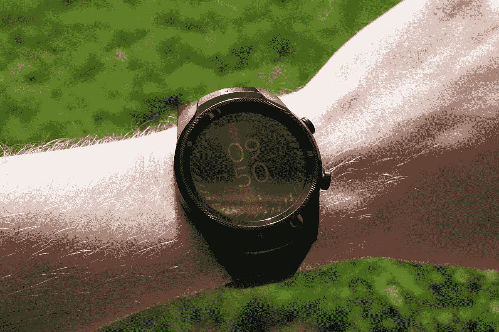
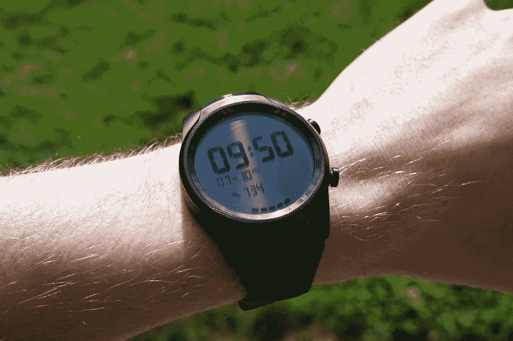
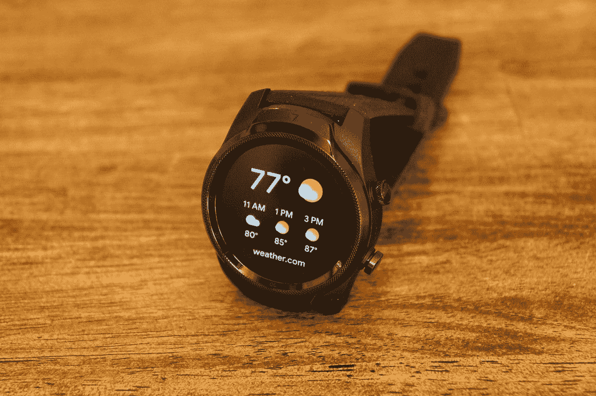

# TicWatch Pro 4G/LTE 第一印象:两块显示屏好看两倍

> 原文：<https://www.xda-developers.com/ticwatch-pro-4g-lte-first-impressions-two-displays-are-twice-as-nice/>

今天发布的 TicWatch Pro 4G/LTE [是原版的升级版。这是一款 Wear OS 设备，但我现在还不打算谈论常见的 Wear OS 比喻。我们经常听说谷歌不关心平台，市场上没有多少有趣的选择，芯片组如何降低性能，等等。所有这些，在很大程度上，可以被认为是真实的。TicWatch Pro 4G 与其他 Wear OS 设备有很多相同的缺点，但它有足够的额外功能来克服这些问题吗？](https://t.co/ifmUarJu97)

Mobvoi 是目前仍在生产 Wear OS 设备的少数几家公司之一。TicWatch Pro 4G/LTE 是他们第一款具有蜂窝连接功能的智能手表。硬件几乎与[蓝牙/Wi-Fi 型号](https://www.xda-developers.com/ticwatch-pro-layered-display-30-day-battery/)相同，但增加了 4G/LTE 功能，让你可以不带手机就把手表拿出来。至少，是这样的想法。

4G/LTE 连接在发布时不可用。一个月后，威瑞森的用户将可以连接到网络。Mobvoi 允许媒体提前测试 4G/LTE 连接，但在此之前，这只是“第一印象”稍后我会进行全面检讨。

| 

规范

 | 

TicWatch Pro 4G/LTE

 |
| 大小 | 45.15 x 52.8 x 12.6，47.4 克 |
| 颜色；色彩；色调 | 黑色 |
| 显示器玻璃 | 大猩猩玻璃 3 |
| 案例材料 | 聚酰胺和玻璃纤维，不锈钢表圈，铝制后盖 |
| 表带 | 硅胶(可互换)，22 毫米 |
| 操作系统（Operating System） | 佩戴操作系统 |
| 手机兼容性 | 安卓、iPhone |
| 社会学 | 高通骁龙 Wear 2100 |
| RAM/存储 | 1GB 内存，4GB 存储 |
| 网络 | 4G/LTE FDD |
| 显示 | 1.39 英寸 AMOLED (400 x 400 像素)+ FSTN 液晶显示器 |
| 连通性 | 蓝牙 4.2 版+ BLE，WiFi 802.11 b/g/n |
| 全球（卫星）定位系统 | GPS + GLONASS +北斗 |
| 传感器 | PPG 心率传感器、加速度计、陀螺仪、电子罗盘、环境光传感器、低延迟体外传感器 |
| NFC 支付 | 是的，Google Pay |
| 电池 | 415 毫安时 |
| 军用标准 810G | 能承受-30℃到 70℃之间的温度冲击；工作温度在-20℃至 55℃之间；57 千帕压力；44℃太阳辐射；95%湿度；盐雾；沙尘；震惊 |
| IP 等级 | IP68 +游泳池游泳适用 |

## TicWatch Pro 4G/LTE 设计

TicWatch Pro 4G/LTE 的设计与原版完全相同。这取决于你的风格偏好，可能是也可能不是一件好事。很多人喜欢大而笨重的手表，显示屏上有滚花和数字(即使它们在智能手表上没有任何用途)。它不合我的胃口，但这并不意味着它是一块难看的手表。

无可否认，这是一只很大的手表。Mobvoi 确实设法让它比原来轻了 11g，但它仍然是一块厚手表。我习惯戴三星 Gear Sport，比 TicWatch Pro 4G 薄 1mm。这可能看起来不多，但它有相当大的区别。Gear Sport 其实重了 20g，但是戴在手腕上感觉小了很多。这在很大程度上与 TicWatch Pro 4G 的外壳尺寸更大有关。

右边的两个按钮非常突出，发出非常令人满意的咔哒声。顶部按钮有几个用途。它会带你回家(钟面)，从主屏幕打开应用抽屉，长按打开谷歌助手，如果你继续长按，你会得到电源菜单。底部的按钮是“功能”单按可以被编程为启动一个应用程序，双击会打开 Google Pay(或其他支付应用程序)，长按会打开 SOS、基本模式、重启和关机的快捷菜单。

TicWatch Pro 4G 自带的表带是相当标准的硅表带。当我戴着它活动时，我的手腕出汗了，正如你在照片中看到的，它收集了灰尘和其他颗粒。值得庆幸的是，这款表带可以快速拆卸，因此很容易更换成不同的 22 毫米表带。

## TicWatch Pro 4G/LTE 显示屏

 <picture></picture> 

AMOLED outside

对我来说，TicWatch Pro 4G/LTE 的突出特点是双层显示屏。有两种显示技术正在被利用:LCD 和 AMOLED。Wear OS 界面采用分辨率为 400 x 400 的 AMOLED 显示屏。这被称为“智能模式”LCD 显示屏显示时间、日期、心率、步数和电池电量。每当 AMOLED 显示屏不显示时，该显示屏就会显示，并且它使用非常少的电池。

“基本模式”是一个非常方便的电池节省功能，只使用液晶显示器。它本质上把设备变成了传统的手表，但它确实可以跟踪步数和心率。在基本模式下，您可以将电池续航时间延长至 30 天。

 <picture></picture> 

LCD outside

液晶显示器的一大好处是户外能见度。在阳光直射下，阅读 LCD 要比阅读 AMOLED 容易得多。由于它使用如此少的电池，你不必担心选择始终看到时钟或杀死你的电池。这是智能手表的一个大问题。你想一直看到时钟，就像传统的手表一样，但这是有代价的。液晶显示屏解决了这个问题，现在我希望每块智能手表都有液晶显示屏。在我看来，这是智能手表真正的游戏规则改变者。

AMOLED 显示屏不是我在智能手表上见过的最好的显示屏之一。当你需要比液晶显示器更多的东西时，室外的能见度很低。但在良好的照明条件下，颜色看起来很好，分辨率也是我对智能手表的期望。没什么特别的。

## 健身功能

TicWatch Pro 4G/LTE 在你的手腕上放置了许多健身功能。你有两个平台可以选择:Google Fit 和 Mobvoi 自己的 TicHealth 套件。Mobvoi 的应用包括 TicHealth、TicPulse、TicExercise 和一个泳池运动的快捷方式。谷歌健身包括主要的健身应用程序，健身呼吸和健身锻炼。大多数人会倾向于坚持使用谷歌自己的应用程序，但 Mobvoi 确实提供了一些健身爱好者会喜欢的功能。

锻炼检测使跟踪你的所有活动变得非常容易。当我骑车或散步时，我经常忘记开始锻炼。TicExercise 可以自动检测锻炼并开始记录。在现实世界中，我得到了混合的结果，尤其是骑自行车的时候。在接下来的几周里，我会对此进行更多的测试。

另一个有用的功能是 24/7 被动心率记录。这项功能似乎不会影响电池寿命，甚至可以在基本模式下工作。这些数据在手表上进行了很好的颜色编码和组织，但不幸的是，它在 Mobvoi 的配套应用程序中无法查看。

说到 Mobvoi 的手机 app，其实没什么必要。即使在手表上使用 Mobvoi 的健身功能，也不需要手机 app。它所做的只是在一个类似 Apple Watch 的圆形图表中显示非常基本的健身数据。

来自三星 Gear Sport，我发现 TicWatch Pro 的健身功能有点欠缺。我也能追踪同样的事情，但是我需要更多的投入。这种体验并不像我希望的那样不受干扰。我不知道我应该责怪 Mobvoi 还是谷歌。健身是 TicWatch Pro 4G 的一个重要组成部分，尤其是当蜂窝连接上线时。

## 佩戴操作系统

在我深入思考 Wear OS 之前，先了解一下我的背景。我从一开始就使用 Android Wear 的 Moto 360，但后来我用了很长时间才过渡到 Pebble。最近，我一直在使用 Gear Sport。所以 Wear OS 从我上次用到现在*变化很大*。

来自 Tizen(一个 UI，不管他们现在叫它什么)，Wear OS 的设置过程很粗糙。过了一段时间才明白电源键不是后退键。返回需要从左向右滑动。从我上次使用 Android Wear 开始，我就希望我所有兼容手表功能的手机应用程序都已经存在了，但我必须单独安装它们。Wear OS 已经发展成为一个独立的操作系统，而我的 Gear Sport 更像是手机的扩展。

很难从一个你已经非常熟悉的操作系统转向一个新的操作系统，并且对第一个操作系统没有偏见。话虽如此，我确实认为有些事情三星比谷歌做得更好。我不认为智能手表 OS 需要 home 键。你通常不会深入到手表应用程序中，所以我认为只需按一个按钮就能返回就可以达到同样的目的。在小屏幕上，比起手势，我更喜欢使用触觉按钮。

这不是谷歌或 Mobvoi 的错，但三星的旋转边框真的宠坏了我。戴上 OS 的应用抽屉和磁贴*求*用边框滚轮滚动。我在 TicWatch Pro 上非常想念它，现在三星[似乎要永远抛弃它](https://www.xda-developers.com/samsungs-galaxy-watch-active-2-ecg-support/)，这让我更加难过。

 <picture></picture> 

Weather Tile

说到磁贴，这是对 Wear OS 的一个[的巨大补充。三星有一个类似的功能叫做“Widgets ”,非常方便。我经常使用天气磁贴，定时磁贴也很方便。智能手表的用户界面应该尽可能的简洁。Widgets/Tiles 允许您在不打开特定应用程序的情况下快速浏览信息。](https://www.xda-developers.com/wear-os-app-updated-manage-tiles/)

Wear OS 最糟糕的地方已经被很好的证明了:性能。让最初的设置过程如此令人沮丧的一个原因是缓慢。动画很糟糕，触摸屏有时没有反应，感觉就像是我在和手表战斗。一旦我通过了最初的设置，性能就稳定下来了，现在看起来很好。不过，Wear 2100 上的 Wear OS 充其量也没有三星手表那么流畅。

我在这款手表上遇到的一个合理的问题是 Google Pay。我可以在手机上毫无问题地使用 Google Pay，但我无法在手表上设置它。我在手表上开始设置，然后它在我的手机上打开，这样我就可以确认我的卡，当我提交以完成设置时，我得到一个错误，说“无法完成设置以在商店支付。”它说我的手机不能使用，因为它是“根或以其他方式改变。”我的手机没有根，正如我提到的，它可以使用 Google Pay。我不知道这是怎么回事。

## TicWatch Pro 4G/LTE 性能

正如上一节简要提到的，性能是 Wear OS 的一个已知问题，这也是我在 TicWatch Pro 4G/LTE 上注意到的问题。手表突突地通过了初始设置过程，从那以后它基本上没问题。关于 4G/LTE 型号需要注意的一点是，它有 1GB 的内存，比最初的 TicWatch Pro 多。由于没有用过原版，我不知道它在性能上是否有很大的不同。无论如何，这款手表显然不在我的 Gear Sport 的同一水平上，它已经有 2 年历史了。对于大多数人来说，性能可能还可以，但谷歌的智能手表平台急需更好的芯片组。

电池寿命相当不错。我可以充电 2 天左右，但在第二天快结束时，我将非常接近基本模式。这是启用 24/7 心率监测和跟踪锻炼的结果。在我使用智能手表的经验中，2-3 天的电池续航时间相当不错。如果你禁用了一些背景功能，如 24/7 心率、NFC、Wi-Fi 等，你可以进一步延长它。基本模式非常适合当你想挤出一些额外的果汁，而手腕上仍然有一个功能手表的时候。

TicWatch Pro 4G/LTE 自带的充电底座是扁平的，有磁性。该坞站需要一个标准的 USB 墙壁适配器，因为它没有无线充电功能，所以您需要随身携带。手表在大约两个小时内从 0-100%充电。我发现 dock 使用起来有点麻烦。当手表没有对接时，它不想平放。我想看看更重的东西。

接下来几周，我会密切关注表现。

## 最初的想法

在使用 TicWatch Pro 4G/LTE 大约 5 天后，我的第一印象大多是正面的。我对 Wear OS 有一些明确的问题，我还没有对 Mobvoi 的健身功能感兴趣。然而，我的许多批评归结为“这不是我习惯的手表”，这并不完全公平。在接下来的几周里，我将继续把这款手表作为我的日常驾驶，并进一步熟悉它。

总的来说，我认为这是一款不错的 Wear OS 手表。感觉不便宜，这很好，因为不是。双层显示屏是一个真正伟大的功能。我希望手表更小更时尚，但这只是我个人的风格偏好。

我非常有兴趣了解蜂窝连接如何影响我的体验。自从第一款具有蜂窝连接功能的智能手表上市以来，我就一直怀疑它的好处。我无法想象自己离开家不带手机，在另一个设备上支付数据听起来也没有吸引力。当我开始尝试的时候，我们会看到我的看法是否会改变。

截至目前，TicWatch Pro 4G/LTE 为 Wear OS 提供了超值套餐。如果你现在正在寻找一款 Wear OS 设备，我认为双层显示屏足以改变游戏规则，值得一看 TicWatch Pro 4G/LTE。