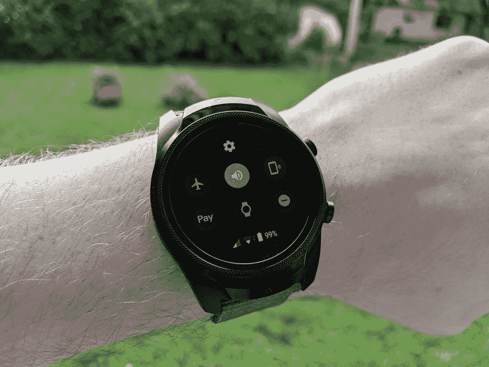

# TicWatch Pro 4G/LTE 评测——仅好于其最薄弱的环节

> 原文：<https://www.xda-developers.com/ticwatch-pro-4g-lte-review-only-as-good-as-its-weakest-link/>

今年夏天充斥着 Android 手机的发布和上市，但不久前我们也有了一款新的智能手表。TicWatch Pro 4G/LTE 于 7 月宣布[，但给予它名字的 LTE 连接是](https://www.xda-developers.com/ticwatch-pro-4g-lte-first-impressions-two-displays-are-twice-as-nice/)[直到 8 月中旬](https://www.xda-developers.com/ticwatch-pro-4g-lte-launch/)才可用。在使用支持 LTE 的 TicWatch Pro 4G 几周之后，我终于准备好对这款手表进行全面评测了。

在我们开始之前，这里有一个关于 TicWatch Pro 4G 的小背景故事。最初的 TicWatch Pro 是在一年多前推出的，只有 Wi-Fi 和蓝牙。这是 Mobvoi 首次进入更昂贵的高端智能手表领域。TicWatch Pro 4G 保留了相同的设计和大部分规格，但增加了更多 RAM 和 LTE 连接。Mobvoi 最好的硬件和聪明的想法足以克服 Wear OS 的缺点吗？让我们找出答案。

| 

规范

 | 

TicWatch Pro 4G/LTE

 |
| 大小 | 45.15 x 52.8 x 12.6，47.4 克 |
| 颜色；色彩；色调 | 黑色 |
| 显示器玻璃 | 大猩猩玻璃 3 |
| 案例材料 | 聚酰胺和玻璃纤维，不锈钢表圈，铝制后盖 |
| 表带 | 硅胶(可互换)，22 毫米 |
| 操作系统（Operating System） | 佩戴操作系统 |
| 手机兼容性 | 安卓、iPhone |
| 社会学 | 高通骁龙 Wear 2100 |
| RAM/存储 | 1GB 内存，4GB 存储 |
| 网络 | 4G/LTE FDD |
| 显示 | 1.39 英寸 AMOLED (400 x 400 像素)+ FSTN 液晶显示器 |
| 连通性 | 蓝牙 4.2 版+ BLE，无线网络 802.11 b/g/n |
| 全球（卫星）定位系统 | GPS + GLONASS +北斗 |
| 传感器 | PPG 心率传感器、加速度计、陀螺仪、电子罗盘、环境光传感器、低延迟体外传感器 |
| NFC 支付 | 是的，Google Pay |
| 电池 | 415 毫安时 |
| 军用标准 810G | 能承受-30℃到 70℃之间的温度冲击；工作温度在-20℃至 55℃之间；57 千帕压力；44℃太阳辐射；95%湿度；盐雾；沙尘；震惊 |
| IP 等级 | IP68 +游泳池游泳适用 |

## TicWatch Pro 4G/LTE 设计

当我想到 TicWatch Pro 的设计时，一个词跃入我的脑海:矮胖。无可否认，这是一只很大的手表。显示屏很大，机身很厚，表带表耳周围有很多材料。将尺寸与市场上的其他智能手表进行比较，我感到惊讶的是，它实际上并不比普通手表厚多少。车身的整体设计和尺寸让*感觉*笨重。

手表设计比我们今天在智能手机上看到的有更多的变化。这意味着会有人喜欢每块手表的设计，也会有人讨厌每块手表的设计。这是非常私人的。在这方面，TicWatch Pro 也没有什么不同。有些人喜欢厚重的工业滚花金属外观，而另一些人则喜欢更干净简单的外形。我倾向于属于后一类，但我并不觉得 TicWatch Pro 有*丑*。我把它戴在手腕上已经一个多月了。

TicWatch Pro 设计的好处是没有太多不必要的风格。工业设计的智能手表通常会试图看起来像一只“真正的手表”，在显示屏周围有一个假表盘。Mobvoi 在这里并没有走极端。显示屏和电源按钮周围的滚花边缘足以突出工业设计。附带的硅胶带也很不错，但你可能会想换掉它(上图中的带子来自[发条协同](https://www.clockworksynergy.com/))。

## 双层显示器

TicWatch Pro 4G 的显示屏与最初的 TicWatch Pro 相同。这意味着一个 1.39 英寸的 OLED 面板(400 x 400)和一个 LCD 面板。据我所知，双层显示屏是这款手表的突出特点。这是一种双管齐下的方法，对佩戴者来说等于零。这个功能并不新鲜，因为它与最初的 TicWatch Pro 相同，但它仍然很出色。

有机发光二极管的展示很好，但并不特别出色。它又脆又亮，颜色也很好。你买的是高级手表，这确实是高级有机发光二极管展示。当谈到智能手表显示屏时，我通常会谈到的负面问题，如阳光下的可视性，都通过液晶面板解决了。

*液晶显示屏在阳光直射下更容易看清*

那块液晶面板是透明的，它位于有机发光二极管显示器的顶部。当有机发光二极管显示屏关闭时，LCD 开始显示时间、日期、电池电量、步数，甚至心率。这就是辅助显示器真正派上用场的地方。智能手表让我恼火的一点是，如果你想获得良好的电池续航时间，你几乎必须禁用“永远在线”显示屏。有了 LCD 面板，您可以享受无电池消耗的持续显示的好处。

“基本模式”是副显示器的另一大特色。当电池电量达到极低水平时，基本模式就会启动。这种模式*实质上是*将手表变成“哑表”您可以看到 LCD 面板上显示的所有信息(时间、日期、步骤等)，但智能功能(即有机发光二极管)不可用。这使得手表在普通智能手表成为你手腕上的沉重负担后，仍能长时间保持有用。

有一件事，我希望二次显示器有:定制。液晶屏上显示的“表盘”无法更改。这是一个完全可以接受的表盘，但我希望能够自定义时钟字体或决定显示哪些信息。

## 4G LTE 连接

 <picture></picture> 

Connectivity signal strength

LTE 显然是 TicWatch Pro 4G 的很大一部分。毕竟是以设备的名义。作为一个平台，Wear OS 也是一件大事，因为这是第一款采用谷歌智能手表操作系统的设备，具有 LTE 连接功能(Android Wear 有一些)。你只能在威瑞森的 LTE 网络上使用 TicWatch，该网络确实覆盖了大部分地方，但不幸的是只有一个运营商选择。这是我拥有的第一块具有蜂窝连接功能的手表，所以我非常好奇它会对我的使用产生什么影响。

典型的智能手表通过蓝牙或 Wi-Fi 与手机保持连接。基本上，只要你呆在同一栋大楼里，你的手表就会被连接起来。加入 LTE 意味着你可以去任何地方。手表将始终能够与您的手机通信。你仍然会收到通知，并能够在手表上使用 Wear OS 应用程序。只要你的手机在某个地方连接到互联网，手表就会像正常一样工作。

TicWatch Pro 4G 需要在威瑞森上有自己的线路，所以你也可以打电话、接电话和发送/接收短信。这一切都与你的手机无关。如果你想经常把手机放在家里，这是一种保持联系的便捷方式，而不用把笨重的手机放在口袋里。LTE 允许手表在本质上像一部戴在手腕上的小手机一样工作。

抛开所有积极因素，在测试 LTE 功能时，有一件事一直在我脑海中闪现:Wear OS 还没有为此做好准备。大多数 Wear OS 应用程序仍然需要直接连接到手机(即蓝牙)。Spotify for Wear OS 不支持在手表上听音乐(Google Play Music 支持)。Facebook Messenger 应用程序不支持查看对话；你能做的就是回复通知。当我把手机留在家里时，我也收到了不同的通知。我在用 LTE 的时候好像漏了一些。

在我的测试中，启用 LTE 的电池续航时间远不如仅使用 Wi-Fi 和蓝牙的电池。随着 LTE 的启用，我几乎无法熬过基本模式启动前的那一天。没有 LTE，我可以轻松度过没有基本模式的一天。这可能与我所在地区的接收情况有很大关系。我家的威瑞森信号不太好，所以手表搜索了很久。稍后将详细介绍电池寿命。

遗憾的是，在目前的状态下，我不认为 Wear OS 设备上的 LTE 是一个令人信服的卖点。有时候它会派上用场，但我不认为它值得再买一条电话线。如果你发现自己很希望能把手机留在身后，也许这是值得的。我开始对智能手表的蜂窝连接持怀疑态度，我觉得我先入为主的观念是正确的。

## TicWatch Pro 4G/LTE 性能和电池续航时间

测试一个小工具的性能通常依赖于将其与其他东西进行比较。感觉是快了还是慢了？我已经很久没有用过 Wear OS 手表了，但我听到的都是它太慢太落后了。TicWatch Pro 4G 采用了较旧的骁龙 Wear 2100 处理器和 1GB 内存，与只有 512MB 的原始版本相比，性能显然有了很大的不同。我不能评论它如何比较，但对我来说，Wear OS 有点迟钝。

执行初始设置时，性能问题非常明显。应用程序正在后台安装，Wear OS 教程不断弹出，手表口吃得很厉害。我担心这场演出比我听到的还要糟糕。令人欣慰的是，一旦所有东西都安装好了，设置也完成了，事情就变得更好了。

不过相比我三星 Gear Sport 上的 Tizen 4.0/One UI 1.0，Wear OS 还是感觉慢了一些。随着我对操作系统越来越熟悉，它确实变得越来越好，但当我回到 Gear Sport 时，我立即意识到它有多快。当你从一个全新的设备换到一个超过 2 年的旧设备时，这不是很好。

尽管如此，我不认为性能是一个足够大的问题，不推荐这款手表。如果你想买一台 Wear OS 设备，性能是你必须接受的，我相信 1GB 的内存会有所不同。

### 电池寿命

TicWatch Pro 4G 配备了 415mAh 电池，与最初的 TicWatch Pro 大小相同。如 LTE 部分所述，使用蜂窝连接对电池寿命有很大影响。然而，即使当我禁用 LTE，只使用 Wi-Fi 和蓝牙时，我也对电池有点失望。

如果你经常使用 LTE 连接，你绝对需要每天晚上给 TicWatch Pro 4G 充电，也许在一天结束前就会进入基本模式。在禁用 LTE 的情况下，我能够舒适地度过一天，但我没有足够的剩余时间让它离开充电器一夜。我认为这是好的电池寿命，但肯定不是 T2 的好电池寿命。

再次，我必须与我生命中的另一款智能手表三星 Gear Sport 进行比较。Gear Sport 的电池容量较小，为 300 毫安时，但性能远远超过 TicWatch Pro 4G。我可以用 Gear Sport 充电近三天。事实上，我甚至没有把充电器放在卧室里。如果我周末要离开家，我不带充电器就足够好了。

和性能问题一样，我认为这更像是一个磨损操作系统的问题，而不是 TicWatch Pro 4G 的问题。Tizen/One UI 似乎是更高效的智能手表 OS。Mobvoi 正努力通过基本模式和伟大的双层显示屏来克服 Wear OS 的缺点，但电池寿命仍然还可以。

## 软件和健身

谈到性能问题时，我已经对 Wear OS 很严厉了，但现在是时候谈谈它实际上是如何工作的了。从 Tizen/One UI 到 Wear OS 很有趣，因为两者有非常不同的导航方式。Tizen/One UI 是一个更重按钮的体验，而 Wear OS 使用更多的手势。

一开始 Wear OS 只是觉得*不对*因为我太习惯用一个按钮返回了。然而，由于我已经习惯了，我想我实际上更喜欢滑动手势。作为一个生活在寒冷气候中的人，我当然喜欢身体输入(手套使之成为必要)，但滑动手势感觉更自然。

Wear OS 做得更好的另一件事，至少在我看来，是通知。当通知在你的手表上弹出时，你可以快速轻松地将它刷走。Tizen/One UI 可以让你点击一个按钮，向下滚动到“清除通知”。我通常也喜欢通知的设计和呈现方式。

总的来说，我喜欢 Wear OS 的设计，在很大程度上，它使用起来很直观。尽管我的大脑天生就能以 Tizen/One UI 的方式做事，但还是没多久就学会了 Wear OS。Wear OS 的另一个优势是更好的应用程序和手表面部选择。我在 Gear Sport 上用的应用不多，但在 TicWatch Pro 4G 上用过。

### 健康

谈论智能手表不能不提健身功能。这就是随身携带设备的好处之一:它可以跟踪活动。Mobvoi 包括他们自己的一套健身应用程序以及 Google Fit，但它们都是非常标准的产品。

TicExcersice 是一款训练跟踪应用程序，您可以使用它来手动启动六个训练预设中的一个。TicPulse 用于心率监测，它可以被动地测量您的心率，同时最大限度地减少电池消耗。最让我兴奋的是 TicMotion，这是一款人工智能应用程序，应该可以自动跟踪跑步和行走。不幸的是，我发现这很不可靠。

首先也是最重要的，它并不总是能检测到我在做什么活动。我在散步、骑自行车、跑步和一般活动中尝试过。当它检测到我在做某件事时，需要一段时间才能开始，如果我停下来，它会很快结束。然后它将无法再次重新启动。

现在，我讨厌一直提起 Tizen/One UI，但三星真的钉了自动跟踪功能。Gear Sport 很好地区分了步行、跑步和骑自行车。如果我在院子里工作，它甚至会给我一个“其他锻炼”的学分。我喜欢这样。我对 TicMotion 的功能感到兴奋，但如果你想准确跟踪锻炼，你需要手动启动它们。

## 结论

评论智能手表与评论手机截然不同。当我们回顾 Android 手机时，很容易简单地与其他 Android 手机进行比较。但是有了智能手表，Android 用户有两个平台可以选择:Wear OS 或者 Tizen/One UI。TicWatch Pro 4G/LTE 有两条竞争路径。

就 Wear OS 设备而言，TicWatch Pro 4G 无疑是目前你能买到的最好的设备之一，如果不是最好的话。双层显示屏是真正改变游戏规则的功能。我现在希望我使用的每一款智能手表都有这个功能。此外，如果你对 LTE 连接感兴趣，TicWatch Pro 4G 基本上是你唯一的选择。

就性能而言，TicWatch Pro 4G 似乎是目前你能获得的最好的 Wear OS。虽然电池寿命并不惊人，但也不是灾难性的糟糕。健身功能还有很多需要改进的地方，但重要的是要记住，这首先是一款智能手表，其次是健身追踪器。

如果你想买一款 Wear OS 智能手表，我可以推荐 TicWatch Pro 4G/LTE。即使你不需要 LTE 连接，我认为 1GB 的内存也是值得的。这款手表在[亚马逊](https://www.amazon.com/dp/B07RKQBHC9?tag=xdadev04-20&ascsubtag=UUxdaUeUpU25654)和 [Mobvoi 网站](http://bit.ly/2XJqnNz)有售，售价 299 美元。

然而，如果你不承诺佩戴 OS，我确实认为三星的手表提供了更精致的智能手表体验。你当然会怀念 Google Assistant 和 Google Pay 之类的东西，但在我看来这种权衡是值得的。有些人认为三星手表只适用于三星手机，但事实并非如此。

谷歌正在让 Mobvoi 等公司对 Wear OS 的现状感到失望。TicWatch Pro 4G/LTE 是一款由软件支撑的出色硬件。我希望谷歌有一天会认真对待 Wear OS，因为像 TicWatch Pro 4G/LTE 这样的设备值得拥有。