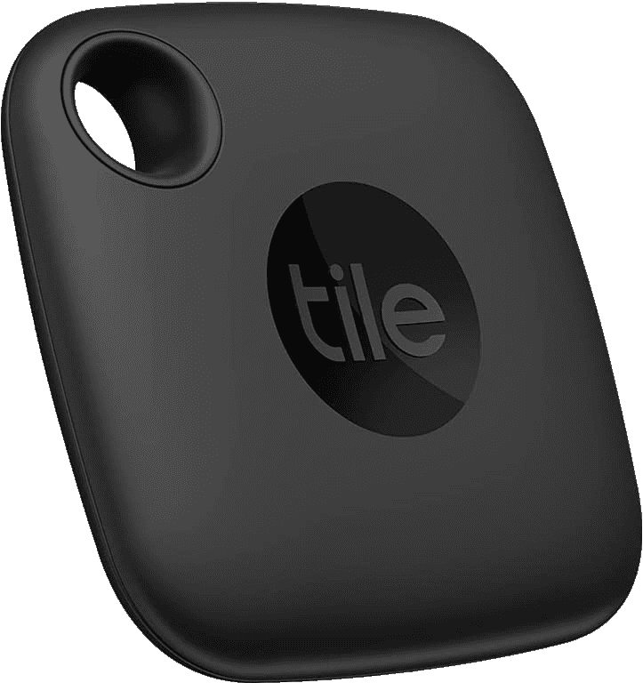
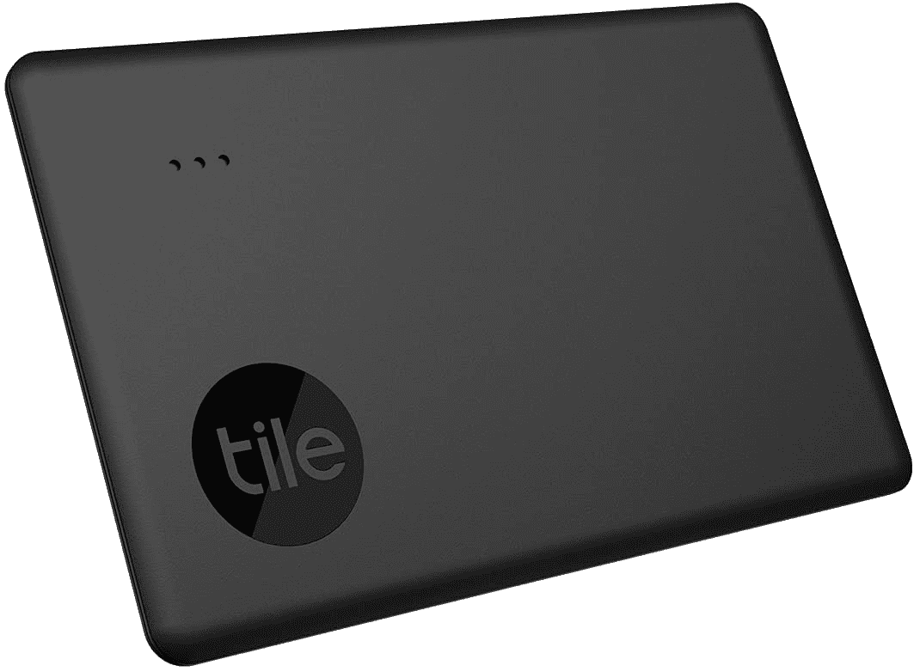

# 购买全新的 Tile Mate 和 Tile Sim 追踪器，起价 20 美元

> 原文：<https://www.xda-developers.com/tile-black-friday-deals/>

在过去的一年里，小型跟踪设备市场出现了爆炸式增长，苹果推出了空中标签，三星开始销售 Galaxy 智能标签，还有数十家其他公司也在尝试。Tile 的追踪器仍然是一些可用的最佳选择，特别是如果你想要一个可以在任何 Android 和 iOS 设备上工作的东西，现在该公司的最新追踪器首次在黑色星期五销售。

首先是新的 Tile Mate(20 美元，低于 25 美元)，Tile 称之为 2022 模型，尽管 2022 *肯定*还没有开始。它通过蓝牙传输其位置，最远距离为 250 英尺/ 76 米，而且它还防水。如果您丢失了磁贴所连接的任何东西，并且它仍在您的手机(或连接到您帐户的其他设备)的覆盖范围内，您可以让磁贴发出声音。当一个磁贴超出范围时，安装了磁贴应用程序的其他设备可以帮助你找到它——磁贴的网状网络不像苹果的 AirTags 那样广阔，但 AirTags 只能在 iOS 设备上使用。

 <picture></picture> 

Tile Mate (2022)

##### 瓷砖伴侣(2022)

这款最新的 Tile Mate 非常适合跟踪钥匙和其他小物体。

 <picture></picture> 

Tile Slim (2022)

##### 超薄瓷砖(2022)

这种瓷砖可以像信用卡一样滑入钱包或口袋。

新的 Tile Slim 也在销售(从 35 美元降至 28 美元)，它的工作原理与 Tile Mate 一样(完全相同的 250 英尺)。范围)，但它更容易放入钱包。Tile Slim 和 Tile Mate 都有不可更换的电池，所以大约三年后，你必须购买新的。Tile Pro 有一个可更换的电池，就像 Galxay SmartTags 和 Apple AirTags 一样，但那个是[不在售](https://shop-links.co/1758564598330903179?u1=1b474cb2-6587-4e39-a4cb-71a8c815a40a)。

在过去的几个月里，我为自己买了几个磁砖追踪器，我的狗现在就在它的项圈上戴着一个。使用图块应用程序与其他人“共享”您的图块也很方便。