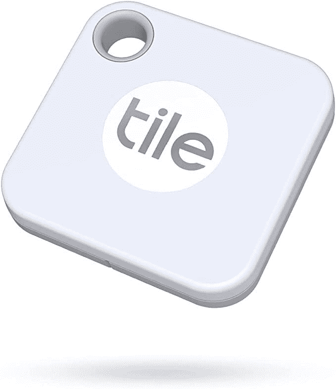

# 瓷砖伴侣是一个伟大的航空标签的替代品，售价 20 美元

> 原文：<https://www.xda-developers.com/tile-mate-tracking-tags-now-on-sale-for-just-20/>

# 瓷砖伴侣跟踪标签现在仅售 20 美元

Tile Mate 蓝牙追踪标签的售价为 20 美元，比普通价格低 5 美元，比苹果 AirTags 的价格低 10 美元。

Tile 是第一批开始销售蓝牙追踪标签的公司之一，即使苹果和三星现在也在生产自己的版本，Tile 的标签仍然是很好的选择。现在，你可以在亚马逊上花 19.99 美元买到入门级的 Tile Mate，比普通价格节省 5 美元，比苹果 AirTags 便宜 10 美元。

这是 Tile 的基本追踪器，蓝牙范围在 200 英尺左右。它被设计成可以挂在钥匙、包和其他你偶尔需要找到的东西上。你也可以按磁贴上的按钮来定位你的手机。就像苹果 AirTags 和三星 Galaxy SmartTags 一样，内部电池一旦耗尽就可以很容易地更换，所以不需要不断地给标签充电。当你需要找到磁贴时，你可以从手机应用程序中选择它，它就会开始响铃。

 <picture></picture> 

Tile Mate (2020) 1-pack

##### 瓷砖伴侣(2020)

这款蓝牙追踪器可以在 iOS 和 Android 上工作，具有防水设计，可以使用可更换的电池。对于那些不能(或不想)使用苹果标签的人来说，这是一个很好的 AirTags 替代品。

Tile Mate 和 Apple AirTags 有两个关键区别。首先，Tile 兼容 iOS 和 Android 设备，所以如果你只有一部 Android 手机，或者想与他人共享标签，它会更有用。第二，Tile 没有苹果那么大的追踪网络(这导致了[的隐私担忧](https://thenextweb.com/news/apple-airtags-find-my-app-work-because-massive-covert-tracking-network-syndication))，所以你找到丢失物品的几率没有 AirTags 高。

蓝牙追踪器是一种跟踪重要物品的好方法，在这个销售价格下，Tile Mate 是一个很好的选择(只要物品在你手机的范围内)。