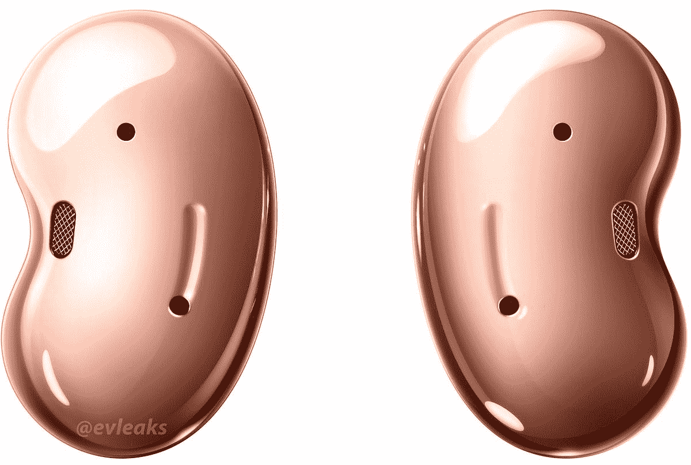

# 仅今天:只需 95 美元就能获得三星 Galaxy Buds Live 耳塞

> 原文：<https://www.xda-developers.com/today-only-get-the-samsung-galaxy-buds-live-earbuds-for-just-95/>

# 仅今天:只需 95 美元就能获得三星 Galaxy Buds Live 耳塞

三星的豆形耳塞现在售价不到 100 美元，有“神秘青铜色”和“神秘黑色”两种。

Galaxy Buds Live 是三星去年发布的真正的无线耳塞。这种独特的设计为他们赢得了“银河豆”的绰号，无需入耳式橡胶耳塞就能提供良好的音质。这款耳塞已经很久没有出现在最初的 169.99 美元的建议零售价上了，现在只需 94.99 美元。这比亚马逊目前的价格低了 55 美元。

这些耳塞有 12 毫米的扬声器，一个用于增强低频声音的低音管道，以及用于暂停/跳过播放的触摸控制(不用伸手拿手机)。Buds Live 在技术上也有主动噪音消除(ANC)，但它在现实世界的使用中几乎没有影响，所以如果你需要带噪音消除的耳塞，请到别处看看。查看[我们的完整评论](https://www.xda-developers.com/samsung-galaxy-buds-live-review/)了解更多详情。

 <picture></picture> 

Samsung Galaxy Buds Live

##### 三星 Galaxy Buds 直播

三星的豆形耳塞目前仅在亚马逊旗下的 Woot 卖 94.99 美元。亚马逊 Prime 会员标准运费免费。

耳塞外壳使用 USB Type-C 进行充电，或者您可以将其设置在任何 Qi 无线充电板的顶部。亚马逊拥有的 Woot 有“神秘青铜”和“神秘黑色”两种颜色，但遗憾的是，红色和白色都没有。