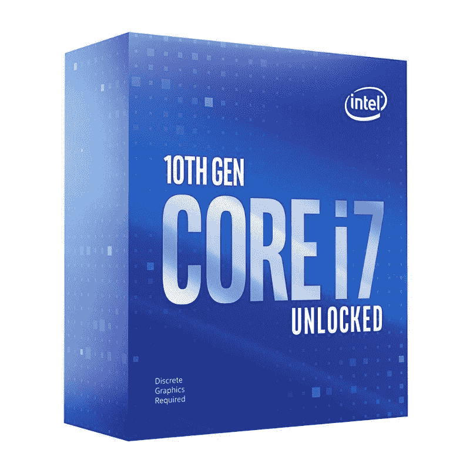
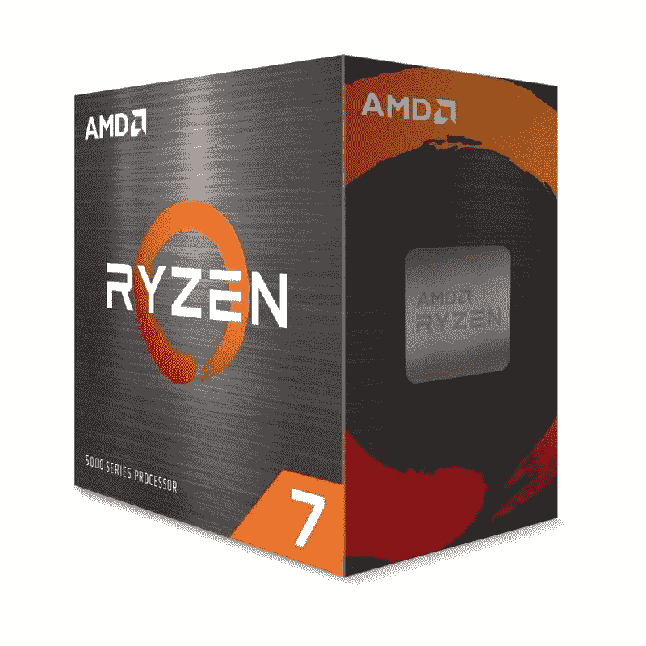
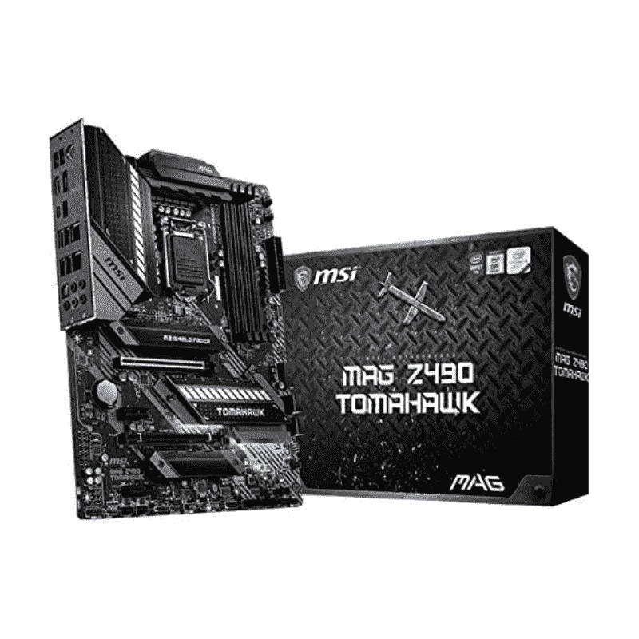
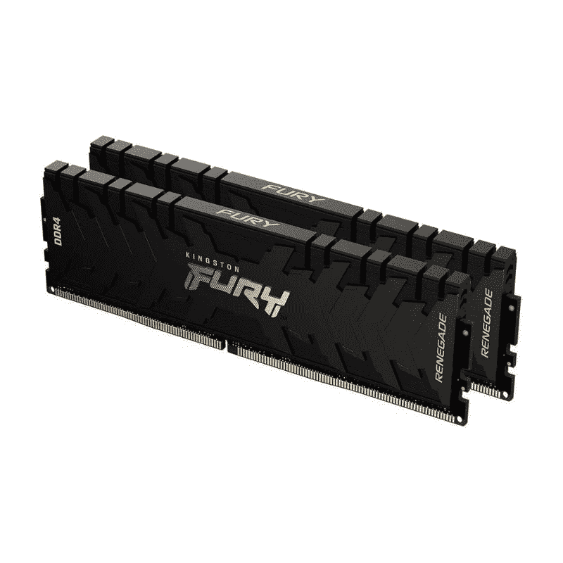
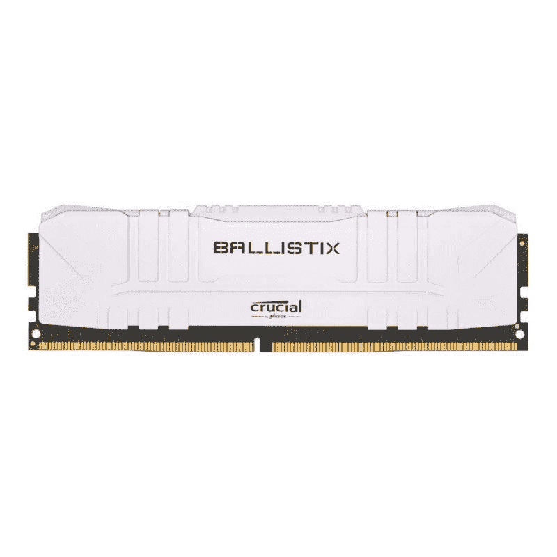

# 购买英特尔、AMD 等厂商的电脑组件，最高可享受 30%的折扣

> 原文：<https://www.xda-developers.com/today-only-get-up-to-30-off-on-pc-components-from-intel-amd-and-more/>

当你计划一个新的构建，或者仅仅是渴望一个特殊的碰撞时，没有什么比在 PC 组件上找到一个伟大的交易更好的感觉了。幸运的是，亚马逊在一系列电脑组件上提供高达 30%的折扣，包括处理器、主板等等。并非所有的交易都值得你绞尽脑汁，这就是为什么我们在这里为你收集了一些交易。

## 处理器交易

### 英特尔酷睿 i7-10700KF 处理器

英特尔酷睿 i7-10700KF 目前在亚马逊上降至 247 美元。它与 Core i7-10700K 完全相同，只是集成了一个 GPU。这款 125 瓦的 CPU 与其运行在 5.1GHz 睿频加速频率下的未锁定兄弟一样快。它有 8 个内核、16 个线程和 16MB 高速缓存。如果您还没有 400 系列芯片组主板，请不要忘记购买。

 <picture></picture> 

Intel Core i7-10700KF Processor

##### 英特尔酷睿 i7-10700KF

尽管它不是市场上最新的处理器，但英特尔酷睿 i7-10700KF 足够强大，可以满足您的所有游戏需求。

### AMD 锐龙 7 5800X

AMD 锐龙 7 5800X 目前售价略低于 400 美元，低于其 450 美元的上市价格。我们认为对于该公司 Zen 3 驱动的产品系列中的处理器来说，这是一个很好的要价。它带来了 8 个内核和 16 个线程，是 AMD 5000 系列的主流性能主力。

 <picture></picture> 

AMD Ryzen 7 5800X processor

##### AMD 锐龙 7 5800X

AMD 锐龙 7 5800X 是一款价格不到 400 美元的出色 CPU。它可以不费吹灰之力处理大多数 AAA 头衔。只是记得买一个冷却器来搭配这个单元。

## 主板交易

### 技嘉 B450 AORUS PRO Wi-Fi

GIGABYTE B450 AORUS PRO Wi-Fi 目前在亚马逊上的售价仅为 94 美元，低于其通常 139.99 美元的标价。它不是主板的野兽，但它可以提供适度的超频。这种主板因其广泛的连接选项和美观而更受欢迎。总的来说，这是一个很好的选择，特别是如果你打算购买上面提到的锐龙 7 5800X。

 <picture></picture> 

Gigabyte B450 Aorus Pro Motherboard

##### 技嘉 B450 Aorus Pro

Gigabyte B450 Aorus Pro 是一款物有所值的主板，提供了一系列相当简单的功能。如果你打算升级到一个使用 AM4 插槽的较新的锐龙 CPU，这是一个很好的选择。

### 微星 MAG Z490 战斧游戏主板

现在从亚马逊挑选一款微星 MAG Z490 战斧游戏主板，你可以节省高达 60 美元。对于那些正在升级到第十代英特尔酷睿处理器(如我们上面提到的酷睿 i7-10700KF)的人来说，149 美元的微星 MAG Z490 战斧游戏主板是一个很好的选择。请记住，这款主板将不会支持即将推出的[阿尔德湖 CPU](https://www.xda-developers.com/intel-shares-details-alder-lake-chips-coming-this-fall/)，因为它需要一个 LGA 1700 插座。

 <picture></picture> 

MSI MAG Z490 Tomahawk Gaming Motherboard

##### 微星 MAG Z490 战斧

微星 MAG Z490 战斧游戏主板是一款出色的主板，支持英特尔第十代酷睿处理器。它还配备了用于板上两个 M.2 插槽的散热器。

## RAM 模块交易

### 金斯顿愤怒叛徒 64GB 内存套件

如果您计划使用例如英特尔酷睿 i9 或 AMD 9 5950X 的高端 PC，Kingston FURY Renegade RAM 模块是很好的选择。该 DDR4 模块具有黑色 PCB 和内置 RGB 照明。这些 CL16 棒在 1.5v 电压下工作，最高频率可达 4600MHz。你现在只需花 279.99 美元就能买到 64GB 的套件(2x32GB)，非常划算。

 <picture></picture> 

Kingston FURY Renegade 64GB RAM

##### 金斯敦愤怒叛徒 64GB 内存

金斯敦愤怒叛徒 64GB 值得拿起出售。这些棒将以其令人印象深刻的性能和美学完美地补充您的高端游戏 PC 构建。

### 重要的 Ballistix 3200 MHz DDR4 内存套件

如果你喜欢 RGB 灯最少的最小设置，那么 Ballistix 的标准内存套件现在也在销售。不过，只有白色的模块在出售。它们是一组运行在 3200MHz 频率的出色 DDR4 模块，并支持 XMP 2.0 自动超频。

 <picture></picture> 

Crucial Ballistix 3200 MHz DDR4 DRAM Desktop Gaming Memory Kit

##### 重要的 Ballistix 3200 MHz DDR4 DRAM

重要的 Ballistix 套件是市场上最受欢迎的内存模块之一。这些 CL16 套件以高频率运行，并支持 XMP 2.0 自动超频。

## 最后的想法

这些是我们今天在亚马逊上设法找到的一些交易，我们希望这些收集将帮助你省钱来购买更多的组件和外设，如[显示器](https://www.xda-developers.com/best-monitors/)、[键盘](https://www.xda-developers.com/best-mechanical-keyboards/)等。为了使节省更简单，我们将努力保持我们的眼睛去皮更多的电脑部件交易在线。