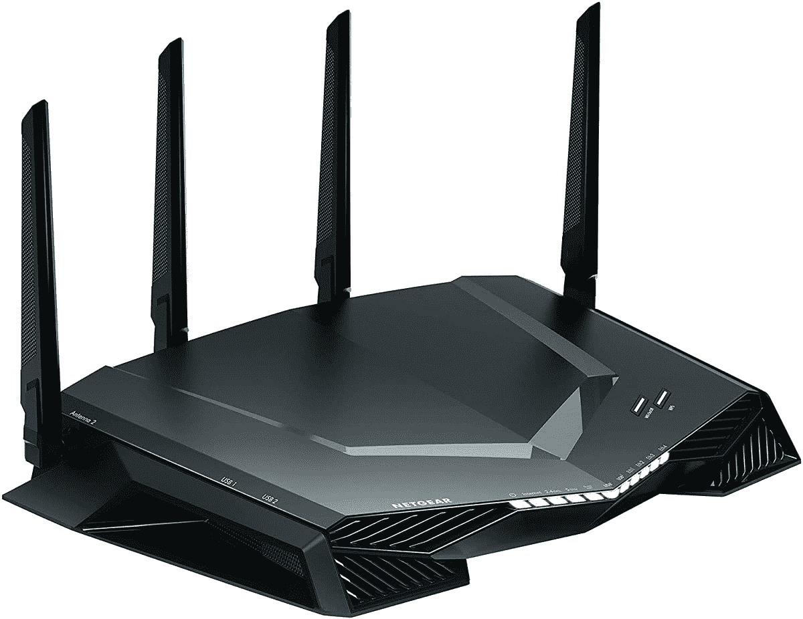
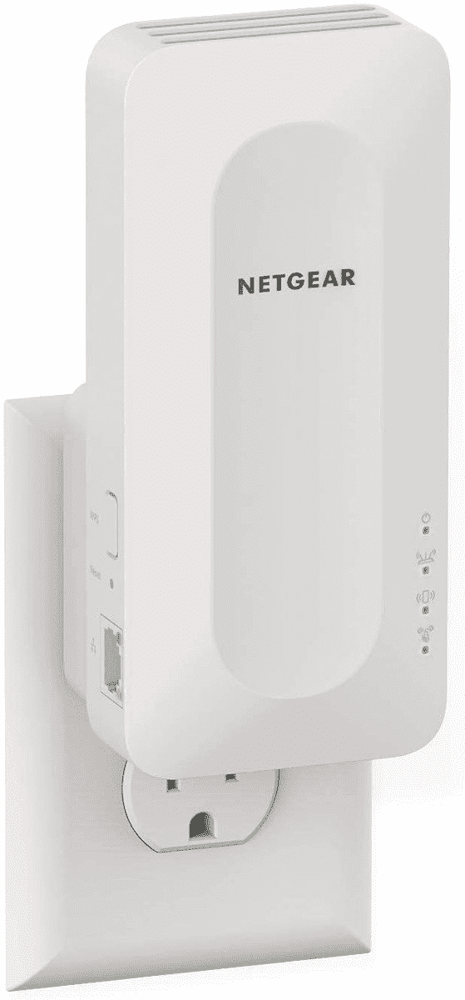

# 仅今天:Netgear 的 Wi-Fi 路由器和扩展器高达 26%的折扣

> 原文：<https://www.xda-developers.com/today-only-wi-fi-routers-and-extenders-from-netgear-are-up-to-26-off/>

# 仅今天:Netgear 的 Wi-Fi 路由器和扩展器高达 26%的折扣

亚马逊在两个 Netgear 路由器和一个 Netgear Wi-Fi 6 扩展器上进行为期一天的销售，比原价低 26%。

在家工作的增加让我们许多人意识到我们的无线网络很糟糕。不可避免地会有一个房间的信号太弱，或者当有人启动网飞时，整个网络变慢。令人欣慰的是，Netgear 在亚马逊的一天销售中对其部分路由器和扩展器进行了打折，使今天成为升级 Wi-Fi 的绝佳时机。

首先是 [Netgear AX1800](https://www.amazon.com/NETGEAR-4-Stream-WiFi-Router-R6700AX/dp/B08KTXG8Q5?tag=xda-6uno0bh-20&ascsubtag=UUxdaUeUpU4755&asc_refurl=https%3A%2F%2Fwww.xda-developers.com%2Ftoday-only-wi-fi-routers-and-extenders-from-netgear-are-up-to-26-off%2F&asc_campaign=Short-Term) ，它是为 1500 平方英尺的家庭建造的。制成全面支持 Wi-Fi 6。它目前的售价为 74.99 美元，比通常的 90-100 美元节省了不少。该路由器对于较小的家庭来说是一个不错的选择，尤其是价格低于 100 美元的家庭，但它不支持较新的 Wi-Fi 6E 标准。

 <picture></picture> 

Netgear R6700AX Router

##### NETGEAR R6700AX 路由器

这款 Wi-Fi 6 路由器是小型家庭的绝佳选择，因为这些家庭并不真正需要网状系统。

 <picture></picture> 

Netgear Nighthawk Pro Gaming XR500

##### 网件夜鹰专业游戏 XR500

这款路由器拥有强大的游戏专用接口和更多局域网连接器，但不支持 Wi-Fi 5。

 <picture></picture> 

Netgear WiFi 6 Mesh Range Extender (EAX15)

##### Netgear WiFi 6 Mesh 范围扩展器(EAX15)

这有助于扩展您现有 Wi-Fi 网络的覆盖范围，完全支持 Wi-Fi 6。

另一款在售的路由器是[夜鹰 Pro XR500](https://www.amazon.com/NETGEAR-Nighthawk-Ethernet-Wireless-Optimized/dp/B078GWJ44Z?tag=xda-6uno0bh-20&ascsubtag=UUxdaUeUpU4755&asc_refurl=https%3A%2F%2Fwww.xda-developers.com%2Ftoday-only-wi-fi-routers-and-extenders-from-netgear-are-up-to-26-off%2F&asc_campaign=Short-Term) ，它的速度比上述 AX1800 更快，也有一个更可定制的仪表盘。售价为 159.99 美元，路由器通常在 190-200 美元左右。尽管这种型号在理论上速度很快，但它不能广播 Wi-Fi 6 网络，所以如果你周围有许多其他 Wi-Fi 信号，你可能会遇到连接问题(例如，你住在一个公寓楼里)。

最后，Netgear 正在以 89.99 美元的价格出售其 [Wi-Fi 6 Mesh 范围扩展器](https://www.amazon.com/NETGEAR-WiFi-Range-Extender-EAX15/dp/B08K2ZX2RY?tag=xda-6uno0bh-20&ascsubtag=UUxdaUeUpU4755&asc_refurl=https%3A%2F%2Fwww.xda-developers.com%2Ftoday-only-wi-fi-routers-and-extenders-from-netgear-are-up-to-26-off%2F&asc_campaign=Short-Term)，低于通常 129.99 美元的价格。这主要是为了与现有的 Wi-Fi 6 网络一起使用，但它也适用于任何路由器或网络。它是双频带，而不是三频带，所以速度会比你的主路由器发出的信号慢——但如果你的路由器无法首先到达某个区域，那也没什么关系。