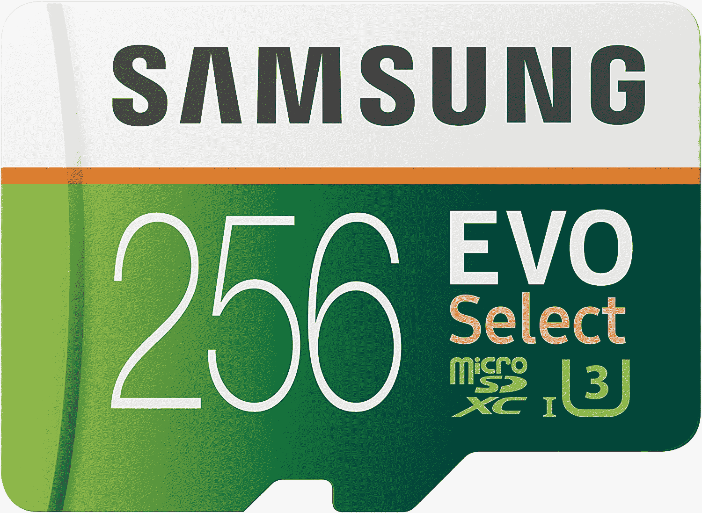
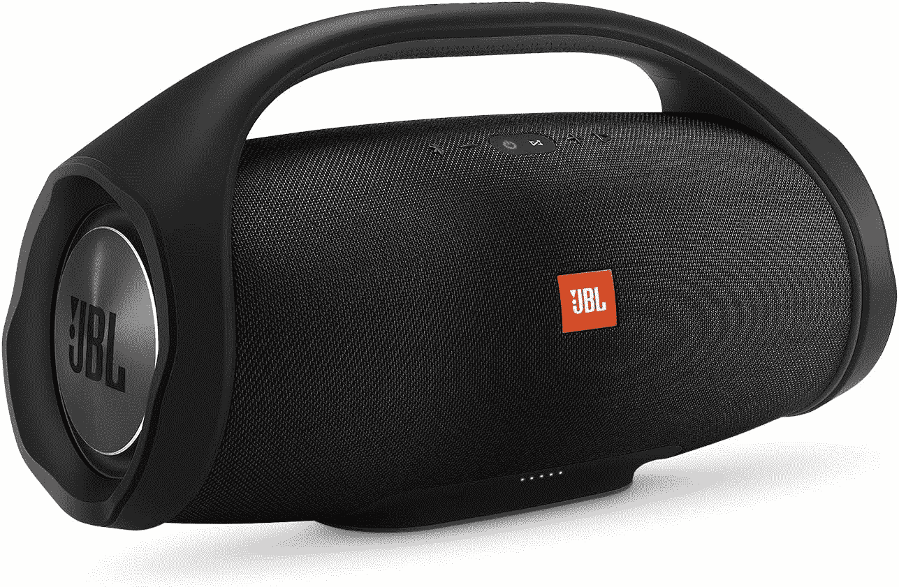

# 亚马逊 Prime Day 2020 交易:外星人，苹果，8bitdo &更多！

> 原文：<https://www.xda-developers.com/top-10-amazon-prime-day-2020-deals/>

# 最后一分钟亚马逊 Prime Day 2020 交易:外星人显示器，苹果 iPad Pro，安卓游戏控制器，等等！

当我们在这里有十个最好的非闪电交易时，为什么要在无尽的亚马逊 Prime Day 2020 交易中转换？

这一天终于到来了——2020 年亚马逊优惠日的时间到了。48 小时的购物活动将充满交易，交易，甚至更多的交易，足以让你头晕目眩！你会看到亚马逊自己的产品大幅降价，以及许多试图从 Prime Day 馅饼中分一杯羹的其他卖家的折扣。

这是销售的第二天，也是最后一天，我们有 10 个新鲜的交易供您在下面选择！

* * *

## 2020 年黄金日十大交易

 <picture></picture> 

Fire HD 10 Tablet, $70 Off

##### 亚马逊 Fire HD 10

寻找一款质量不错的平板电脑，可以用于基本任务，但不想花费超过 100 美元？Fire HD 10 平板电脑 Prime Day 售价仅为 80 美元，比建议零售价低 70 美元。凭借 12 小时的电池续航时间和内置的 Alexa，这是一款完美、简单的平板电脑，也是一份伟大的礼物！

 <picture></picture> 

TicWatch Pro 4G just $200!

##### TicWatch Pro 4G

Mobvoi 决定将他们的 Prime Day 2020 交易限制在一天内，那一天就是今天！购买 TicWatch Pro 4G 仅需 200 美元，优惠 90 美元。这款健身手表可以跟踪你想要的一切，如果你有一个合格的威瑞森计划，你可以添加 4G 网络，而不必依赖蓝牙或 Wi-Fi 进行 GPS 和更新！

 <picture></picture> 

AUKEY Wireless 10000mAh Portable Charger with Foldable Stand

##### AUKEY PB-WL02 Basix 无线电源组

电源组和电池组总是 2020 年 Prime Day 的大件商品，所以很难分辨哪些是优质的。嗯，这个电池组是我个人使用的，在结账时使用代码 **NQJS24TS** ，你只需 28 美元就能得到它。

 <picture></picture> 

Turtle Beach Battle Buds In-Ear Gaming Headset

##### 海龟海滩战斗芽

游戏耳机对你来说太大太笨重？我理解这种感觉。Turtle Beach 的 Ballte Buds 售价仅为 20 美元，提供游戏耳机的所有基本功能，但没有笨重的耳机。

 <picture></picture> 

Xbox Cloud Controller for Android

##### 安卓版微软 Xbox 云控制器

Xbox One 控制器很棒，但如果你想要更传统的 Andriod 游戏，你可以选择 8bitdo 的 SN30 Pro 控制器，代码为 **158BITDO** ，仅售 33 美元。我个人可以推荐这个品牌，这个版本的 SN30 是专门为配合 Xbox 的云游戏服务而打造的。

 <picture></picture> 

WD 12TB Elements Desktop Hard Drive, 30% Off

##### WD Elements 外置硬盘

现在是拿起外置硬盘的最佳时机之一。Wd 的 12TB 大硬盘 Prime Day 售价 175 美元，比建议零售价低 30%。Western Digital 是最好的数据存储品牌之一，所以你知道你会从他们那里得到一个可靠和高质量的外部硬盘。

 <picture></picture> 

Samsung EVO Select microSD sale

##### 三星 EVO Select microSD

不要为你的 microSD 购买一个没有名字的品牌而丢失你的数据-拿一个三星 microSD 并且保存！256 GB 的 microSD 仅售 28 美元，价格实惠。其他容量也在出售，所以看看吧！

 <picture></picture> 

ALIENWARE Curved 34 Inch WQHD Monitor

##### 戴尔外星人 34 英寸曲面游戏显示器

下一代游戏即将到来...你的电脑准备好了吗？以 849 美元的价格购买外星人的超宽曲面显示器，让您的显示器适应未来。这款显示器具有 120Hz 的刷新率，再加上 NVIDIA 的 GSync 技术，这将使您的所有游戏看起来，更重要的是，感觉很棒。

 <picture></picture> 

JBL Boombox - Waterproof Portable Bluetooth Speaker

##### JBL 音箱

JBL 是蓝牙音箱的大品牌，而音箱是他们最好的产品之一。通常 400 美元，你只需花 280 美元就可以得到这个强大的防水扬声器，直到一天结束。抓住一个，让你的社交聚会更上一层楼！

* * *

## 其他交易

寻找昨天的 Prime Day 2020 特色交易，以及其他没有进入我们前 10 名的交易？下面就来看看吧！