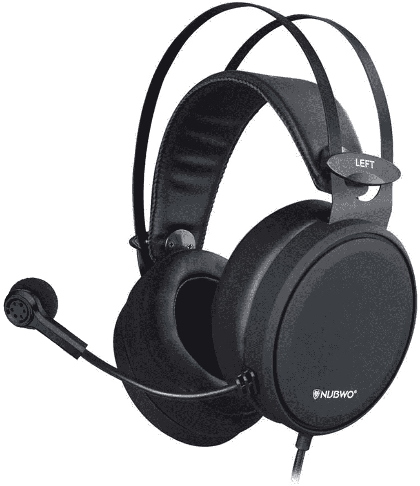
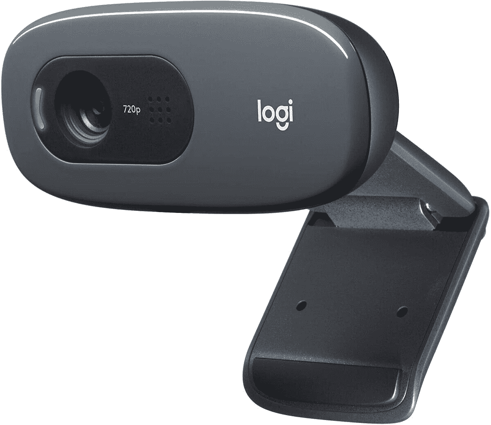
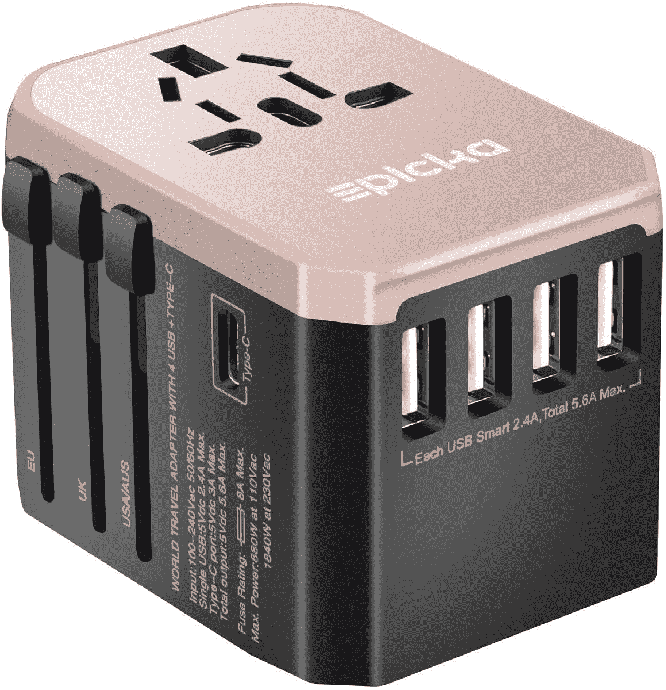

# 顶级技术交易:Echo Dot 2 包售价 40 美元，Aukey 电池组售价 35 美元！

> 原文：<https://www.xda-developers.com/top-5-deals-october-1/>

老实说，我迫不及待地想拿起新的谷歌 Chromecast。谷歌电视能够从我所有的流媒体服务中创建一个观看列表，这是一个天赐良机，尤其是在我最喜欢的一些节目似乎无休止地播放的时候。我正在等待新的 Chromecast 在亚马逊上流行，这样我就可以用一些 Prime Day 福利来购买它。这款设备可能不会发售，但会有促销活动，比如在全食超市消费[10 美元](https://www.amazon.com/alm/storefront?tag=xda-2oh02a1-20&ascsubtag=UUxdaUeUpU30051&asc_refurl=https%3A%2F%2Fwww.xda-developers.com%2Ftop-5-deals-october-1%2F&asc_campaign=Short-Term)或在一家小企业网上店面消费[10 美元](https://www.amazon.com/b/ref=s9_acss_bw_cg_sbp01_1a1_w?ots=1&slotNum=1&imprToken=78ba721c-ecff-6565-ca8&ascsubtag=UUxdaUeUpU30051&node=17879387011&tag=xda-2oh02a1-20&asc_refurl=https%3A%2F%2Fwww.xda-developers.com%2Ftop-5-deals-october-1%2F&asc_campaign=Short-Term)并获得 10 美元 Prime Day 积分(每人！)，我可以获得一些我需要的物品，并使用点数以更低的价格购买我想要的设备。

今天，我们要做一些稍微不同的事情-所有这些项目都在 100 美元以下！有时候你的钱包需要休息一下，对吧？我们今天的顶级(和低成本)技术交易包括 40 美元的两个 Echo Dots，35 美元的 Aukey 电池组，等等！

## 只有今天，Nubwo 的游戏耳机才 17 美元

有时候，你只需要一个耳机，你不想花很多钱，特别是如果你或你爱的人...一边打游戏一边咄咄逼人。就在今天，你只需花 17 美元就能买到 [Nubwo N7 游戏耳机](https://www.amazon.com/dp/B07KXMMXKP?tag=xda-2oh02a1-20&ascsubtag=UUxdaUeUpU30051&asc_refurl=https%3A%2F%2Fwww.xda-developers.com%2Ftop-5-deals-october-1%2F&asc_campaign=Short-Term)。这不是以质量效果为主题的，但这款耳机提供了良好的声景，一个降噪麦克风，可以与任何现代游戏机配合使用。亚马逊一万多的评价真的很正面，这个价位，你有什么损失呢？

 <picture></picture> 

NUBWO Gaming Headset

##### NUBWO 游戏耳机

对于一个高质量的耳机来说，你真的不能比这更低了！由亚马逊评论支持，Nubwo 游戏耳机有一个消除噪音的麦克风，可以与你的任何游戏机或 PC 配合使用。只需 18 美元，就在今天，还等什么？现在就抓一个！

## 早期黄金日交易:两个第三代回声点 40 美元

想要开始使用智能家居吗？作为 Prime Day 早期销售的一部分，你现在可以花 40 美元买到两个第三代 Echo Dots 。亚马逊确实宣布了一个[新的 Echo Dot](https://www.amazon.com/All-New-Echo-Dot-4th-Gen/dp/B07XJ8C8F7?tag=xda-2oh02a1-20&ascsubtag=UUxdaUeUpU30051&asc_refurl=https%3A%2F%2Fwww.xda-developers.com%2Ftop-5-deals-october-1%2F&asc_campaign=Short-Term) ，代码 **DOTPRIME2PK** 也将适用于新型号，但你可能也更喜欢旧型号。第三代 Echo Dot 更低调，不像新 Dot 的球形。你也可以安装第三代 Echo Dot，但新 Echo Dot 的形状不允许这样做。最后，我的意思是...你真的不能为了 40 美元争论两个回声点。你需要成为亚马逊的 Prime 会员才能享受这项优惠，所以[在这里注册](https://www.amazon.com/amazonprime?tag=xda-2oh02a1-20&ascsubtag=UUxdaUeUpU30051&asc_refurl=https%3A%2F%2Fwww.xda-developers.com%2Ftop-5-deals-october-1%2F&asc_campaign=Short-Term)。

 <picture></picture> 

Amazon Echo Dot

##### 亚马逊回声点(第三代)

以低廉的价格开始您的智能家居设置！如果你在结账时使用 **DOTPRIME2PK** ，你可以花 40 美元得到两个第三代 Echo Dots。更低调，能够安装在墙上，你可能会喜欢这个模型比最近宣布的新的回声点一代。

## 罗技 C270 720p 网络摄像头，售价 28 美元

罗技是一个你知道质量的品牌，目前，他们的 [C720 网络摄像头](https://www.amazon.com/Logitech-Desktop-Widescreen-Calling-Recording/dp/B004FHO5Y6?tag=xda-2oh02a1-20&ascsubtag=UUxdaUeUpU30051&asc_refurl=https%3A%2F%2Fwww.xda-developers.com%2Ftop-5-deals-october-1%2F&asc_campaign=Short-Term)售价 28 美元。然而，需要注意的是，这是一个 720p 的网络摄像头，所以它不能用于全高清容量。这绝对不是 Twitch 上的网络摄像头，但如果你需要一些适合缩放会议、课程和其他在家工作任务的东西，这款网络摄像头将很好地完成工作。

 <picture></picture> 

Logitech C270

##### 罗技 C270 网络摄像头

需要一个可靠的网络摄像头用于工作或学习？罗技的 C270 网络摄像头在亚马逊上仅售 28 美元。这个网络摄像头最多只能拍摄 720 像素的图像，但对于会议和课堂，这个小设备可以完成工作。

## 花 35 美元买两天奥基的电池组和支架

有很棒的电池组，还有我自己的电池组，客观上是最好的一个。 [Aukey 的 20,000mAh 电池组](https://www.amazon.com/dp/B08CDVBH54?tag=xda-2oh02a1-20&ascsubtag=UUxdaUeUpU30051&asc_refurl=https%3A%2F%2Fwww.xda-developers.com%2Ftop-5-deals-october-1%2F&asc_campaign=Short-Term)如果在结账时使用代码 **NY7UX3UI** 的话，未来两天 35 美元。这款设备可以通过有线或无线方式为你的智能手机快速充电，它本身也可以快速充电，甚至还有一个支架，这样你就可以在看视频的同时看一些东西。这只是一个很棒的小电源库，所以在明天下班前买一个吧！

 <picture></picture> 

AUKEY 20,000mAh Wireless Portable Charger

##### AUKEY PB-WL03 20000mAh Basix Pro 无线电源组

买一个不仅很棒，而且我可以亲自担保的电池组。如果你在结账时使用代码 **NY7UX3UI** ，Aukey 的 20，000 power bank 在亚马逊未来两天的价格是 35 美元。这款手机最多可以为三个设备快速充电，并配有一个支架，可以在充电的同时观看视频，绝对不会出错。

## PICKA 多合一全球壁式充电器，售价 16 美元

所以，奥基的电池组当然非常适合旅行。但是，如果你要出国旅行，你需要确保自己做好准备，能够真正将设备插入插座。使用通用墙壁适配器，防患于未然。Picka 的适配器可让您插入任何墙壁适配器，您可以将 Picka 适配器插入任何您需要的插座。简单，有效，解决问题。只需 16 美元，即可获得优惠券。

 <picture></picture> 

PICKA All in One Worldwide Wall Charger

##### PICKA 多合一全球壁式充电器

准备出门旅行时，带上 Picka 壁式充电器，再也不用担心是否有合适的适配器。如果你在结账前剪下优惠券，玫瑰金版只要 16 美元！

## 更多技术交易

寻找更多的技术交易？下面我们为你准备了！

## 2020 年黄金日早期交易

我们已经收集了目前为止在下面找到的 2020 年 Prime Day 早期交易！