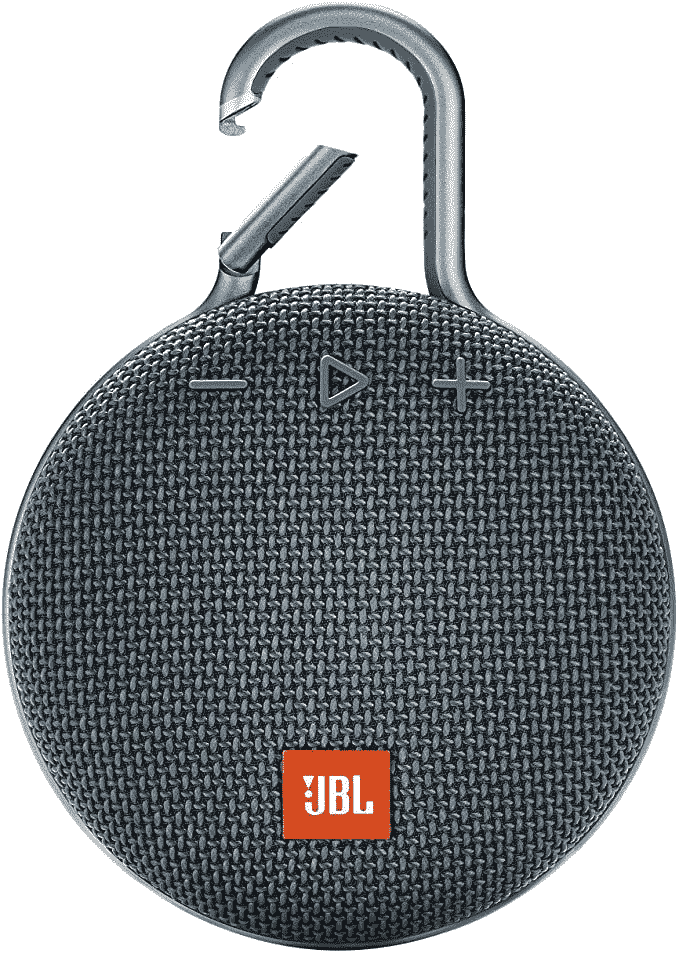
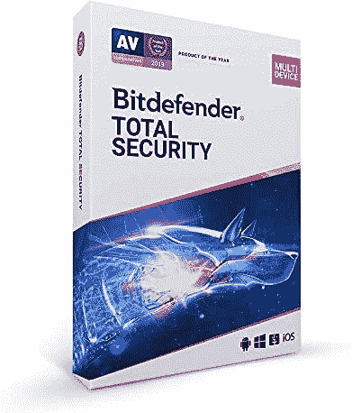
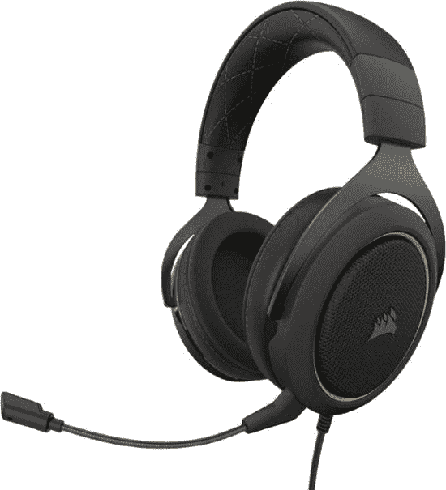
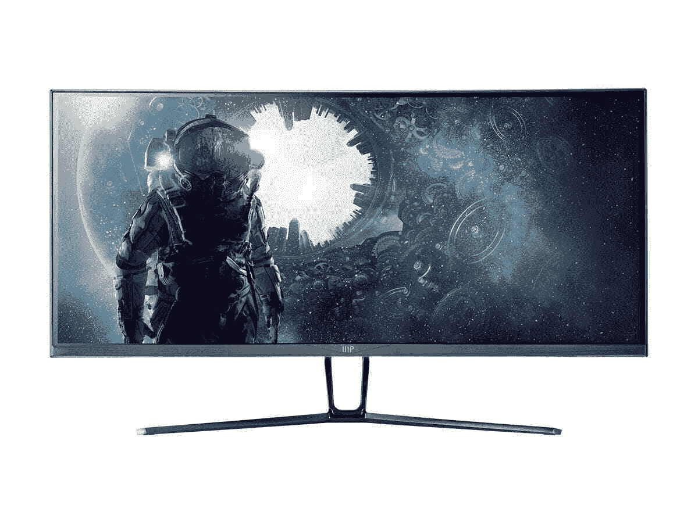
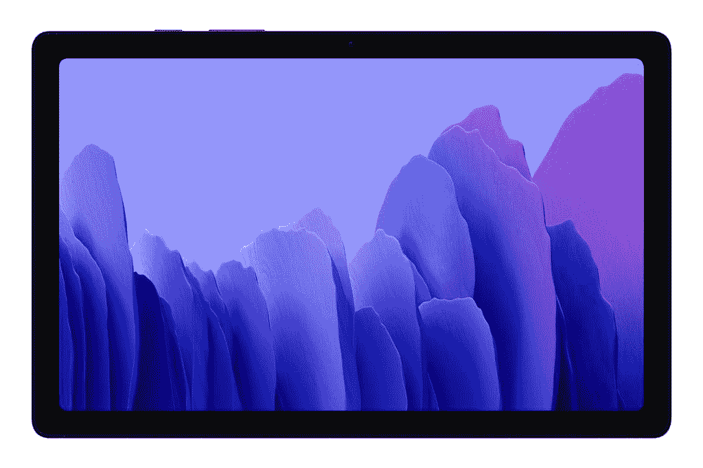

# 今天的技术交易:20 美元的 Bitdefender，300 美元的曲面显示器，等等！

> 原文：<https://www.xda-developers.com/top-5-deals-october-15/>

黄金日太疯狂了，不是吗？经过 48 小时的交易，在更多的交易分层，你认为今天将没有什么可谈的！但是你错了。非常不对。交易不会停止。在这个地球上，没有哪一天你不能在某样东西上省钱，而我的工作就是让你知道还有更多省钱的方法。我永远不会逃避交易，也就是说你也不会。

因此，尽管如此，今天的顶级技术交易包括 20 美元的 Bitdefender Total Security 一年，300 美元的 Monoprice 曲面显示器等等！

## 亚马逊上 JBL 产品的大优惠

精选的 JBL 产品在亚马逊 Prime Day 打折，但是现在，你可以[节省更多种类的 JBL 扬声器和耳机](https://www.amazon.com/deal/a9e02286?tag=xda-7mdv1jp-20&ascsubtag=UUxdaUeUpU30237&asc_refurl=https%3A%2F%2Fwww.xda-developers.com%2Ftop-5-deals-october-15%2F&asc_campaign=Short-Term)...你甚至不需要一个主要成员！如果你在过去的两天里没有买到任何一款耳机，你仍然可以在 JBL 的 [Live 650BTNC](https://www.amazon.com/JBL-Around-Ear-Wireless-Headphone-Cancellation/dp/B07PVR6SXW?tag=xda-7mdv1jp-20&ascsubtag=UUxdaUeUpU30237&asc_refurl=https%3A%2F%2Fwww.xda-developers.com%2Ftop-5-deals-october-15%2F&asc_campaign=Short-Term) 或 [Club One](https://www.amazon.com/JBL-CLUB-ONE-Cancellation-Customization/dp/B084HNNYWB?tag=xda-7mdv1jp-20&ascsubtag=UUxdaUeUpU30237&asc_refurl=https%3A%2F%2Fwww.xda-developers.com%2Ftop-5-deals-october-15%2F&asc_campaign=Short-Term) 上省钱，这两款耳机本身就很棒。或者可以拿起[夹子 3](https://www.amazon.com/JBL-Waterproof-Portable-Bluetooth-Speaker/dp/B07Q3SXPFY?tag=xda-7mdv1jp-20&ascsubtag=UUxdaUeUpU30237&asc_refurl=https%3A%2F%2Fwww.xda-developers.com%2Ftop-5-deals-october-15%2F&asc_campaign=Short-Term) ，便携防水蓝牙音箱。

 <picture></picture> 

Save up to 43% on JBL Products

##### JBL 剪辑 3

在亚马逊上购买一些高品质的扬声器、耳机和更多 JBL 商品。Clip 3 无线扬声器仅售 40 美元，没有理由不买一个！

## 20 美元一年的 Bitdefender

有很多反病毒软件可供选择，所以如果你被这些选项弄得不知所措，我不会责怪你。不过，我在这里要告诉你的是， [Bitdefender](https://www.amazon.com/Bitdefender-Total-Security-Device-Year/dp/B07G8SQ2S3?tag=xda-7mdv1jp-20&ascsubtag=UUxdaUeUpU30237&asc_refurl=https%3A%2F%2Fwww.xda-developers.com%2Ftop-5-deals-october-15%2F&asc_campaign=Short-Term) 是其中的佼佼者。我使用 Bitdefender 已经很多年了，而且只使用 Bitdefender，它在保护我的电脑安全方面做得非常好。在亚马逊，将优惠券夹在商店页面上，只需 20 美元就可以获得最多五台设备一年的防病毒安全保护。

 <picture></picture> 

Bitdefender Total Security 2021 (1 Year)

##### Bitdefender 总体安全性

以低廉的价格保护您的设备安全。将优惠券夹在商店页面上，只需 20 美元即可获得一年的 Bitdefender Total Security！该订阅将保护多达五台设备，无论是 PC、Mac 还是移动设备。

## 海盗船的 HS60 游戏耳机优惠 20 美元

如果你不是 Razer 的粉丝，你可能会发现这款耳机在 Prime Day 期间有所打折...缺乏。不过，百思买已经覆盖了你，你可以在 [Corsair HS60 游戏耳机](https://shop-links.co/link/?exclusive=1&publisher_slug=xda&article_name=Today%27s+Top+Tech+Deals%3A+A+Year+of+Bitdefender+for+%2420%2C+%24300+Curved+Monitor%2C+and+More%21&article_url=https%3A%2F%2Fwww.xda-developers.com%2Ftop-5-deals-october-15%2F&u1=UUxdaUeUpU30237&url=https%3A%2F%2Fwww.bestbuy.com%2Fsite%2Fcorsair-hs60-pro-surround-wired-stereo-gaming-headset-yellow%2F6402931.p%3FskuId%3D6402931)上节省 20 美元。这款耳机有着低调的黄色风格，看起来比普通的游戏耳机要好很多，在普通游戏耳机中，大胆而花哨的配色方案似乎是受欢迎的选择。百思买对这款耳机的评价也非常积极，称声音清晰，麦克风灵敏。

 <picture></picture> 

Corsair HS60 Headset

##### 海盗船 HS60 耳机

只需 50 美元，就能买到一款不碍眼的优质游戏耳机。Corsair 的 HS60 游戏耳机看起来不错，听起来也不错，提供了出色的音频和高质量的麦克风。

## 单价 300 美元的曲面游戏显示器

仅售 300 美元的超宽曲面游戏显示器？这不仅仅是亚马逊或新蛋，你必须去易贝才能达成交易！Monoprice 正在那里销售其 [35 英寸 Zero-G 曲面显示器](https://www.ebay.com/itm/233507904051)，对于这种风格的显示器来说，价格确实不错。100 赫兹的刷新率也不容小觑，尤其是大多数 120 赫兹的显示器价格要高得多。如果您想在预算有限的情况下升级电脑，这款显示器是个不错的选择。

 <picture></picture> 

Monoprice Zero-G 35-inch Curved Gaming Monitor

##### 35 英寸弯曲游戏显示器

去易贝买一台便宜的曲面显示器吧。Monoprice 的 35 英寸曲面显示器仅售 300 美元，内置 FreeSync 技术，这款显示器将为您带来出色的游戏体验。

## 大优惠活动:三星 Galaxy Tab A7 售价 170 美元

大多数其他零售商已经结束了本周的大型活动，但沃尔玛仍在大力开展今天结束的大减价活动。有了它，你可以花 170 美元买到一台 [Galaxy Tab A7](https://www.walmart.com/ip/SAMSUNG-Galaxy-Tab-A7-32GB-10-4-Wi-Fi-Gray-SM-T500NZAAXAR/511417372) ，比建议零售价低 60 美元。它没有配备键盘盖，也肯定不是 Tab A 系列的最新型号，但它本身就是一款功能强大的平板电脑。如果你正在寻找一台平板电脑来完成一些简单的任务，你真的不需要最前沿的东西，而 Tab A7 将是一个很好的预算。

 <picture></picture> 

SAMSUNG Galaxy Tab A7

##### 三星 Galaxy Tab A7

今天是大节省活动的最后一天，所以这是在三星 Galaxy Tab A7 上节省的最后机会！Tab A7 是一个不错的预算选择，节省 60 美元让选择它变得更加诱人。

## 更多技术交易

寻找更多的技术交易？下面我们为你准备了！[的 Soundcore Life Q20 耳机](https://www.amazon.com/Soundcore-Cancelling-Headphones-Wireless-Bluetooth/dp/B07NM3RSRQ?tag=xda-7mdv1jp-20&ascsubtag=UUxdaUeUpU30237&asc_refurl=https%3A%2F%2Fwww.xda-developers.com%2Ftop-5-deals-october-15%2F&asc_campaign=Short-Term)仍然是 45 美元的基本黄金日价格，所以如果你还没有买的话就去买吧！