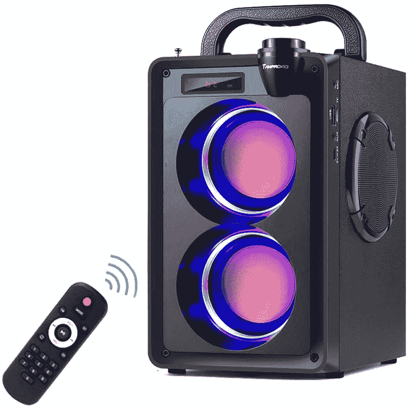

# 今天的科技交易:4K 索尼电视降价 430 美元，联想半年度大甩卖！

> 原文：<https://www.xda-developers.com/top-5-deals-october-2/>

你的周末计划是什么？也许是时候学门新手艺了？没有比现在更好的时机了，真的！我们可以帮助您终生访问五个(！)电子学习平台，仅售 99 美元。这是一个令人难以置信的交易，平台包括从 IT 到游戏设计到人力资源到管理的课程。说真的，没有理由抓住这个交易并开始学习。

现在你拿起包回来了，我们今天的顶级技术交易包括联想的半年度销售，4K 索尼电视的优惠折扣，还有更多！

动物穿越任天堂 Switch 目前在沃尔玛有售[！如果你一直没有抓住这个特别版控制台，现在是你的机会！](https://www.walmart.com/ip/Nintendo-Switch-Console-Animal-Crossing-New-Horizons-Edition/539083068)

## Aduro 6 端口 2 USB 电涌保护器，仅售 13 美元

插上，插上！用 Aduro 的 6 端口、2 USB 电涌保护器把它全部插上，[Woot 仅售 13 美元！](https://www.anrdoezrs.net/links/100122946/type/dlg/sid/UUxdaUeUpU30062/https://electronics.woot.com/offers/aduro-surge-charging-station-6-outlet-3)。这是一种直接插入插座的电涌保护器，没有笨重的电线和条带，因此非常适合娱乐中心后面和狭小的空间。如果你是[亚马逊 Prime 会员](https://www.amazon.com/amazonprime?tag=xda-3sghqpg-20&ascsubtag=UUxdaUeUpU30062&asc_refurl=https%3A%2F%2Fwww.xda-developers.com%2Ftop-5-deals-october-2%2F&asc_campaign=Short-Term)(顺便说一句，在 Prime Day 购买)的话，这项购买是免费送货的，并且有一年的保修期。

 <picture></picture> 

Aduro 6-Port 2-USB Surge Protector

##### Aduro 6 端口 2 USB 电涌保护器

让您的所有设备都插上电源，而不必处理电源板！Aduro 6 端口、2 USB 电涌保护器将漂亮、扁平地插入您的插座，使其成为狭窄区域的绝佳选择。在伍特！，如果您是亚马逊 Prime 会员，您可以获得免费送货服务！

## 联想的半年度销售对新电脑有很大的折扣

[联想半年度销售正在进行](https://shop-links.co/link/?exclusive=1&publisher_slug=xda&article_name=Today%27s+Top+Tech+Deals%3A+%24430+Off+a+4K+Sony+TV%2C+Lenovo%27s+Big+Sale+on+Computers%2C+and+More%21&article_url=https%3A%2F%2Fwww.xda-developers.com%2Ftop-5-deals-october-2%2F&u1=UUxdaUeUpU30062&url=https%3A%2F%2Fwww.lenovo.com%2Fus%2Fen%2Fd%2Fdeals%2Fdoorbusters%2F%3Famp%253BcurrentResultsLayoutType%3Dgrid%26sort%3DsortBy&ourl=https%3A%2F%2Fwww.lenovo.com%2Fus%2Fen%2Fd%2Fdeals%2Fdoorbusters%3Fsort%3DsortBy%26amp%3BcurrentResultsLayoutType%3Dgrid)，你可以在一些很棒的电脑上节省很多钱。热门产品包括 [ThinkPad X390](https://shop-links.co/link/?exclusive=1&publisher_slug=xda&article_name=Today%27s+Top+Tech+Deals%3A+%24430+Off+a+4K+Sony+TV%2C+Lenovo%27s+Big+Sale+on+Computers%2C+and+More%21&article_url=https%3A%2F%2Fwww.xda-developers.com%2Ftop-5-deals-october-2%2F&u1=UUxdaUeUpU30062&url=https%3A%2F%2Fwww.lenovo.com%2Fus%2Fen%2Fp%2F20Q0004VUS&ourl=https%3A%2F%2Fwww.lenovo.com%2Fus%2Fen%2Flaptops%2Fthinkpad%2Fthinkpad-x%2FX390%2Fp%2F20Q0004VUS) 、 [Legion Tower 5i](https://shop-links.co/link/?exclusive=1&publisher_slug=xda&article_name=Today%27s+Top+Tech+Deals%3A+%24430+Off+a+4K+Sony+TV%2C+Lenovo%27s+Big+Sale+on+Computers%2C+and+More%21&article_url=https%3A%2F%2Fwww.xda-developers.com%2Ftop-5-deals-october-2%2F&u1=UUxdaUeUpU30062&url=https%3A%2F%2Fwww.lenovo.com%2Fus%2Fen%2Fp%2F90NC001JUS&ourl=https%3A%2F%2Fwww.lenovo.com%2Fus%2Fen%2Fdesktops-and-all-in-ones%2Flegion-desktops%2Flegion-t-series-towers%2FLenovo-Legion-T5-28IMB05%2Fp%2F90NC001JUS) 以及其他许多产品。对于任何想升级的人来说，那里肯定有一台计算机！想存更多钱(当然想)？结账时使用代码 **EXTRAFIVE** ！

 <picture></picture> 

Lenovo Semi-Annual Sale

##### 联想 ThinkPad X390

升级您的笔记本电脑或台式机，通过联想半年度销售节省大量费用。开门大甩卖在流行的型号上提供非常大的折扣，但是会很快售罄，所以如果你看到你感兴趣的东西，现在就抓住它，使用代码 **EXTRAFIVE** 来节省额外的 5%！

## Tamproad 20W 便携式蓝牙扬声器，带低音炮，售价 29 美元

蓝牙音箱的名声往往不好，但现在已经不是这样了。在亚马逊，你可以花 29 美元买到 Tamproad 的 20W 蓝牙扬声器，它还配有低音炮！在这个价位的蓝牙音箱中，这种情况并不常见。为了获得最大折扣，你需要剪下 5%的优惠券，并在结账时使用代码 **308VM9Y1** 。

 <picture></picture> 

20W Portable Bluetooth Speaker with Subwoofer

##### 20W 便携式蓝牙扬声器，带低音炮

使用 Tamproad 的蓝牙扬声器，随时随地轻松播放高品质音乐。这个 20 英镑的扬声器包含一个低音炮，通过使用代码 **308VM9Y1** 并剪下优惠券，你可以只花 29 美元买到它

## 索尼的 X900H 4K 65 英寸智能电视，降价 430 美元

人们通常会等到黑色星期五才买一台新电视，但是现在有很棒的电视在打折，为什么还要等呢？在亚马逊，你可以通过在页面上剪下优惠券，以 970 美元的价格买到[索尼的 X900H 电视](https://www.amazon.com/Sony-X900H-65-Inch-Compatibility/dp/B084KQLVFH?tag=xda-3sghqpg-20&ascsubtag=UUxdaUeUpU30062&asc_refurl=https%3A%2F%2Fwww.xda-developers.com%2Ftop-5-deals-october-2%2F&asc_campaign=Short-Term)。这比建议零售价低了 430 美元！X900H 是一款 65 英寸的 4K 智能电视，配有 HDR，基本上是一款完美的家庭影院设置电视。现在就抓住它，在黑色星期五轻松度过。

 <picture></picture> 

Sony X900H 4K 65-inch Smart TV

##### 索尼 X900H Bravia 65 英寸 4K LED 电视

想要升级您的家庭影院系统吗？这样的交易不需要等到黑色星期五！X900H 是一款 65 英寸的 4K HDR 智能电视，所以基本上你需要的一切都可以让你的设置在未来几年里经得起考验。将优惠券夹在页面上，获得最大折扣！

## Acer Nitro XZ342CK 34 英寸曲面 WQHD 显示器，售价 441 美元

如果您对家庭影院设置不太感兴趣，而对您的 PC 游戏设置更感兴趣，还有一个不错的显示器交易可以利用！ [Acer Nitro XZ342CK](https://www.amazon.com/gp/product/B08BW3XS12?tag=xda-3sghqpg-20&ascsubtag=UUxdaUeUpU30062&asc_refurl=https%3A%2F%2Fwww.xda-developers.com%2Ftop-5-deals-october-2%2F&asc_campaign=Short-Term) 是一款巨大的 34 英寸曲面显示器，专门为提供出色的游戏体验而制造。144Hz 的刷新率和 1 毫秒的响应时间意味着输入延迟尽可能小，超宽的尺寸意味着您可以尽可能多地观看游戏。

 <picture></picture> 

Acer Nitro XZ342CK 34-inch Curved WQHD Monitor

##### 宏碁 Nitro XZ342CK 34 英寸曲面 WQHD 显示器

使用 Acer 的 XZ342CK 超宽曲面显示器获得最佳 PC 游戏体验。这款显示器拥有 144 赫兹的刷新率和 1 毫秒的响应时间，你还能要求什么呢？在它没了之前抓住它。

## 更多技术交易

寻找更多的技术交易？下面我们为你准备了！ [AUKEY 20，000mAh 无线便携式充电器](https://www.amazon.com/dp/B08CDVBH54?tag=xda-3sghqpg-20&ascsubtag=UUxdaUeUpU30062&asc_refurl=https%3A%2F%2Fwww.xda-developers.com%2Ftop-5-deals-october-2%2F&asc_campaign=Short-Term)仍然以 35 美元的价格出售，代码为 **NY7UX3UI** ，但今天是挑选一个的最后一天！

## 2020 年黄金日早期交易

我们已经收集了目前为止在下面找到的 2020 年 Prime Day 早期交易！