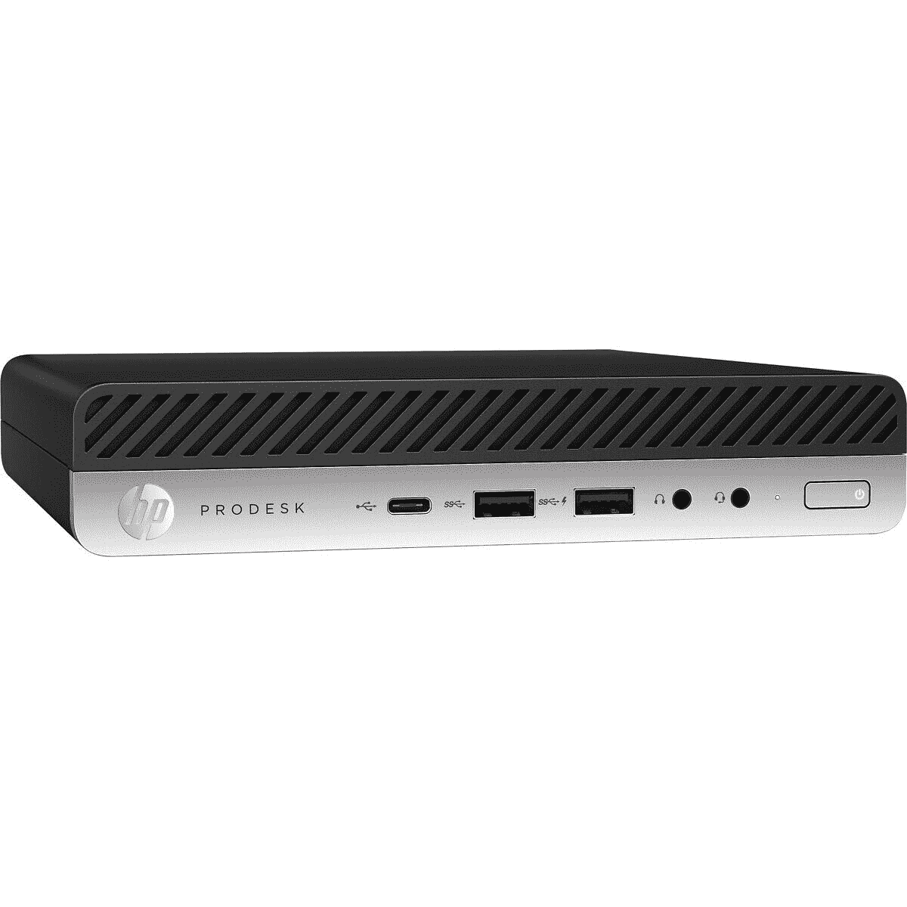
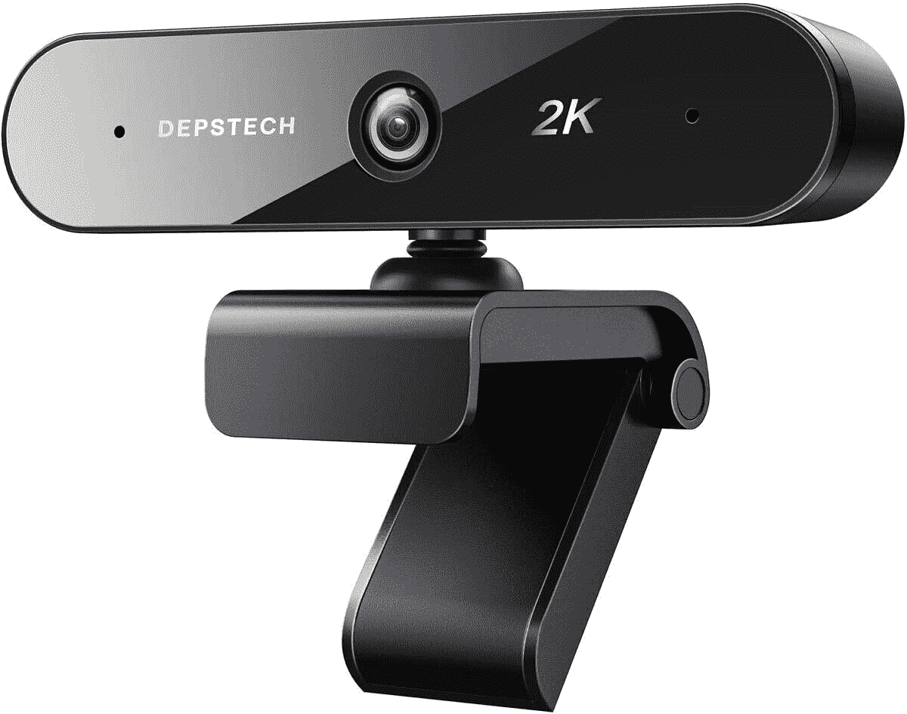
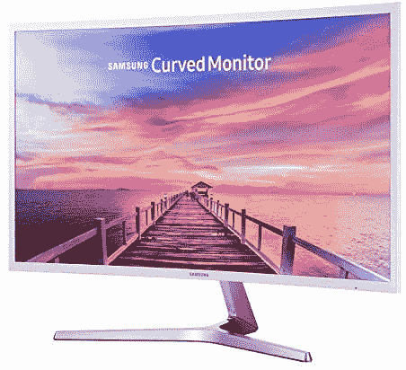

# 今天的技术交易:900 美元的 Galaxy Note 20 Ultra，500 美元的惠普迷你电脑！

> 原文：<https://www.xda-developers.com/top-5-deals-october-5/>

周一快乐！今天和周末一直善待我们的节俭倾向，有一堆惊人的交易可以利用。这还不包括[这些应用程序交易](https://www.xda-developers.com/7-great-deals-on-apps-this-week-incl-rosetta-stone/)，这些交易可以帮助你在一系列你肯定会用到的服务上节省大笔费用。这就像是吝啬鬼的圣诞节！嗯，我想那是黑色星期五，但你明白我的意思。

今天的顶级技术交易包括 Galaxy Note 20 Ultra 的较低价格，一台 500 美元的惠普迷你 PC 可以完成工作，以及更多！

## TONOR 电脑电容 PC 话筒，仅售 13 美元

耳机可能很棒，但如果你正在录制视频或流媒体，耳机可能会很烦人，有时不是最好的外观。用 [Tonor 电脑麦克风](https://www.amazon.com/gp/product/B07WLWN2ZT?tag=xda-14kph51-20&ascsubtag=UUxdaUeUpU30084&asc_refurl=https%3A%2F%2Fwww.xda-developers.com%2Ftop-5-deals-october-5%2F&asc_campaign=Short-Term)升级录音设置，售价 13 美元，低于 40 美元的建议零售价。这款麦克风在亚马逊上的评价很高，不像 Yeti 麦克风那样昂贵，所以为什么要为同样的体验付出更多呢？确保使用代码 **ASDWUKS4** 并剪下优惠券以获得全额折扣。

 <picture></picture> 

TONOR Computer Condenser PC Mic

##### TONOR 电脑电容 PC 话筒

停止摆弄不舒服的耳机，开始时尚录音！Tonor 的 PC 麦克风降到了 13 美元，带有优惠券夹和代码 **ASDWUKS4** ，你不应该睡在这笔交易上。它有自己的支架，一个流行过滤器，并且易于设置，没有理由不抓住这个麦克风！

## 惠普 ProDesk 600 G4 迷你台式机，仅限今天

对于一台可以播放媒体并整齐地放在娱乐中心的迷你 PC 来说，惠普 ProDesk 600 G4 绝对不会错。在伍特！，这款全新的小台式机售价仅为 500 美元。借助英特尔 i5 处理器、8GB 内存和集成显卡，这款笔记本电脑可以成为一款出色的紧凑型办公台式机，或者在客厅电视上轻松播放任何媒体(视频游戏除外)。但是，如果你想得到它，你需要尽快行动——这笔交易只在今天结束前有效，或者直到他们售完为止！

 <picture></picture> 

HP ProDesk 600 G4 Mini Desktop

##### 惠普 ProDesk 600 G4 迷你台式机

需要一台性能良好但没有空间放置全尺寸机箱的电脑吗？HP ProDesk 600 G4 迷你台式机将作为办公台式机或媒体设备发挥巨大作用。只有 Woot 才有！今天，所以不要拖延！

## DEPSTECH D08 2K 双麦克风网络摄像头，仅售 19 美元

网络摄像头仍然很受欢迎。我强调的大多数产品似乎很快就卖光了，所以如果你还在寻找，不要坐以待毙！如果你使用代码 **ZVXLU7KJ** 并将优惠券夹在页面上，德普斯泰克的 2K 网络摄像头仅售 19 美元。拥有超过 1，000 条亚马逊评论和 4 星评级，您知道这款网络摄像头将为您的缩放会议完成工作，双麦克风意味着您甚至不需要拿起耳机。

 <picture></picture> 

DEPSTECH D08 2K Webcam with Dual-Mic

##### DEPSTECH 2K 网络摄像头

不要再等了-如果你需要一个工作或学校用的网络摄像头，你需要在 Depstech 的 2K 网络摄像头售罄之前购买它！通过使用代码 **ZVXLU7KJ** ，以及将优惠券剪在页面上，您将获得最大的节省。

## 三星 Galaxy Note 20 超 5G 价格在百思买进一步下降

百思买的 Galaxy Note 20 Ultra 5G 交易已经在我们的名单上有一段时间了，但现在，百思买已经进一步降价，你需要知道它！你现在可以买到这款功能强大的旗舰产品，起价仅为 900 美元，是 Note 20 Ultra 迄今为止最低的价格之一。900 美元的价格是如果你用威瑞森激活手机，一个 24 个月的付款计划。如果你想使用美国电话电报公司或 T-Mobile，你仍然可以节省，在 24 个月的付款计划中，总额将为 1000 美元。这不是一个解锁的手机，但有了这样的节省，无论如何都需要一个运营商，你不能对这些价格提出异议！

 <picture></picture> 

Samsung Galaxy Note 20 Ultra

##### 三星 Galaxy Note 20 Ultra

如果你像我一样，已经盯上 Note 20 Ultra 有一段时间了，百思买在这款旗舰设备上有一些最好的价格。如果你以 24 个月的付款计划购买威瑞森运营商的手机，你只需支付 900 美元！如果你选择美国电话电报公司或 T-Mobile，价格是 1000 美元。

## 翻新的三星 32 英寸曲面 LED 显示器，售价 180 美元

监视器是...价格昂贵。但是，如果你对翻新的显示器没意见，你可以在 Woot 省下一大笔钱！，只限今天！三星的 32 英寸曲面显示器在 Woot 仅售 180 美元！这是我见过的高质量曲面显示器的最低价格之一。这款显示器不是 4K 的，刷新率为 60hZ，因此它不是游戏的最佳选择，但对于工作和观看 YouTube 上的视频来说，你不会出错。你只能在今天结束前拿到这个！

 <picture></picture> 

Samsung 32-inch Curved LED Monitor

##### 三星 CF397 34 英寸曲面 LED 显示器

今天只在伍特！，低价获得翻新的三星显示器。这款 32 英寸曲面显示器仅售 180 美元，但你只有一天的时间来抢购它！如果你有亚马逊 Prime，你还可以享受免费送货。

## 更多技术交易

寻找更多的技术交易？下面我们为你准备了！

## 2020 年黄金日早期交易

我们已经收集了目前为止在下面找到的 2020 年 Prime Day 早期交易！