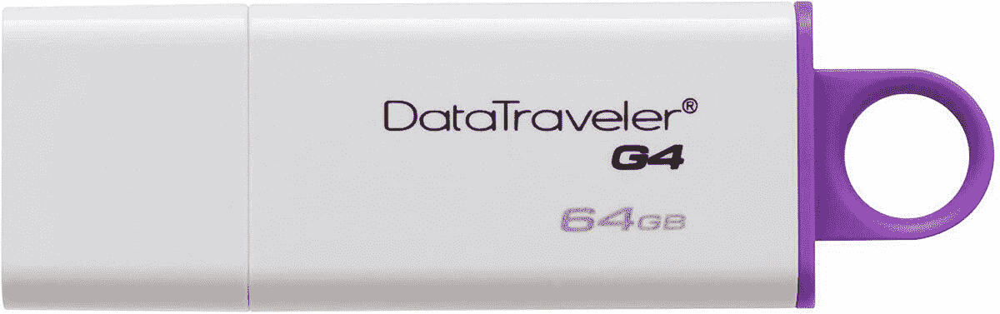
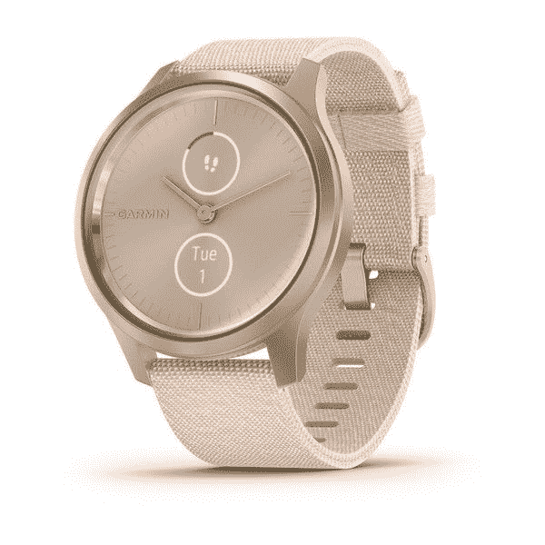
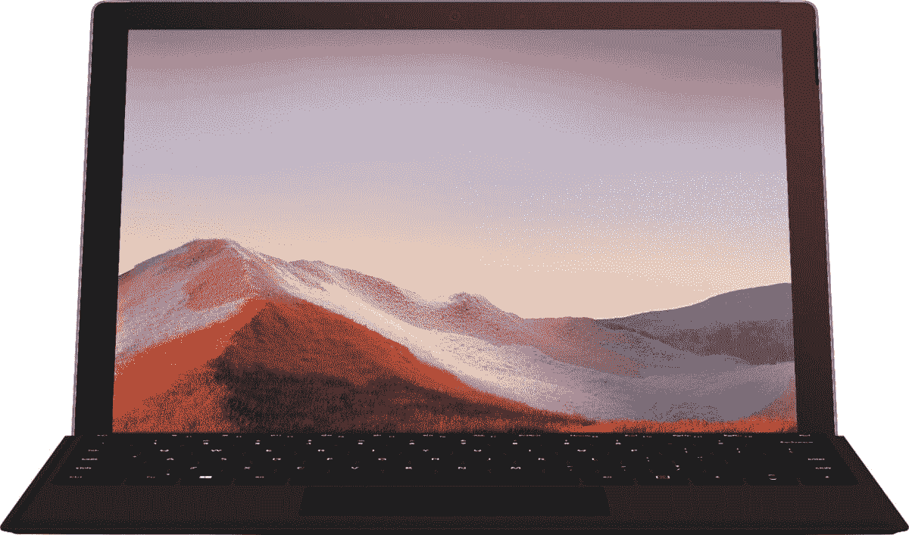

# 今天的顶级技术交易:90 美元的 Razer Kayboard，600 美元的 Surface Pro 7！

> 原文：<https://www.xda-developers.com/top-5-deals-september-10/>

随着时间的推移，我对这些更大、有时可折叠的手机和平板电脑更感兴趣。随着我们的 [Galaxy Z Fold 2 day one 评测](https://www.xda-developers.com/samsung-galaxy-z-fold-2-ongoing-review-day-one/)和 [Surface Pro Duo 评测](https://www.xda-developers.com/microsoft-surface-duo-review/)，拥有一部更像微型平板电脑而不是实际手机的智能手机变得越来越有诱惑力。不过，这种诱惑很快就被这些价位冲淡了。我大概可以用两倍的价格升级我的整个电脑设备！

无论如何，今天的顶级技术交易包括 90 美元的 Razer 游戏键盘，Surface Pro 7 的大幅折扣等等！

## 金士顿 64GB 闪存驱动器，售价 11 美元

我有一个金士顿闪存盘差不多有十年了，它还没有让我失望。在这一点上，我更有可能失去它，而不是它死了，而且那个闪存盘真的经历了很多。因此，当你看到像金士顿 64GB 闪存盘 11 美元的交易时，它绝对值得一看。简单有效，上面还有一点紫色。有什么不喜欢的？

 <picture></picture> 

Kingston 64GB Flash Drive

##### 金士顿 64GB 闪存驱动器

身边有一个闪存盘总是一个好主意，如果你不担心它会过时就更好了。金士顿的 64GB 闪存驱动器将覆盖你，你现在只需 11 美元就可以得到它。

## Razer 游戏键盘，60 美元

没有什么比机械键盘更好的了。用机械键盘噼啪作响的感觉真的很令人满意，硅胶键盘的准确性是无可匹敌的。问题是，机械键盘可能很贵。

现在，你可以以 60 美元的价格买到 [Razer 的 Huntsman 游戏键盘](https://www.amazon.com/Razer-Huntsman-Opto-Mechanical-Board-Durability/dp/B07DHNZ676?tag=xda-jteir2u-20&ascsubtag=UUxdaUeUpU29787&asc_refurl=https%3A%2F%2Fwww.xda-developers.com%2Ftop-5-deals-september-10%2F&asc_campaign=Short-Term)，这使它低于 100 美元。你可以为你喜欢的游戏设置宏，当然，它非常点击，有 RGB 照明。你不能要求太多了！

 <picture></picture> 

Razer Huntsman Gaming Keyboard

##### 雷蛇猎人

Razer 声称他们的机械键盘开关是周围最快的，他们自己的定制开关设计从竞争中脱颖而出。一个新的 RGB 背景键盘只需 90 美元，买一个，看看你是否会爱上 clicky 键。

## Garmin 的生日特卖现场直播！

生日快乐佳明！庆祝一大堆 Garmin 股票的拍卖。无论你是在寻找一款可以追踪一切的健身手表，还是一款看起来很时尚并能给你提示的简单智能手表，Garmin 可能有你想要的，而且可能还在打折。看看销售情况，你可能会找到你最喜欢的新手表。

 <picture></picture> 

Garmin Birthday Sale

##### 加明·菲尼克斯·5X

有了加明本能、活力、先导等的折扣，这个生日聚会对每个人都有好处。查看正在出售的产品，或许您能以合理的价格购买下一款智能手表。

## 百思买深度 Surface Pro 7 折扣

高档笔记本电脑都很好，但有时您只想要一台好的平板电脑，可以像笔记本电脑一样偶尔使用。在这种情况下，微软的 Surface Pro 7 将是你最好的选择之一。在百思买，您只需 800 美元就可以买到 8GB RAM 的 Surface Pro 7，无需支付 MSRP 费用即可节省 230 美元。8GB 的内存应该足以运行最耗费资源的生产力应用程序，但是如果你不介意 4GB，你可以以更低的 600 美元购买 Surface Pro 7。

 <picture></picture> 

Microsoft Surface Pro 7

##### 微软 Surface Pro 7

如果您想要一台功能强大的平板电脑，而不是笔记本电脑，Surface Pro 7 是一款无需动脑筋的产品。定制平板电脑，满足您的需求，同时节省大笔费用！

## JBL T750BTNC 耳机，100 美元

如果您正在寻找一副坚固的耳机，但真的不支付索尼的价格，JBL 是一个很好的选择。现在，您可以从 MSRP 中以 100 美元甚至 30 美元的价格购买他们的 [T750BTNC 耳机](https://www.amazon.com/dp/B0818P1Q7L?tag=xda-jteir2u-20&ascsubtag=UUxdaUeUpU29787&asc_refurl=https%3A%2F%2Fwww.xda-developers.com%2Ftop-5-deals-september-10%2F&asc_campaign=Short-Term)。这些蓝牙耳机有十五个小时的电池寿命一次充电和主动噪音消除，以及 JBL 的纯低音声音。本质上，您将在不破坏银行的情况下获得出色的质量。

 <picture></picture> 

JBL T750BTNC Headphones

##### JBL 曲调 T750BTNC

JBL 的蓝牙耳机具有主动降噪功能，您可以不间断地欣赏音乐。单次充电的电池续航时间为 15 小时，这些耳机可以让您一整天都呆在这个区域。

## 更多技术交易

寻找更多的科技交易？我们在下面为您准备了它们！