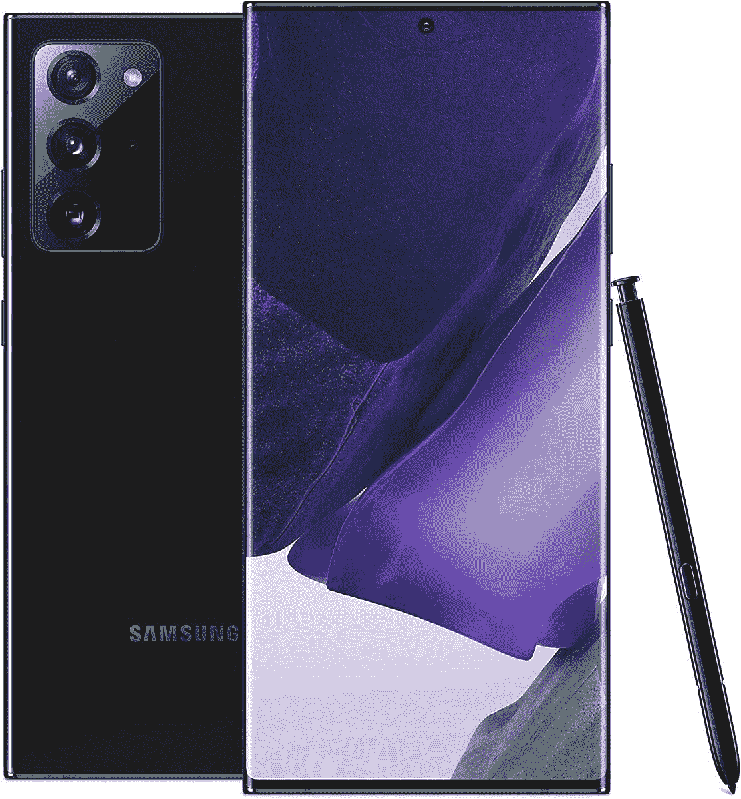
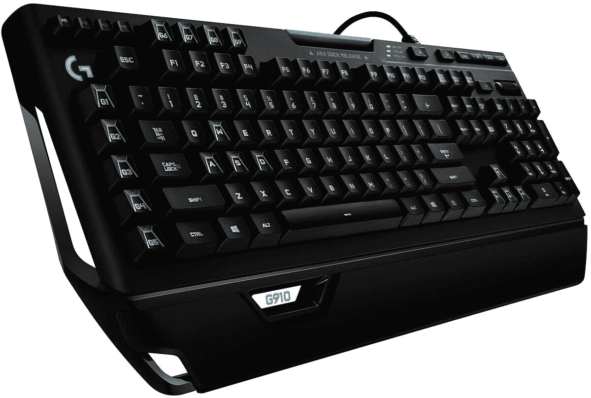
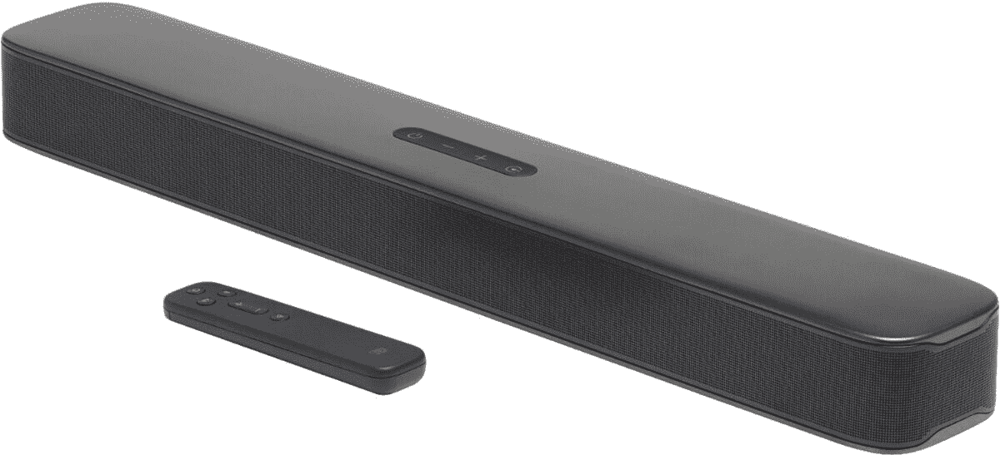

# 今天的顶级技术交易:200 美元的 Note 20 Ultra，105 美元的游戏键盘！

> 原文：<https://www.xda-developers.com/top-5-deals-september-11/>

星期五快乐！你的周末计划是什么？我可能会在周末的大部分时间里放松和玩视频游戏，同时关注我们对 Galaxy Z Fold 2 的持续评论。看到这款可折叠手机的能力是令人着迷的，即使我短期内买不起它，即使当你以旧换新时有一些很棒的 [Galaxy Z Fold 2 交易](https://www.xda-developers.com/best-galaxy-z-fold-2-deals/)。

今天的顶级技术交易包括三星的另一款旗舰产品 Galaxy Note 20 Ultra 降价 200 美元，罗技的 Orion Spark 游戏键盘售价 105 美元，等等！

顺便说一下，[任天堂 Switch Lite](http://xda.tv/NintendoSwitchLiteBestBuy) 的所有四种颜色在百思买都还有现货！这肯定是任天堂 Switch 股票的某种记录...

## 仅今天，精选 Anker 商品可享受 35%的优惠

需要一个新的手机充电器，或者是时候储备 USB-C 线了？今天，只有在亚马逊，你可以节省高达 35%的选择安科产品。Anker 是一个众所周知的，高质量的廉价品牌，所以你可以肯定无论你购买什么都是符合标准的。这次销售包括壁式充电器，一些无线充电器，甚至是一个电源插排。在价格回升之前，今天就抓住你想要的！

 <picture></picture> 

35% Off Anker Products

##### Anker PowerCore Fusion 5000 电池组

仅在今天提供，您可以在精选 Anker 产品上节省高达 35%的费用。如果你需要一个新的壁式充电器，电源板，或一些 USB-C 线，现在是你节省这个质量品牌的机会。

## 三星 Galaxy Note 20 Ultra 优惠 200 美元

还记得亚马逊[将普通 Galaxy Note 20 打折 200 美元](https://www.amazon.com/gp/product/B08BX7LJ5T?tag=xda-17597cg-20&ascsubtag=UUxdaUeUpU29805&asc_refurl=https%3A%2F%2Fwww.xda-developers.com%2Ftop-5-deals-september-11%2F&asc_campaign=Short-Term)吗？嗯，他们对 [Galaxy Note 20 Ultra](https://www.amazon.com/gp/product/B08BX7XBGN?tag=xda-17597cg-20&ascsubtag=UUxdaUeUpU29805&asc_refurl=https%3A%2F%2Fwww.xda-developers.com%2Ftop-5-deals-september-11%2F&asc_campaign=Short-Term) 做了同样的事情，总价格降到了 1100 美元。对于最近发布的产品来说，以 200 美元的价格获得这款 5G 旗舰产品并解锁是一个很好的价格。如果你一直在等待一个体面的交易，并且不希望你的手机绑定到运营商，现在是你升级的机会。

 <picture></picture> 

Samsung Galaxy Note 20 Ultra

##### 三星 Galaxy Note 20 Ultra

是时候升级了！在亚马逊以 200 美元的价格购买三星最新的 5G flagsip 手机 Galaxy Note 20 Ultra。Prime Rewards 卡提供 Prime 运输和支付计划，这是获得解锁 Note 20 Ultra 的最简单方式。

## 外星人的 Aurora 11 台式机售价 1480 美元

拥有一台功能强大、支持游戏的电脑是一件美妙的事情，但如果你不是电脑游戏技术专家，就很难将它们组合在一起。虽然从头开始构建自己的 PC 可以确保您的装备完全符合您的需求，但这很耗时，而且不是每个人都适合这种精细的工作。拿起[外星人极光 11](https://www.anrdoezrs.net/links/100122946/type/dlg/sid/UUxdaUeUpU29805/https://www.dell.com/en-us/shop/cty/pdp/spd/alienware-aurora-r11-desktop/wdaurr1120s) 游戏台式机，削减所有的挫折感，已经为你需要的一切而建造。在结账时使用代码 **SAVE17** ，你就能以 1480 美元的价格买到 Aurora 11 的基础版。

 <picture></picture> 

Alienware Aurora 11 Gaming Desktop

##### 戴尔外星人极光 11

外星人极光 11 配备了 256 固态硬盘、英伟达 RTX 2060 和第十代英特尔酷睿 i7 处理器。如果您正在寻找一款没有构建和研究麻烦的游戏台式机，Aurora 11 就是您的理想之选。确保在结账时使用代码 **SAVE17** 。

## 罗技 G910 猎户座火花机械键盘，售价 105 美元

你知道你刚买的新极光 11 需要什么吗？闪亮的新键盘！与 Razer 的游戏键盘一样，[罗技的 Orion Spark 机械键盘](https://www.amazon.com/Logitech-Orion-Mechanical-Gaming-Keyboard/dp/B00N3OELPU?tag=xda-17597cg-20&ascsubtag=UUxdaUeUpU29805&asc_refurl=https%3A%2F%2Fwww.xda-developers.com%2Ftop-5-deals-september-11%2F&asc_campaign=Short-Term)在亚马逊上售价 105 美元，比建议零售价低 75 美元。罗技是电脑配件最多产的品牌之一，这是有充分理由的——他们以合理的价格制造出很棒的设备。Orion Spark 有九个可编程按钮、专用媒体控制按钮，甚至还有一个智能手机底座。罗技为这个键盘想到了一切！

 <picture></picture> 

Logitech G910 Orion Spark Keyboard

##### 罗技 G910 猎户座火花键盘

使用罗技的 G910 洋葱火花机械键盘，你不需要降低要求。凭借其独特的开关、九个可编程按钮和一个可以将游戏中的数据显示到手机上的智能手机坞站，这款键盘不容小觑。

## JBL 2.0 声道条形音箱，售价 150 美元

您是否希望为您的计算机或娱乐中心提供更好的音频，但没有钱或空间来购买完整的环绕声设备？获得一个条形音箱可以很好地兼顾出色的音频和成本效益。在百思买，你可以花 150 美元买到 [JBL 的 2.0 声道条形音箱，比建议零售价低 200 美元。这个条形音箱有 80W 的输出功率和一个杜比数字解码器，所以它肯定会提升你的音频游戏，而不需要在整个音响系统上花费 1000 多美元。](http://xda.tv/JBLSoundbarDealBestBuy)

 <picture></picture> 

JBL 2.0 Channel Soundbar

##### JBL 2.0 声道条形音箱

获得高质量的音频播放，而不打破银行拿起一个条形音箱。JBL 的 2.0 声道 soundbar 在百思买(Best Buy)售价 150 美元，配有杜比数字解码器，让你在没有环绕声的情况下获得电影院品质的音频。

## 更多技术交易

寻找更多的技术交易？下面我们为你准备了！