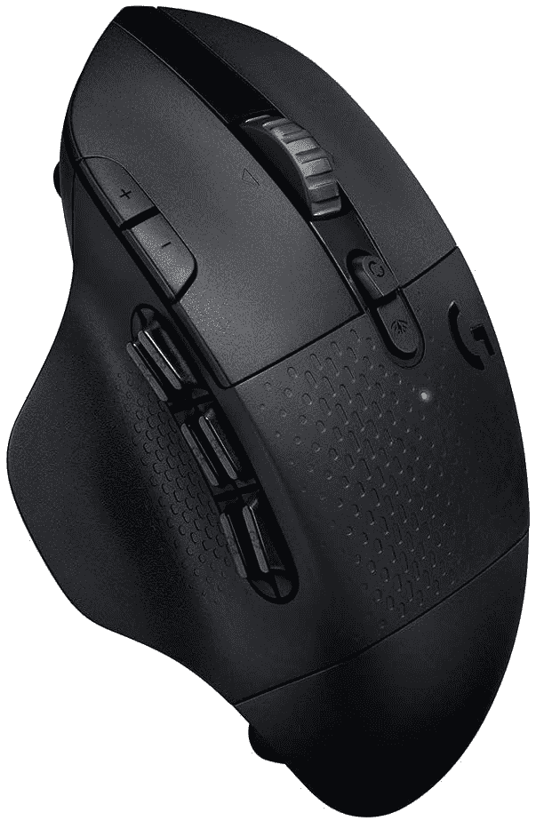
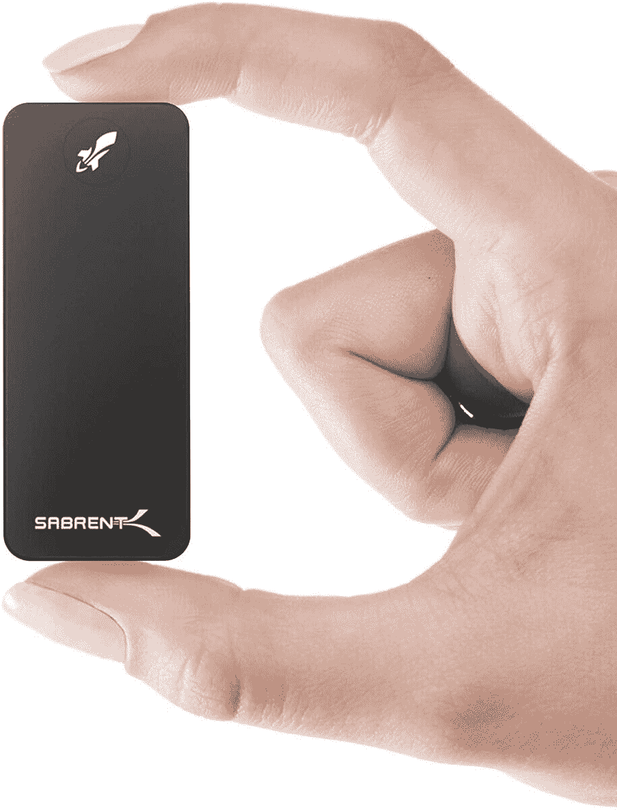
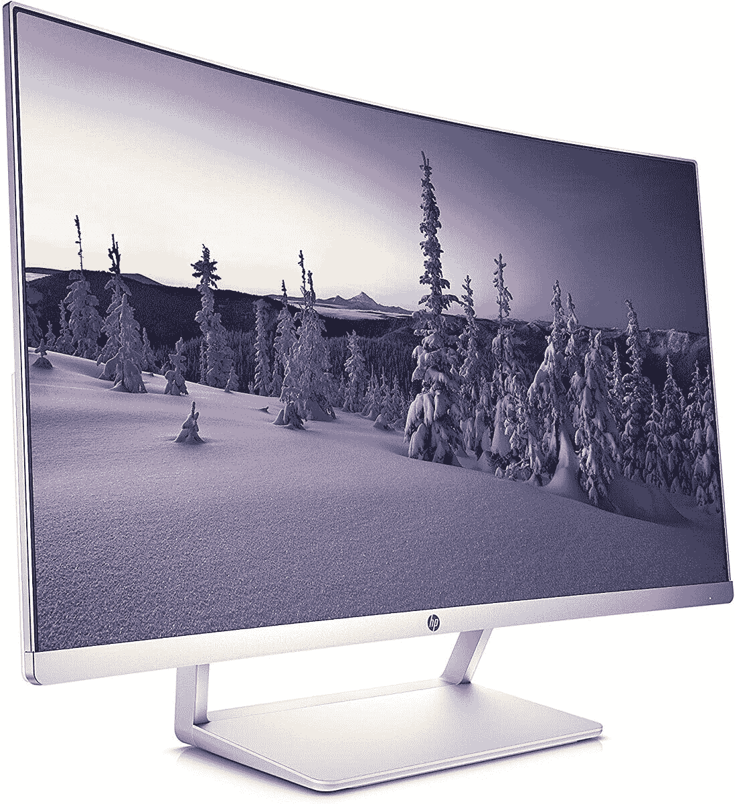

# 今天的顶级技术交易:200 美元的曲面显示器，240 美元的 2TB 外置硬盘！

> 原文：<https://www.xda-developers.com/top-5-deals-september-14/>

周一快乐！像往常一样，周末会有一系列大减价，我们为您准备了这些东西，让您马上开始一周的工作。不过，首先，我忍不住对配备谷歌电视的谷歌 Chromecast 感兴趣，这是一个很拗口的名字。多年来，我的普通 Chromecast 已经被广泛使用，所以根据“Chrome TV”的要求(如果有烦人的区域锁定)，我可能会被说服升级。

但是，那是以后的事了。今天最热门的技术交易包括售价 60 美元的 2TB 小型外置硬盘、售价 200 美元的 16:9 27 英寸曲面显示器等等！

## 罗技 G604 光速无线游戏鼠标优惠 30 美元

你上周拿到那个[罗技游戏键盘](https://www.amazon.com/Logitech-Orion-Mechanical-Gaming-Keyboard/dp/B00N3OELPU?tag=xda-2tam69m-20&ascsubtag=UUxdaUeUpU29829&asc_refurl=https%3A%2F%2Fwww.xda-developers.com%2Ftop-5-deals-september-14%2F&asc_campaign=Short-Term)了吗？很好！现在是时候拿起罗技的游戏鼠标了。花 70 美元，你可以得到[罗技光速游戏鼠标](https://www.amazon.com/gp/product/B07QN369XX?tag=xda-2tam69m-20&ascsubtag=UUxdaUeUpU29829&asc_refurl=https%3A%2F%2Fwww.xda-developers.com%2Ftop-5-deals-september-14%2F&asc_campaign=Short-Term)！这款别致的鼠标有 15 个可编程按钮(非常适合您的所有宏)，一个“超快”滚轮，单节 AA 电池续航时间可达 240。如果您的鼠标在游戏过程中无法正常工作，罗技可以为您提供解决方案。

 <picture></picture> 

Logitech G604 Lightspeed Wireless Gaming Mouse

##### 罗技 G604 光速

罗技的 Lightspeed 游戏鼠标拥有 15 个可编程按钮和更多功能，可能正是您游戏装备所需要的。在销售结束前，立即以 30 美元的价格购买一台！

## Sabrent Nano 2TB 外置硬盘，售价 240 美元

外置硬盘对于备份数据至关重要，但有时它们实在太大了。如果你需要易于运输的东西，那么你会想看看 [Sabrent 的 Nano 外置硬盘。](https://www.amazon.com/gp/product/B07XQZPX81?tag=xda-2tam69m-20&ascsubtag=UUxdaUeUpU29829&asc_refurl=https%3A%2F%2Fwww.xda-developers.com%2Ftop-5-deals-september-14%2F&asc_campaign=Short-Term)这款硬盘仅比闪存盘大一点点，但提供 10GB/s 的数据速度和您期望从外置硬盘获得的一切。如果你在结账时使用代码 **20TRNRT7** ，你可以以 60 美元的价格买到 2TB 的型号，总共 240 美元。

 <picture></picture> 

Sabrent Nano 2TB External Hard Drive

##### 萨布伦火箭纳米

Sabrent 的微型外置硬盘提供了硬盘的所有优势，如 10 GB/s 的数据速度，但具有闪存驱动器的外形。在结账时使用代码 **20TRNRT7** ，只需 240 美元即可获得 2TB 型号！

## 三星 Galaxy Buds+售价 130 美元

任何时候，只要你能在三星产品上省钱，那就是好日子。在 Target，你可以花 130 美元买到三星 Galaxy Buds+,比 150 美元的零售价低 20 美元。这适用于所有颜色，包括非常强烈的红色花蕾！你知道吗，如果你的手机也是三星设备，你可以通过手机的无线充电器给 buds 充电？这太疯狂了，尽管我不想为了这些芽而耗尽我的手机电池。尽管如此，除了其他许多功能之外，该功能仍然存在。

 <picture></picture> 

Samsung Galaxy Buds+

##### 三星 Galaxy Buds+

三星 Galaxy Buds+一次充电可连续播放 11 个小时的音乐，并具有环境感知功能，确保您了解周围发生的事情。在 Target 买一双你最喜欢的颜色的鞋，优惠 20 美元！

## OptiPlex 3070 微型台式机起价 449 美元

微型台式机真的很有用。狭小的办公空间？一个小小的桌面可以腾出一个小空间。您的家庭影院系统需要一个媒体设备吗？微型桌面将会比智能电视更加多功能，而且你也不需要摆弄物理媒体。在戴尔，OptiPlex 3070 微型台式机的起价为 449 美元，可以节省很多费用。我推荐 529 美元的微型台式机，它配备了英特尔酷睿 i3-9100T 处理器，但你可以根据自己的需要定制设备。

 <picture></picture> 

OptiPlex 3070 Micro Desktop

##### Dell OptiPlex 3070 微型台式机

对于空间有限的 PC 用户，或者基本上不是高端 PC 游戏玩家的任何人来说，微型台式机都是一个很好的解决方案。起价 449 美元，您可以购买戴尔的 OptiPlex 3070 Micro，它非常适合媒体娱乐中心或日常办公。

## 惠普 27 英寸曲面显示器，售价 200 美元

如果你有一台游戏电脑，你知道什么最适合它吗？一个漂亮的大 27 英寸曲面显示器。在 Staples，你只需花 200 美元就能买到惠普的曲面显示器，这对于任何这种尺寸的曲面显示器来说都是非常低的价格。这不是一个超宽显示器，但毕竟不是每个人都喜欢超宽显示器。你甚至可以得到免费的一天送货上门服务！

 <picture></picture> 

HP 27-inch Curved LED Monitor

##### 惠普 27 英寸曲面 LED 显示器

如果你正在寻找一款不会让你倾家荡产的非超宽曲面显示器，惠普的 27 英寸显示器将会满足你的需求。现在，它在 Staples 只卖 200 美元，所以如果你感兴趣的话，在卖完之前买一个吧！

## 更多技术交易

寻找更多的技术交易？下面我们为你准备了！