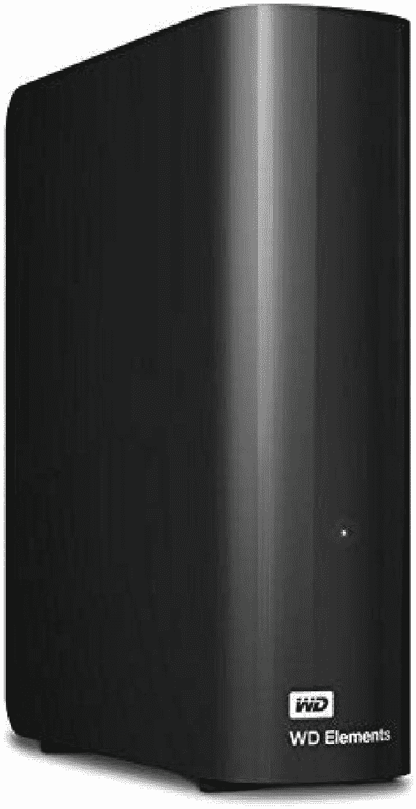
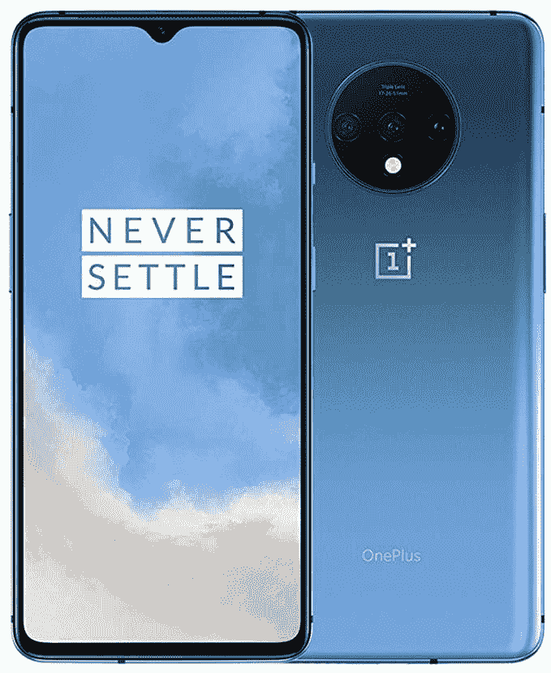
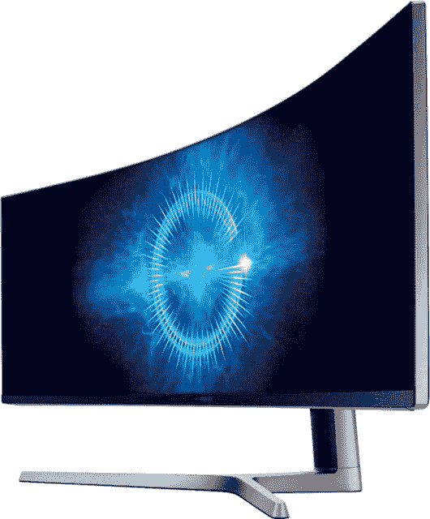
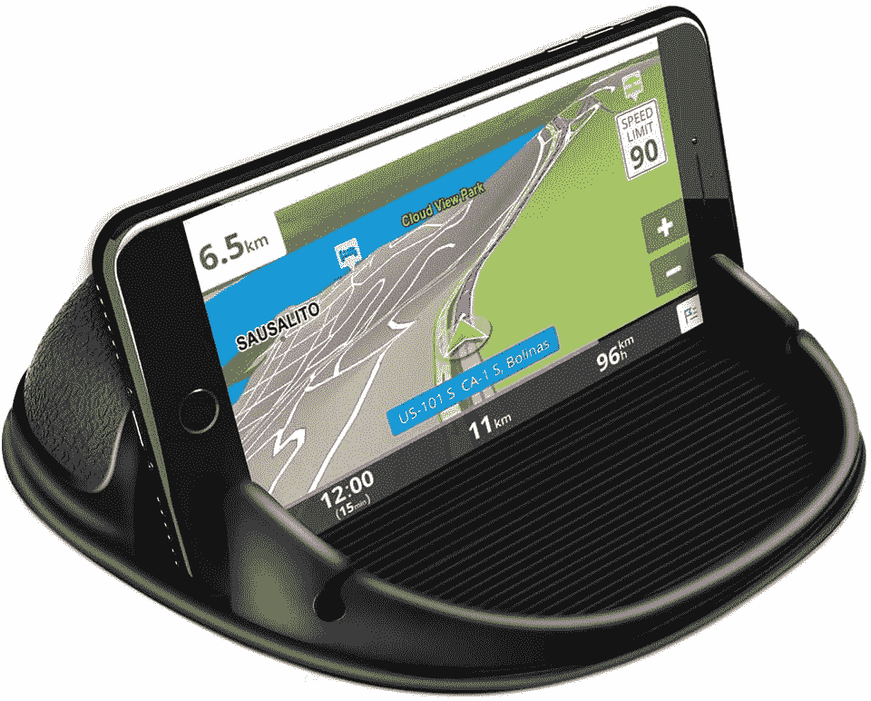

# 今天的顶级技术交易:亚马逊的 Switch Lite，超级超宽显示器！

> 原文：<https://www.xda-developers.com/top-5-deals-september-15/>

你所在地区的天气怎么样？我住的地方已经连续下了一周的雨，这在很大程度上要归功于一场席卷该地区的热带风暴。它对睡眠很好，但如果停电，对工作和我的技术人员的一般健康来说就不太好了。最重要的是，看起来 T-Mobile 需要为他们的 5G 网络购买新的 SIM 卡，所以如果互联网中断了，我就只能呆在家里用较慢的速度。至少我有另一个理由去商店考虑升级。不过，与我不同的是，你们都有机会通过 OPPO Find X2 赢得[的免费升级，所以请务必参加！](https://www.xda-developers.com/win-an-oppo-find-x2/)

今天的顶级技术交易包括 900 美元的超级超宽显示器，亚马逊库存的 Switch Lites，等等！

## WD 8TB Elements 台式机硬盘，售价 145 美元

昨天，我在一个[微型外置硬盘](https://www.amazon.com/gp/product/B07XQZPX81?tag=xda-4bc9ajr-20&ascsubtag=UUxdaUeUpU29853&asc_refurl=https%3A%2F%2Fwww.xda-developers.com%2Ftop-5-deals-september-15%2F&asc_campaign=Short-Term)(如果你使用代码 20TRNRT7，它仍然有效)上强调了一个不错的交易，但今天我要做大。如果你需要尽可能多的东西而又不倾家荡产，WD 的 8TB Elements 外置硬盘售价 145 美元，比建议零售价低 35 美元。如果你是一个收集无损音乐或只想要 4K 电影的人，这款外置硬盘就适合你。

 <picture></picture> 

WD 8TB Elements Desktop Hard Drive

##### WD Elements 外置硬盘

如果你需要很大的空间，8TB 的硬盘绝对不会错。WD 是一个值得信赖的品牌，因此您知道这款大容量外置硬盘能够经受住时间的考验，保护您所有数据的安全。

## 亚马逊有现货的 Switch Lite

虽然普通的任天堂 Switch 在亚马逊不断进进出出或库存，但 Switch Lite 似乎在库存方面保持稳定。虽然只有[珊瑚色](https://www.amazon.com/dp/B084Y3VVNG?tag=xda-4bc9ajr-20&ascsubtag=UUxdaUeUpU29853&asc_refurl=https%3A%2F%2Fwww.xda-developers.com%2Ftop-5-deals-september-15%2F&asc_campaign=Short-Term)和[灰色](https://www.amazon.com/dp/B07V2BBMK4?tag=xda-4bc9ajr-20&ascsubtag=UUxdaUeUpU29853&asc_refurl=https%3A%2F%2Fwww.xda-developers.com%2Ftop-5-deals-september-15%2F&asc_campaign=Short-Term)两种颜色，但如果你一直在等着抓住这款掌上电脑来利用亚马逊支付计划，现在你有机会抓住它了！

 <picture></picture> 

Nintendo Switch Lite

##### 任天堂 Switch 建兴

虽然目前只有珊瑚色和灰色，但 Switch Lites 在亚马逊上有售，并且库存已超过 15 分钟！不过，谁知道它们还会存在多久，所以如果你想要的话，不要犹豫。

## 仅今天，购买一加 7T 即可享受 33%的优惠

一加七等于 T？我觉得 Woot 的烂笑话开始感染我了？玩笑归玩笑，Woot！今天，[一加 7T 已经以 400 美元的低价解锁](https://www.anrdoezrs.net/links/100122946/type/dlg/sid/UUxdaUeUpU29853/https://electronics.woot.com/plus/one-plus-7t-your-choice)了吗？你可以买到蓝色或银色的，但要注意这是一款 GSM 手机，不适用于威瑞森！不过，它确实适用于 T-Mobile 和 AT & T，所以如果你是他们计划中的一员，你就可以去了。如果你有亚马逊 Prime，从 Woot 发货！是免费的。

 <picture></picture> 

OnePlus 7T

##### 一加 7T

寻找一款价格实惠的一加手机？呜！拥有新的解锁一加 7T 手机，仅售 400 美元，仅限今天。这些都是 GSM 手机，所以在购买之前请确保您的运营商支持 GSM！

## 三星 49 英寸超宽显示器优惠 100 美元

你见过普通高清显示器，你见过超宽显示器，那么超级超宽显示器呢？如果你想要最长的，你可以从百思买(Best Buy)以 900 美元的价格买到[三星的三星 49 英寸 CHG90 超级超宽显示器](https://shop-links.co/link/?exclusive=1&publisher_slug=xda&article_name=Today%27s+Top+Tech+Deals%3A+Switch+Lite+at+Amazon%2C+%24900+Super+Ultra-Wide+Monitor%2C+and+More%21&article_url=https%3A%2F%2Fwww.xda-developers.com%2Ftop-5-deals-september-15%2F&u1=UUxdaUeUpU29853&url=https%3A%2F%2Fwww.bestbuy.com%2Fsite%2Fsamsung-49-chg90-super-ultra-wide-monitor-matte-dark-blue-black%2F6115611.p%3FskuId%3D6115611)，比建议零售价低 100 美元。如果你还没有买的话，你还可以多花 30 美元买一个键盘组合。

 <picture></picture> 

Samsung 49-inch CHG90 Super Ultra-Wide Monitor

##### 三星 45W USB-C 快速充电器

如果超宽对你来说不够宽，三星有一款专为你打造的 49 英寸超宽显示器。在百思买购买 CHG90 可节省 100 美元，今天就准备好享受弧形超宽生活吧。

## Loncaster 车载电话支架，售价 13 美元

当我有一辆车的时候，我很难找到一个手机支架，它能做我需要它做的事情，并且不会感觉我的设备随时会掉出来。我希望我知道 [Loncaster 的手机支架](https://www.amazon.com/Loncaster-Silicone-Dashboards-Compatible-Smartphones/dp/B07TZSC1P3?tag=xda-4bc9ajr-20&ascsubtag=UUxdaUeUpU29853&asc_refurl=https%3A%2F%2Fwww.xda-developers.com%2Ftop-5-deals-september-15%2F&asc_campaign=Short-Term)，它能够在风景模式下舒适地拿着你的手机。GPS 导航的完美选择？支架的设计也使它不太可能分开，现在你只需 13 美元就可以买到一个。

 <picture></picture> 

Loncaster Car Phone Holder

##### Loncaster 车载电话支架

厌倦了尝试其他手机支架并让它们分崩离析？Loncaster 的手机支架简单有效，可确保您在使用手机指路时手机保持安全。

## 更多技术交易

寻找更多的技术交易？下面我们为你准备了！一夜之间，[三星 Galaxy Book Flex](https://www.amazon.com/Samsung-Display-Processor-Bluetooth-Enabled-NP930QCG-K01US/dp/B085D2HHBT?tag=xda-4bc9ajr-20&ascsubtag=UUxdaUeUpU29853&asc_refurl=https%3A%2F%2Fwww.xda-developers.com%2Ftop-5-deals-september-15%2F&asc_campaign=Short-Term) 又下跌了 4 美元...能低到什么程度？