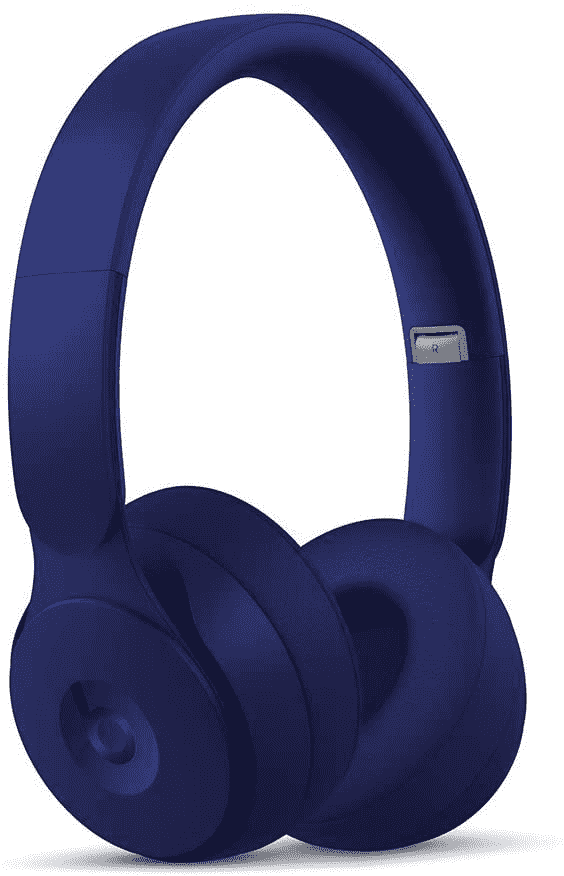
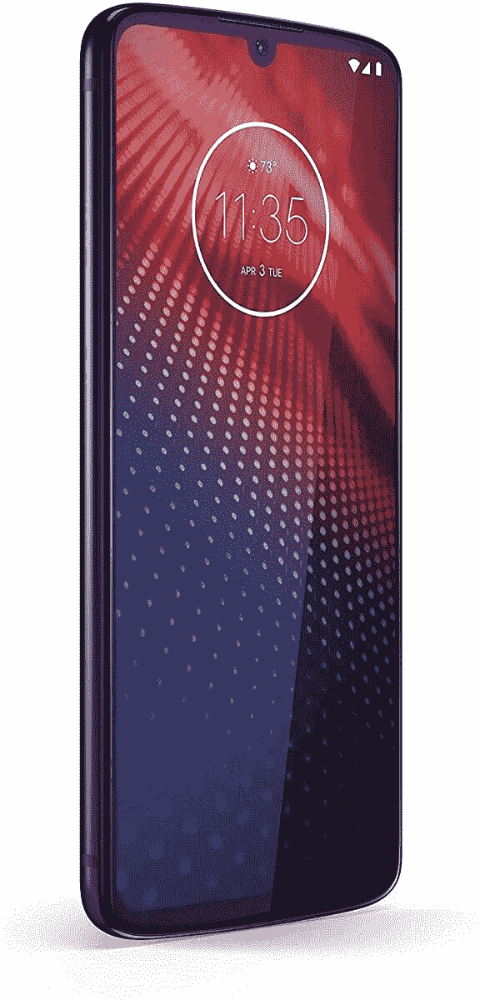

# 今天的顶级技术交易:410 美元的佳明菲尼克斯 5X，400 美元的 Moto Z4，等等！

> 原文：<https://www.xda-developers.com/top-5-deals-september-16/>

你知道，出于某种原因，我的谷歌账户照片有时会显示 15 年前的照片。虽然当我发送电子邮件时，那张照片没有反映出来(谢天谢地)，但似乎没有办法修复那个偶尔出现的、走失的头像。也许[谷歌联系人的最新功能](https://www.xda-developers.com/google-contacts-android-prepares-change-your-google-account-profile-photo-trash-instead-delete-contacts/)将最终永远淘汰那张旧照片。不过，对于那些没有这种独特奇怪问题的人来说，更新还包括了垃圾联系人而不是永久删除联系人的能力，如果你在清理东西时发生意外，这是很好的。

无论如何，今天的顶级技术交易包括 400 美元的 Moto Z4，410 美元的 Garmin 菲尼克斯 5X 蓝宝石，等等！亚马逊今天也在榜单上占据主导地位，所以如果你是这家在线零售商的粉丝，这绝对是你的综述。

## Beats Solo 专业耳机，优惠 100 美元

Beats 可能是最容易识别的耳机名称，通常这个高级名称都带有高级价格标签。不过，现在在亚马逊，你可以以 100 美元的价格买到[各种颜色的 Beats Solo Pro](https://www.amazon.com/Beats-Wireless-Noise-Cancelling-Headphones-Bluetooth/dp/B07YVZ15SG?tag=xda-5gdtkkt-20&ascsubtag=UUxdaUeUpU29868&asc_refurl=https%3A%2F%2Fwww.xda-developers.com%2Ftop-5-deals-september-16%2F&asc_campaign=Short-Term) ，总价格降至 200 美元。Beats Solo Pro 具有主动降噪功能，苹果 H1 耳机芯片可以提供更好的蓝牙质量，一次充电可以播放 22 小时的音乐。

 <picture></picture> 

Beats Solo Pro Headphones

##### Beats Solo Pro

如果你想要一副保证是最好的耳机，Beats 绝对不会错。Beats Solo Pro 的某些颜色降至 200 美元，所以你可以在这些主动降噪、22 小时电池耳机上节省很多钱。

## 带 Instaprint Mod 的解锁版 Moto Z4 售价 400 美元

亚马逊继续提供摩托罗拉折扣，带 Instaprint Mod 的 Moto Z4 售价 400 美元，比 500 美元的建议零售价低 100 美元。这个特殊的，虽然没有锁定，但“为美国制造”，所以它可以与所有主要的运营商合作(尽管产品页面警告说，您可能需要联系客户支持来激活 Sprint)。凭借长电池寿命和 4800 万像素的摄像头，这款廉价手机不会感觉像是一个廉价的选择。

 <picture></picture> 

Moto Z4 with Instaprint Mod

##### 摩托罗拉摩托 Z4

在亚马逊购买 Moto Z4，以 100 美元的优惠价格购买一部出色的手机。Moto Z4 拥有 128GB 的内存、48MP 摄像头和四像素技术。如果你需要一部质量好的手机，但又买不起大牌旗舰手机，摩托罗拉可以满足你。

## 售价 18 美元的 Anker 平板 USB C 充电器

我知道这不是我独有的问题——你去把手机充电器插到书架或床后面的墙上插座上，但是充电器太长了，你插不进去。好吧，与其挣扎着冒着损坏电线的风险或寻找另一个插入的地方，你可以选择一个薄而平的充电器来适应这些狭窄的区域。 [Anker 的 PowerPort Atom III](https://www.amazon.com/Anker-Delivery-Charger-PowerPort-Compact/dp/B07PT7XMP9?tag=xda-5gdtkkt-20&ascsubtag=UUxdaUeUpU29868&asc_refurl=https%3A%2F%2Fwww.xda-developers.com%2Ftop-5-deals-september-16%2F&asc_campaign=Short-Term) 充电器肯定会适合那些狭小的空间(并将为你的设备快速充电)，目前售价为 18 美元。

 <picture></picture> 

Anker Flat USB C Charger

##### Anker 扁平 USB-C 充电器

一个可以放在狭小地方的充电器通常是你在真正需要的时候才意识到你需要的东西。省去麻烦和挫折，以 18 美元的价格购买 Anker 的扁平薄壁充电器，为尝试使用床边墙壁插座的一天做好准备。

## 佳明菲尼克斯 5X 蓝宝石，售价 410 美元

智能手表的世界以及选择哪一款可能会像智能手机的世界一样势不可挡，但有一点是肯定的——Garmin 是一个好品牌。如果你想要一个健身智能手表，无疑会跟踪你做的一切，佳明菲尼克斯 5X 蓝宝石既是一个拗口的名字，也是你想拿起的手表。与许多智能手表不同，Femix 5X 同时使用 GPS 和 Glonass，确保尽可能准确地记录您的锻炼。

 <picture></picture> 

Garmin Fenix 5X Sapphire

##### 佳明菲尼克斯 5X 蓝宝石

智能手表就像智能手机一样多种多样，这使得选择一款适合自己需求的手表有时很困难。佳明菲尼克斯 5X 蓝宝石是一款专注于健身的智能手表，可以自动跟踪最常见的锻炼，你可以在亚马逊以 410 美元的价格买到它。

## 无锁 TCL 10L 售价 210 美元

两个不同的智能手机品牌的股票在一天内有很大的交易？谁能想到呢？如果你是 TCL 的粉丝，在亚马逊页面点击优惠券，你就可以以 210 美元的价格获得一台无锁的 TCL 10L。此手机已解锁，可用于美国运营商，但您可能需要致电威瑞森客户服务中心更新您的帐户，以便正确使用。10L 配备了一个八核处理器，高通骁龙 665 和 6GB 的内存，所以它肯定会以其他手机的一小部分价格完成工作。

 <picture></picture> 

TCL 10L (Unlocked)

##### TCL 10L

很难找到一款性价比高但功能强大的智能手机，但 TCL 的 10L 手机就是这样。10L 将从你的智能手机上做你需要的一切，价格只是更大的品牌旗舰产品的一小部分，通过在亚马逊商店页面上剪下优惠券，你可以额外节省 40 美元。

## 更多技术交易

寻找更多的技术交易？下面我们为你准备了！