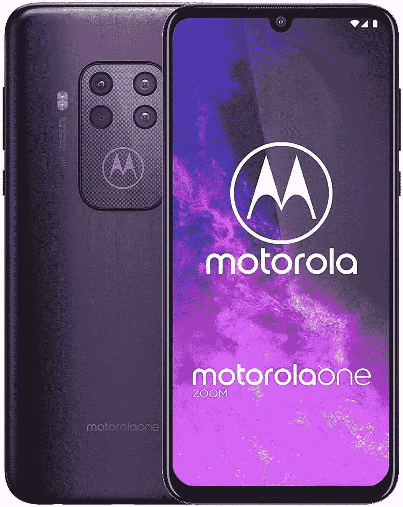
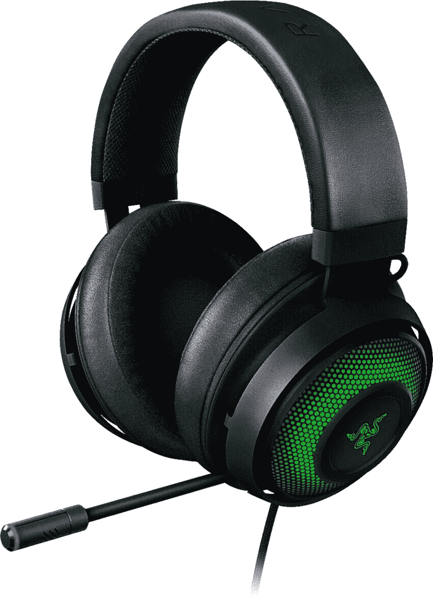

# 今天的顶级技术交易:外星人显示器 25%的折扣，Aukey 网络摄像头 40 美元！

> 原文：<https://www.xda-developers.com/top-5-deals-september-17/>

你是预订 PlayStation 5(T1)或 NVIDIA 3080(T3)的狂热人群中的一员吗？祝你好运，这是一个疯狂的预订世界。看起来两者的库存都是早出晚归，而且不断进进出出...我想买一台 3080，但我想我还得等一会儿。

今天的顶级技术交易包括售价 40 美元的 Aukey 网络摄像头，外星人显示器 24%的折扣，等等！

## 三星 Galaxy Buds+在亚马逊售价 94 美元

Target 本周在三星 Galaxy Buds+上以 130 美元的价格在[进行促销，但](https://www.target.com/p/samsung-galaxy-buds/-/A-79567447)[亚马逊目前的价格超过了](https://www.amazon.com/dp/B084T4KHKT?tag=xda-6s3dorc-20&ascsubtag=UUxdaUeUpU29884&asc_refurl=https%3A%2F%2Fwww.xda-developers.com%2Ftop-5-deals-september-17%2F&asc_campaign=Short-Term)。只要你喜欢黑色，你可以花 94 美元买到三星 premier 蓝牙耳塞，这是我见过的最低价格之一。它们没有美国的保修，但如果你非常小心你的电子产品，这远远不是一个交易破坏者。一次充电可获得环境警报 2 和连续 11 个小时的媒体播放，以不到 100 美元的价格购买 Galaxy Buds+真是太划算了。

 <picture></picture> 

Samsung Galaxy Buds Plus

##### 三星 Galaxy Buds+

不想与其他品牌混为一谈，只是想要一些市场上最好的耳塞，而不是大惊小怪？黑色 Galaxy Buds+在亚马逊上以 94 美元的低价出售。Buds+具有长时间充电和主动降噪功能，但如果您仍然需要听到周围世界的声音，您可以激活环境声音 2。

## Aukey 1080p 网络摄像头，售价 40 美元

网络摄像头仍然是一个非常热门的商品，所以在一个体面的网络摄像头上找到一个很好的交易并不容易。但是，如果你在结账时使用代码 **4KUI7LVE** ，你可以花 40 美元获得 [Aukey 的 1080p 网络摄像头。这会以 1080 便士的价格让你光彩照人的隔离脸流动起来，所以你会在那些缩放会议上看起来很精神。它也是一个“即插即用”的网络摄像头，所以你不需要安装驱动程序或软件来使用它。](https://www.amazon.com/gp/product/B072MMH33F?tag=xda-6s3dorc-20&ascsubtag=UUxdaUeUpU29884&asc_refurl=https%3A%2F%2Fwww.xda-developers.com%2Ftop-5-deals-september-17%2F&asc_campaign=Short-Term)

 <picture></picture> 

Aukey 1080p Webcam

##### AUKEY 概述 1080p FHD 网络摄像头

如果你还在试图寻找一个价格合适的像样的网络摄像头，你可以在收银台使用代码 **4KUI7LVE** 以 40 美元的价格购买 Aukey 的 1080 网络摄像头。这个网络摄像头将确保您在会议和缩放通话期间被看到，没有任何烦人的更新或软件下载。

## 摩托罗拉 One Zoom(解锁)优惠 130 美元

又是一天，亚马逊上又有一款[打折的摩托罗拉手机](https://www.amazon.com/Motorola-One-Zoom-Unlocked-T-Mobile/dp/B07W6L5G3R?tag=xda-6s3dorc-20&ascsubtag=UUxdaUeUpU29884&asc_refurl=https%3A%2F%2Fwww.xda-developers.com%2Ftop-5-deals-september-17%2F&asc_campaign=Short-Term)！摩托罗拉 One Zoom 的宇宙紫版本售价 320 美元，比建议零售价低 130 美元。这只适用于紫色手机，这款解锁的手机只支持 GSM 所以你不能在 Sprint 或威瑞森上使用它。如果这些不是交易破坏者，不过，你现在可以以较低的价格获得这款质量不错的手机。摩托罗拉 One Zoom 不是最尖端的手机，但它肯定能完成所有基本的智能手机功能，没有任何问题。

 <picture></picture> 

Motorola One Zoom (Cosmic Purple, Unlocked)

##### 摩托罗拉一变焦

需要一部可以使用一段时间的经济型手机吗？摩托罗拉 One Zoom 在亚马逊上售价 320 美元，只要你不介意它是紫色的，它就能完成工作，甚至更多。购买之前，请确保您的运营商可以使用 GSM 网络！

## 外星人 34 英寸曲面游戏显示器七五折优惠

这款显示器是为铁杆游戏玩家设计的。[外星人的 34 英寸超宽显示器](https://www.anrdoezrs.net/links/100122946/type/dlg/sid/UUxdaUeUpU29884/https://www.dell.com/en-us/shop/new-alienware-34-curved-gaming-monitor-aw3420dw/apd/210-atzq/monitors-monitor-accessories)是弧形的，具有 2 毫秒的响应时间，确保您和游戏之间没有延迟。这款显示器基本上是显示器产品中的精华，现在在戴尔商店打七五折。为什么不顺便用外星人的显示器称赞一下你想买的 3080 呢？

 <picture></picture> 

Alienware 34-inch Curved Gaming Monitor

##### 戴尔外星人 34 英寸曲面游戏显示器

## 售价 100 美元的雷蛇北海巨妖终极耳机

新耳机总是很难买到。你可以买一个更便宜、知名度更低的品牌，运气好的话，但你很可能会买到一个很快就会坏的耳机，或者长时间戴在耳朵上会不舒服。在百思买购买[雷蛇北海巨妖终极耳机](https://shop-links.co/link/?exclusive=1&publisher_slug=xda&article_name=Today%27s+Top+Tech+Deals%3A+Alienware+Monitor+25%25+Off%2C+Aukey+Webcam+for+%2440%2C+and+More&article_url=https%3A%2F%2Fwww.xda-developers.com%2Ftop-5-deals-september-17%2F&u1=UUxdaUeUpU29884&url=https%3A%2F%2Fwww.bestbuy.com%2Fsite%2Frazer-kraken-ultimate-wired-over-the-ear-headset-classic-black%2F6391902.p%3FskuId%3D6391902)，减少试错，同时省钱。花 100 美元，你会得到一个耳机，你知道这将是一个高质量的建设，它也有发光二极管在里面。谁不喜欢他们的电脑配件有点发光呢？

 <picture></picture> 

Razer Kraken Ultimate Headset

##### 雷蛇北海巨妖终极版

不要再摆弄低质量、廉价的耳机了，用雷蛇北海巨妖旗舰版买一个能用几年的吧。这款有线耳机的杯状部分还带有一些发光二极管，因此您可以玩发光游戏。

## 更多技术交易

寻找更多的技术交易？下面我们为你准备了！[佳明菲尼克斯 5X](https://www.amazon.com/Garmin-Fenix-5X-Sapphire-Slate/dp/B01MQX3306?tag=xda-6s3dorc-20&ascsubtag=UUxdaUeUpU29884&asc_refurl=https%3A%2F%2Fwww.xda-developers.com%2Ftop-5-deals-september-17%2F&asc_campaign=Short-Term) 自昨天以来上涨了 19 美元，但对于一款高端健身智能手表来说，这仍然是一笔很大的交易。