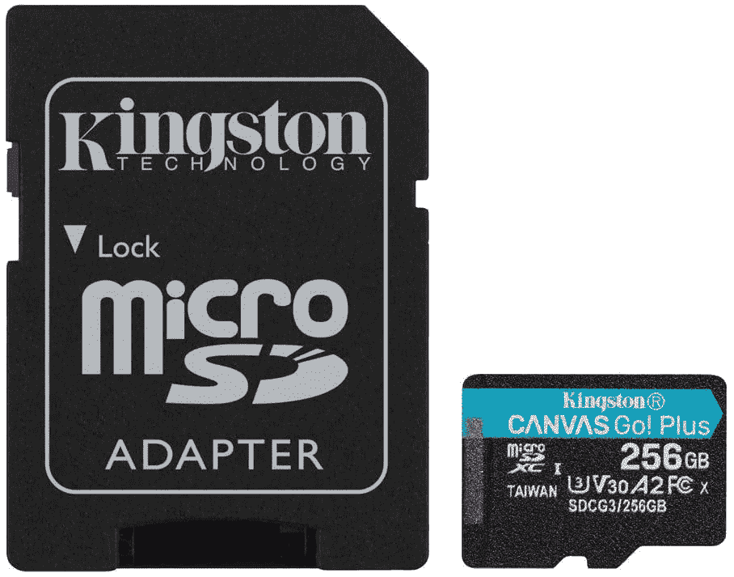
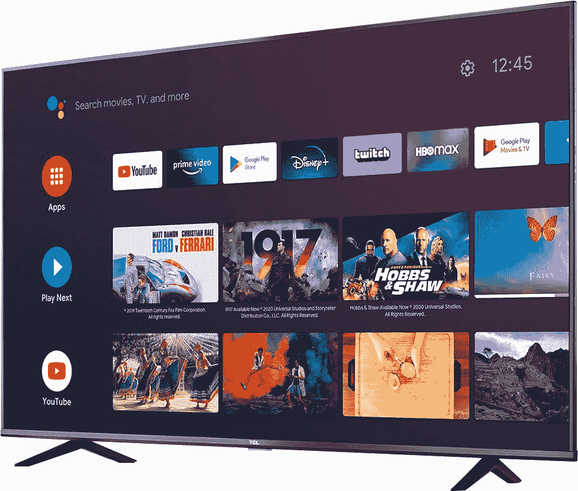
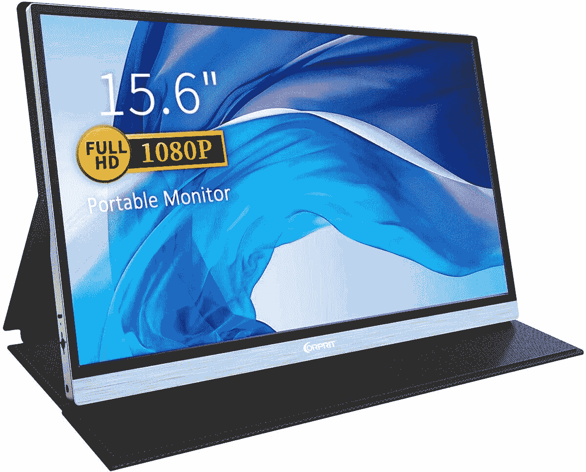

# 今天的顶级技术交易:255 美元的索尼耳机，270 美元的 50 英寸 4K 智能电视！

> 原文：<https://www.xda-developers.com/top-5-deals-september-18/>

今天美国传来了一些疯狂的消息，商务部开始禁止抖音和微信在应用商店销售。有趣的是，关键词“[VPN](https://www.xda-developers.com/get-faster-online-protection-with-44-off-speedify-10-bonding-vpn/)现在正在 Twitter 上流行——这很奇怪，不是吗？这周五的事情很奇怪。

无论如何，今天的顶级科技交易包括低价 4K 智能电视，高品质索尼耳机的单日特卖，等等！

一定要看看我们的[三天 VIP 特卖](https://www.xda-developers.com/xda-developers-three-day-vip-annual-sale/)，利用一些大的节省来学习一些新的编程技能！

## ESR 的 Note 20 和 Note 20 Ultra 配件销售

现在，在亚马逊上，ESR 正在出售其三星 Galaxy [Note 20](https://www.amazon.com/stores/page/9DB076A2-E7D1-4691-AB2B-B59267000DB3?tag=xda-77th1va-20&ascsubtag=UUxdaUeUpU29901&asc_refurl=https%3A%2F%2Fwww.xda-developers.com%2Ftop-5-deals-september-18%2F&asc_campaign=Short-Term) 和 [Note 20 Ultra](https://www.amazon.com/stores/page/2C739815-07C3-4E9D-BF7B-40032D2D3BAF?tag=xda-77th1va-20&ascsubtag=UUxdaUeUpU29901&asc_refurl=https%3A%2F%2Fwww.xda-developers.com%2Ftop-5-deals-september-18%2F&asc_campaign=Short-Term) 配件！它们的外壳非常时尚，金属外壳还包括一个有用的支架，可以在风景或肖像模式下保持手机直立。如果你新买的东西需要一个新的保护套(顺便说一下， [Note 20](https://www.amazon.com/gp/product/B08BX7LJ5T?tag=xda-77th1va-20&ascsubtag=UUxdaUeUpU29901&asc_refurl=https%3A%2F%2Fwww.xda-developers.com%2Ftop-5-deals-september-18%2F&asc_campaign=Short-Term) 和 [Note 20 Ultra](https://www.amazon.com/gp/product/B08BX7XBGN?tag=xda-77th1va-20&ascsubtag=UUxdaUeUpU29901&asc_refurl=https%3A%2F%2Fwww.xda-developers.com%2Ftop-5-deals-september-18%2F&asc_campaign=Short-Term) 都在亚马逊打折)，ESR 有你想要的。

 <picture></picture> 

ESR Note 20 and Note 20 Ultra Accessory Sale

##### ESR 金属支架 Galaxy Note 20 盒

如果你想为你的新 Note 设备购买高质量的配件，但又不想倾家荡产(毕竟你刚刚花了很多钱买了一部手机)，ESR 的销售将为你提供低价的外壳和屏幕保护器。一定要把优惠券夹在单个商品的页面上！

## 仅在今天，以 255 美元的价格购买索尼 WH1000XM3

如果你想要最好的耳机，你会想要索尼 [WH1000XM3 降噪耳机](https://www.anrdoezrs.net/links/100122946/type/dlg/sid/UUxdaUeUpU29901/https://electronics.woot.com/offers/sony-noise-cancelling-headphones-wh1000xm3)。它们绝对令人惊叹，拥有完美的降噪技术、超长的电池续航时间和低调的外观。今天只在伍特！，你可以买到一双全新的黑色 WH1000XM3s，售价仅为 255 美元，比建议零售价低 95 美元。如果你有 Amazon Prime，你也会得到免费的标准运费！

 <picture></picture> 

Sony WH-1000XM3

##### 索尼 WH-1000XM3

就在今天，只需 255 美元就能买到最好的蓝牙耳机。有了主动降噪功能和超长电池续航时间，您在工作时再也不会被打扰。

## 金士顿 256GB microSDXC 售价 50 美元

根据你使用 microSD 卡的目的，你可能想要一个可以高速访问数据的卡。没有什么比交换机中的低质量卡导致长时间加载更糟糕的了！用 [Kingston Canvas Go Plus](https://www.amazon.com/Kingston-256GB-microSDXC-Adapter-SDCG3/dp/B08589RK3M?tag=xda-77th1va-20&ascsubtag=UUxdaUeUpU29901&asc_refurl=https%3A%2F%2Fwww.xda-developers.com%2Ftop-5-deals-september-18%2F&asc_campaign=Short-Term) 防止这种情况发生。256 GB 的型号现在在亚马逊上售价 50 美元，所以买一个吧，这样你就不用担心加载时间了。

 <picture></picture> 

Kingston 256GB microSDXC Canvas Go Plus

##### Kingston microSDXC Canvas Go Plus

使用 Kingston Canvas Go Plus 可获得高达 170 MB/s 的加载速度。再也不用担心数据加载时间长了！

## TCL 50 英寸 4K 智能电视优惠 80 美元

无论您是在升级家庭影院设置，还是为下一代游戏机游戏做准备，4K 和智能电视都开始变得对普通用户来说非常实惠。在百思买，你可以花 270 美元买到 TCL 的[50 寸 4K 智能电视](https://shop-links.co/link/?exclusive=1&publisher_slug=xda&article_name=Today%27s+Top+Tech+Deals%3A+%24255+Sony+WH1000XM3+Headphones%2C+%24270+50%22+4K+Smart+TV%2C+and+More%21&article_url=https%3A%2F%2Fwww.xda-developers.com%2Ftop-5-deals-september-18%2F&u1=UUxdaUeUpU29901&url=https%3A%2F%2Fwww.bestbuy.com%2Fsite%2Ftcl-50-class-4-series-led-4k-uhd-smart-android-tv%2F6422761.p%3FskuId%3D6422761)(使用安卓电视)。这款电视支持开箱即用的所有主要流媒体服务，还具有三个 HDMI 端口，可以插入您需要的任何内容。

 <picture></picture> 

TCL 50-inch 4K UHD Smart Android TV

##### TCL 4 系列 4K LED 电视

今天就用 TCL 的 4K 安卓电视升级你的客厅设置，只需 270 美元。你将拥有拍摄一张好照片所需要的一切，而不必花很多钱。

## Corprit 15.6 英寸 1080P 便携式显示器，售价 115 美元

便携式显示器有许多很好的用途。需要在长途汽车旅行中娱乐孩子吗？想在飞机上自娱自乐？Corprit 的便携式显示器可以为您提供便于携带的 1080p 显示屏，因此您可以随时随地使用它。如果你剪开 30 美元的优惠券，并在结账时使用代码 **151WNS5B** ，你就能以 115 美元的价格买到这件商品。

 <picture></picture> 

Corprit 15.6-inch 1080P Portable Monitor

##### Corprit 15.6 英寸 1080P 便携式显示器

在你可能需要的地方安装一台显示器！购买剪下优惠券并在结账时使用代码 **151WNS5B** ，你可以只花 115 美元获得 Corprit 的 15.6 英寸、1080p 便携式显示器。

## 更多技术交易

寻找更多的技术交易？下面我们为你准备了！