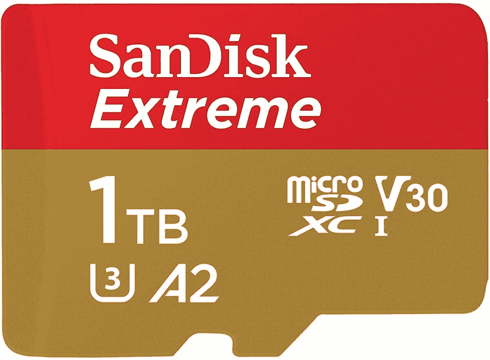
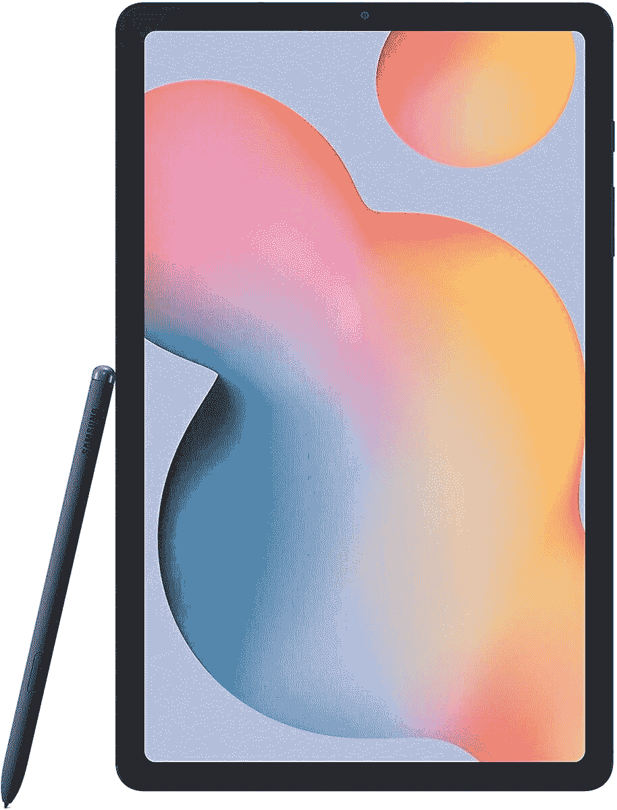

# 今天的热门优惠:1TB microSD 优惠 200 多美元，游戏显示器优惠 400 美元等等！

> 原文：<https://www.xda-developers.com/top-5-deals-september-2/>

我们已经过了这周的一半了！如果你想走在平板电脑技术的前沿，三星 Galaxy Tab S7 Plus 的预购已经开始，并将于 9 月 18 日发布。确保锁定你的预购和 [Galaxy Z Fold 2](https://www.xda-developers.com/best-galaxy-z-fold-2-deals/) ！说到这个，你有没有看过我们的 [Galaxy Z Fold 2 手办](https://www.xda-developers.com/samsung-galaxy-z-fold-2-preview/)？这似乎是一个非常有前途的设备。

至于今天的热门交易，我们在联想游戏显示器上有很大的优惠，在 Galaxy Tab S6 Lite 上有降价，等等！

## 售价 234 美元的 SanDisk 1TB Extreme microSDXC】

众所周知，没有什么比手机或任天堂 Switch 空间不足更令人沮丧的了。每个人都知道，如果你买了一个质量差的微型 SD 卡，它会丢失你需要保存的所有数据，那就更糟了。在亚马逊上，SanDisk Extreme 1TB Micro SD 的价格是 234 美元，比建议零售价低了 216 美元。SanDisk 是一个著名的、可靠的品牌，160 MB/s 的读取速度，让你可以毫无问题地访问你保存在卡上的任何东西。现在购买一个，亚马逊 Prime 会员将在 12 日该商品回到库存时获得两天的运费。

 <picture></picture> 

SanDisk 1TB Extreme microSDXC

##### SanDisk Extreme microSD 卡

厌倦了寻找完美的微型 SD 卡？你的搜寻结束了。凭借 1TB 的空间和 160 MB/s 的读取速度，SanDisk 1TB Extreme microSDXC 是您可以为您的手机或交换机获得的最佳卡之一。

## 联想 G34w-10 34 英寸超宽曲面游戏显示器，售价 400 美元

当您可以升级到令人惊叹的超宽曲面显示器时，为什么还要用无聊的标准显示器来玩游戏呢？联想正在为他们的 G34w-10 显示器提供非常优惠的折扣。虽然商店页面上说你可以以 420 美元的价格买到这款曲面显示器，这本身就是一笔不错的交易，但你可以在结账时使用代码 **EXTRAFIVE** 将总价提高到 400 美元。这可能看起来仍然很贵，但是考虑一下——你想买的另外两台普通的 16:9 显示器多少钱？我打赌不止 400 美元！

 <picture></picture> 

Lenovo G34w-10 34 Inch WLED Ultra-Wide Curved Gaming Monitor

##### 联想 G34w-10 34 英寸 WLED 超宽曲面游戏显示器

你值得加入超宽显示器生活。联想 G34w-10 拥有 144Hz 刷新率、WLED 和低蓝光认证。通过使用 code **EXTRAFIVE** ，你只需要 400 美元就可以得到这种美丽，为什么要延迟呢？

## 关键的 MX500 500GB 内置固态硬盘，售价 60 美元

有时候你只是需要电脑上有一点额外的空间，你不想为此付出很多。[critical 的 MX500 500GB 内置固态硬盘](https://www.amazon.com/dp/B0786QNS9B?tag=xda-6676q22-20&th=1&ascsubtag=UUxdaUeUpU29662&asc_refurl=https%3A%2F%2Fwww.xda-developers.com%2Ftop-5-deals-september-2%2F&asc_campaign=Short-Term)在亚马逊上售价 60 美元，比正常标价低 10 美元。我认为这是一个很棒的二级 SSD，560 MB/s 的读取速度和 510 MB/s 的写入速度。固态硬盘还提供 AES 256 数据加密，并在您的塔突然断电时提供一些自动防故障功能。一点都不差！

 <picture></picture> 

Crucial MX500 500GB 3D Internal SSD

##### 重要的 MX500 固态硬盘

如果您希望扩展计算机的内存，至关重要的 500GB 固态硬盘将轻松完成这项工作。500GB 可以容纳你需要的任何东西(也许除了巨大的媒体收藏)，数据加密可以防止黑客攻击。只需 60 美元，这是一个负担得起的升级。

## 戴尔 Inspiron 15 7000 2 合 1 15.6 英寸触摸屏笔记本电脑，在百思买售价 1050 美元

是时候回去上课了，但是今年有一个重要的不同——许多课程将会在网上进行，完全在虚拟环境中进行。你可能会发现你家里的笔记本电脑或台式机不能胜任这项任务，这意味着是时候升级了！[戴尔的 Inspiron 灵越 15 7000](http://xda.tv/DellInspiron157000DealBestBuy) 在百思买便宜 100 美元，这是生产力作物中的一些精华。这是一款 2 合 1 笔记本电脑，可以像平板电脑一样折叠使用，非常适合记笔记。此外，16GB 的内存标准将确保您可以在打开笔记应用程序的同时运行缩放会议。

 <picture></picture> 

Dell Inspiron 15 7000 2-in-1 15.6 inch Touch-Screen Laptop

##### 戴尔 Inspiron 灵越 15 二合一设备

如果您需要可以在一学年内使用的设备，戴尔的 Inspirion 15 7000 可以满足您的需求。2 合 1 笔记本电脑也可以用作平板电脑，其规格将确保您可以做您需要它做的一切。如果您需要更多空间，甚至可以在将笔记本电脑放入购物车之前升级存储空间。

## 三星 64 GB Galaxy Tab S6 Lite 售价 280 美元

随着 [Galaxy Tab S7 Plus](https://www.xda-developers.com/samsung-galaxy-tab-s7/) [已经在我们手中](https://www.xda-developers.com/samsung-galaxy-tab-s7-plus-preview/)和[可供预购](https://www.xda-developers.com/best-galaxy-tab-s7-plus-deals/)，三星是时候清理旧机型了。如果你正在寻找 Galaxy Tab S6 的优惠，现在就是你的机会。三星的 Tab S6 Lite 售价降至 280 美元，虽然它可能没有 Pro 版本的所有功能，但对于那些寻求更基本功能的人来说，它是一款完美的平板电脑。S Pen 使绘图和其他精密驱动的任务变得轻而易举，S6 Lite 一次充电可以持续 13 个小时。犒劳自己！

 <picture></picture> 

Galaxy Tab S6 Lite

##### 三星 Galaxy Tab S6 Lite

Galaxy Tab S6 Lite 配备了令人惊叹的 S pen，充电 13 小时，是一款出色、简单的平板电脑，不会让您倾家荡产。这种 Wi-Fi 模式也不需要运营商计划！

别忘了明天加入我们，了解更多技术交易！