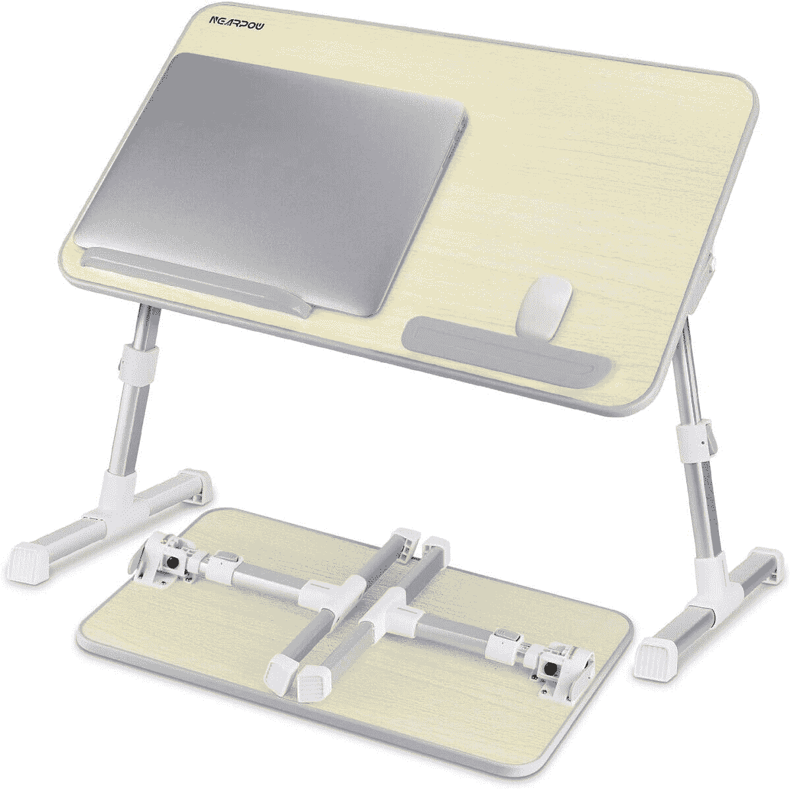
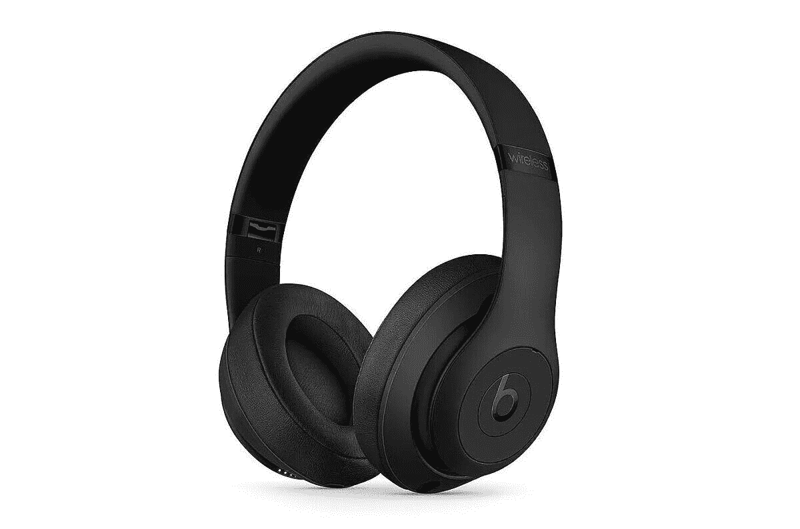
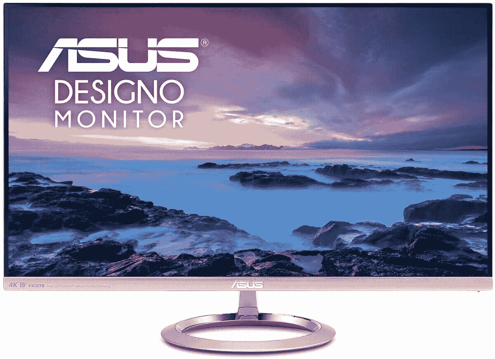
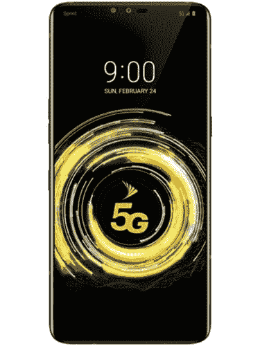
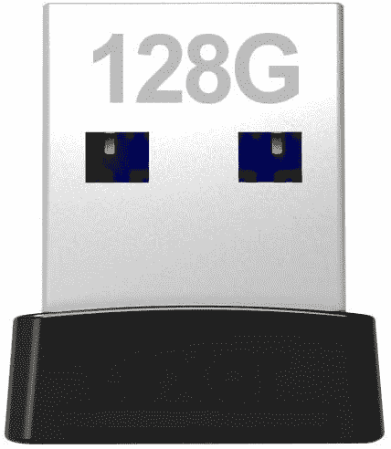

# 今天的技术交易:LG V50 售价 320 美元，Beats Studio3 售价 200 美元，等等！

> 原文：<https://www.xda-developers.com/top-5-deals-september-24/>

我的[罗技游戏耳机](https://www.amazon.com/Logitech-G533-Wireless-Gaming-Headset/dp/B01MXE0FKC?tag=xda-54en6mb-20&ascsubtag=UUxdaUeUpU29969&asc_refurl=https%3A%2F%2Fwww.xda-developers.com%2Ftop-5-deals-september-24%2F&asc_campaign=Short-Term)昨天到了，让我告诉你，我喜欢它们。虽然才过了一天，但它们比我的旧耳机好多了，即使它还没坏。它们在亚马逊仍然是[74 美元，所以如果你一直在犹豫要不要买，我会在价格回升之前买一双！此外，](https://www.amazon.com/Logitech-G533-Wireless-Gaming-Headset/dp/B01MXE0FKC?tag=xda-54en6mb-20&ascsubtag=UUxdaUeUpU29969&asc_refurl=https%3A%2F%2Fwww.xda-developers.com%2Ftop-5-deals-september-24%2F&asc_campaign=Short-Term)[谷歌新的工作日惯例](https://www.xda-developers.com/google-assistant-adds-workday-routine-help-you-manage-your-time/)似乎非常有助于让你一整天都专注于工作。如果我的编辑正在读这篇文章，我绝对不需要这样的东西，一点也不！

无论如何，今天的顶级技术交易包括 Beats Studio3 耳机 150 美元的折扣，LG V50 ThinQ 5G 的大折扣，等等！

## Nearpow 可调节笔记本电脑床架，售价 48 美元

如果我感觉有点不舒服，但不至于完全取消工作日，我喜欢启动笔记本电脑，在床上工作。但是任何一个躺在床上，腿上放着一台电脑的人都会很快意识到，在膝盖上打字并不舒服。这就是笔记本电脑床架发挥作用的地方。 [Nearbow 的中号托盘](https://www.amazon.com/NEARPOW-Adjustable-Portable-Standing-Foldable/dp/B01J3NKBVM?tag=xda-54en6mb-20&ascsubtag=UUxdaUeUpU29969&asc_refurl=https%3A%2F%2Fwww.xda-developers.com%2Ftop-5-deals-september-24%2F&asc_campaign=Short-Term)足够大，可以舒适地放置您的笔记本电脑和鼠标，并且有塞子可以放在上面，防止它们滑落。高度可调节，仅售 48 美元，这款绝对不会错。

 <picture></picture> 

Nearpow Adjustable Laptop Bed Stand

##### 近功率可调笔记本电脑床架

使用可调节的笔记本托盘桌，在完成一些工作的同时，躺下来感觉更好！Nearpow 的产品有四种高度和不同角度可供选择，并且有足够的空间放置您的笔记本电脑和鼠标。

## 击败 200 美元的 Studio3 耳机

想在高品质耳机上省钱吗？当然，你是。在 Target，你可以只花 200 美元买到一副 [Beats Studio3 耳机](http://xda.tv/BeatsStudio3TargetDeal)，比建议零售价低 150 美元。这些蓝牙耳机具有主动噪音消除功能，可以打开和关闭，一次充电可长达 22 小时的电池寿命，以及确保稳定蓝牙连接的苹果 W1 芯片。嗯，它们是节拍！

 <picture></picture> 

Beats Studio3 Wireless Headphones

##### Beats Studio3

在 Target 以 150 美元的价格购买这些优质的名牌耳机。Beats Studio3 耳机将持续一整天，并具有主动降噪功能，您可以打开和关闭。仅售 200 美元，非常划算！

## 华硕 Designo MX27UC 27 英寸显示器八五折优惠

不是曲面显示器革命的粉丝？我不怪你-我更喜欢双显示器，将曲面显示器集成到这种设置中有点困难。如果你仍然想要一个漂亮的 4K 显示器，不是弯曲的，你可以在亚马逊上以 483 美元的价格买到[华硕 Designo 27 英寸显示器](https://www.amazon.com/Designo-MX27UC-Type-C-Monitor-Adaptive/dp/B06XPJYVF2?tag=xda-54en6mb-20&ascsubtag=UUxdaUeUpU29969&asc_refurl=https%3A%2F%2Fwww.xda-developers.com%2Ftop-5-deals-september-24%2F&asc_campaign=Short-Term)。它很薄，配备了华硕眼部护理技术，并且...嗯，这是 4K 的，正在打折。这个绝对值得捡！

 <picture></picture> 

ASUS Designo 4K 27-inch Monitor

##### 华硕设计 4K 27 英寸显示器

如果你想在市场上买到一台漂亮的非曲面 4K 显示器，你的购买时机已经到来。华硕的 27 英寸显示器是 4K 就绪，也有护眼技术，以帮助您阻止蓝光，减少眼睛疲劳。显示器目前打八五折。

## LG V50 5G ThinQ(未锁定)售价 320 美元

你是否需要升级 5G 手机，但真的没有资金购买更新的旗舰手机型号？你可以在易贝花 320 美元买到一台[无锁版的 LG v50 ThinQ，带 5G 功能](http://xda.tv/LGV505GThinQDealEbay)。这款手机可以在 Sprint CDMA 和 GSM 网络上使用，这应该可以与威瑞森以外的任何主要运营商合作。如果你不介意的话，那么请确保在这款手机售罄之前拿起它！

 <picture></picture> 

LG V50 5G ThinQ (Unlocked)

##### LG V50

无需 5G 价格即可获得 5G 速度！在易贝买一部全新的 LG v50 ThinQ，只需 320 美元，你就有了一部可以完成工作的解锁手机。

## Lexar JumpDrive 128GB USB 闪存盘，售价 22 美元

闪存驱动器可能很棒，但有时它们的大小可能比您想象的更难处理。当它插入我的笔记本电脑时，我总是担心推挤和弯曲它或我的端口！Lexar 通过其 JumpDrive 闪存驱动器系列提供了解决方案，128GB 的型号仅售 22 美元。JumpDrive 大约有一个小型蓝牙适配器那么大，所以你可以把它插到你的笔记本电脑上，然后忘掉它。

 <picture></picture> 

Lexar JumpDrive 128GB USB Flash Drive

##### Lexar JumpDrive

花 22 美元买一个不会妨碍你的闪存盘。Lexar 的 128GB JumpDrive 非常小，所以你可以把它插到你的台式机或笔记本电脑上，再也不用担心它了。这是一种扩展内存的简单方法，无需购买固态硬盘！

## 更多技术交易

寻找更多的技术交易？下面我们为你准备了！外星人显示器的价格降得更低了，趁它还能用，赶紧买吧！