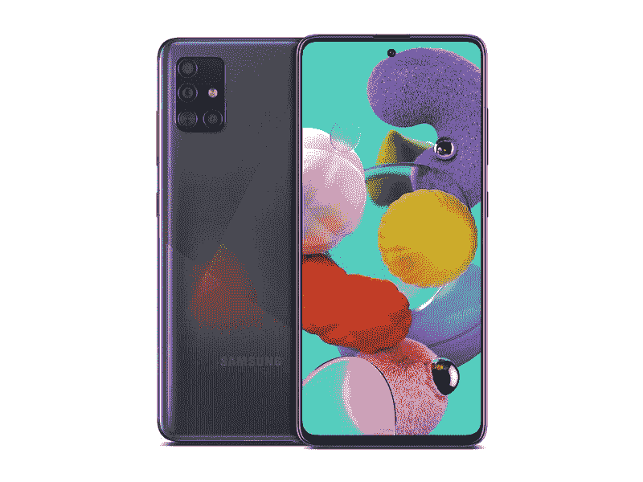
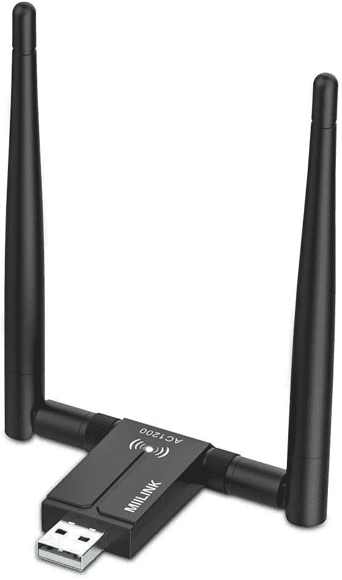

# 今天的技术交易:亚马逊的任天堂 Switch Note 20 Ultra 优惠 250 美元！

> 原文：<https://www.xda-developers.com/top-5-deals-september-28/>

今天是星期一！你知道你需要什么吗？[一个 VPN 服务](https://www.xda-developers.com/save-up-to-95-on-these-vpn-and-cloud-storage-subscriptions/)。VPN 保护你的隐私，这在今天的互联网上总是处于危险之中。现在，您可以在确保数据安全的同时节省大量成本。坦白说，这是双赢。

今天的其他顶级技术交易包括任天堂交换机在亚马逊的库存，一加 8 的价格下降，等等！

## 三星 Galaxy Note 20 Ultra 降价 250 美元

百思买正在为 [Galaxy Note 20 Ultra](https://shop-links.co/link/?exclusive=1&publisher_slug=xda&article_name=Today%27s+Top+Tech+Deals%3A+Nintendo+Switch+at+Amazon%2C+OnePlus+8+Price+Drop%2C+and+More%21&article_url=https%3A%2F%2Fwww.xda-developers.com%2Ftop-5-deals-september-28%2F&u1=UUxdaUeUpU29984&url=https%3A%2F%2Fwww.bestbuy.com%2Fsite%2Fsamsung-galaxy-note20-ultra-5g-128gb-mystic-black-verizon%2F6422216.p) 提供迄今为止最大的折扣，智能设备优惠 250 美元。这是一个固定折扣，但你需要制定 24 个月的付款计划，并在今天激活 Note 20 Ultra，才能获得全额折扣。通过以旧手机换购，你可以节省更多！

 <picture></picture> 

Samsung Galaxy Note 20 Ultra

##### 三星 Galaxy Note 20 Ultra

如果你想要 Galaxy Note 20 Ultra 的最佳交易之一，你应该去百思买。如果您今天激活并注册 24 个月的付款计划，您将获得 250 美元的优惠。

## 一加 8 下降 100 美元

本周五有很多智能手机交易，一加想参与其中。他们已经将一加 8 的价格降低了 100 美元，所以你可以从亚马逊只花 700 美元买到这款 [5G 256GB 型号。这款手机的刷新率为 90 赫兹，电池容量为 4，300 毫安，配备了 48 兆像素的三摄像头。你真的不会错的一加 8！如果你想要绿色手机，你也可以去一加的商店以同样的价格买到。](https://www.amazon.com/dp/B0872473BF?tag=xda-1inl4uc-20&ascsubtag=UUxdaUeUpU29984&asc_refurl=https%3A%2F%2Fwww.xda-developers.com%2Ftop-5-deals-september-28%2F&asc_campaign=Short-Term)

 <picture></picture> 

OnePlus 8 Verizon Unlocked

##### 一加 8 5G

如此多的智能手机交易，如此多的选择，但你知道一加 8 不会出错。该手机制造商已经将所有型号的价格降低了 100 美元，所以你可以从亚马逊以 700 美元的价格买到 256 GB 的型号。这使得亚马逊 Prime Rewards Visa 可以提供 Prime Shipping 和 18 个月的付款计划！

## 三星 Galaxy A51 售价 225 美元

Galaxy Note 20 Ultra 对你来说还是太贵了？我在同一条船上。三星目前的银河 A51 智能手机价格为 225 美元，低于 400 美元的建议零售价。如果你不想走在技术的前沿，只是需要一个便宜的升级来支撑你，这款廉价的手机将会让你如鱼得水。在三星商店，你可以选择解锁的型号，或者与大牌运营商合作的型号。

 <picture></picture> 

Samsung Galaxy A51 5G

用三星 Galaxy A51 给自己买一部一点也不觉得便宜的廉价手机。在三星商店，你可以只花 225 美元买到解锁版或运营商版。它可能没有 5G，但如果你不打算升级你的运营商服务，那么你就不会有问题。

## 任天堂 Switch 实际上还在库存中

我很震惊-任天堂最终解决了他们的生产线问题吗？通常，任天堂的交换机在我能把它们包括进来之前就卖光了。也就是说，现在没有时间睡觉去捡一个，因为你永远不知道它们什么时候会再次用完！较新型号的交换机具有改进的 Joy-Cons 和比上市型号更好的电池寿命，所以谁知道呢，也许是时候升级了。

 <picture></picture> 

Nintendo Switch HAC-001(-01)

##### 任天堂 Switch

任天堂 Switch 在亚马逊有现货！虽然这些整个周末都在库存中，但谁知道它还会持续多久。抓住一个，否则就太晚了！

## 无线 USB WiFi 适配器，仅售 15 美元

台式机最糟糕的一点就是通常连不上 WiFi。这似乎不是一个大问题...直到你意识到你需要把一根以太网电缆穿过你的整个房子或公寓。用这个[无线 WiFi 适配器](https://www.amazon.com/dp/B088TNZYGG?tag=xda-1inl4uc-20&ascsubtag=UUxdaUeUpU29984&asc_refurl=https%3A%2F%2Fwww.xda-developers.com%2Ftop-5-deals-september-28%2F&asc_campaign=Short-Term)解决布线问题，你可以在结账时使用代码 **42XS7H23** 花 15 美元买到它。它甚至可以在 Windows XP 上运行...肯定有事！

 <picture></picture> 

Wireless USB WiFi Adapter

##### MiiLink USB Wi-Fi 适配器

为什么处理长的以太网线路会让你到处绊倒？在收银台支付 15 美元，代码为 **42XS7H23** ，你就可以为你的桌面获得一个 WiFi 适配器，摆脱线缆。

## 更多技术交易

寻找更多的技术交易？下面我们为你准备了！