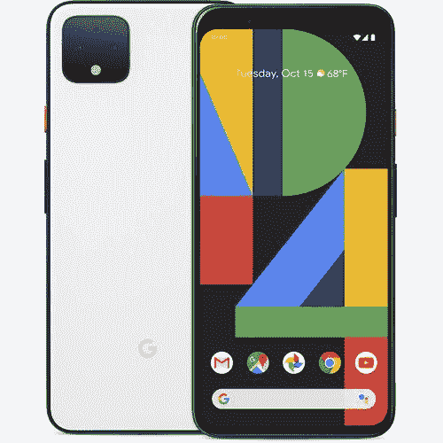
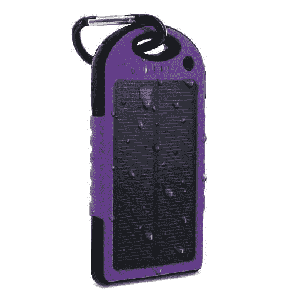
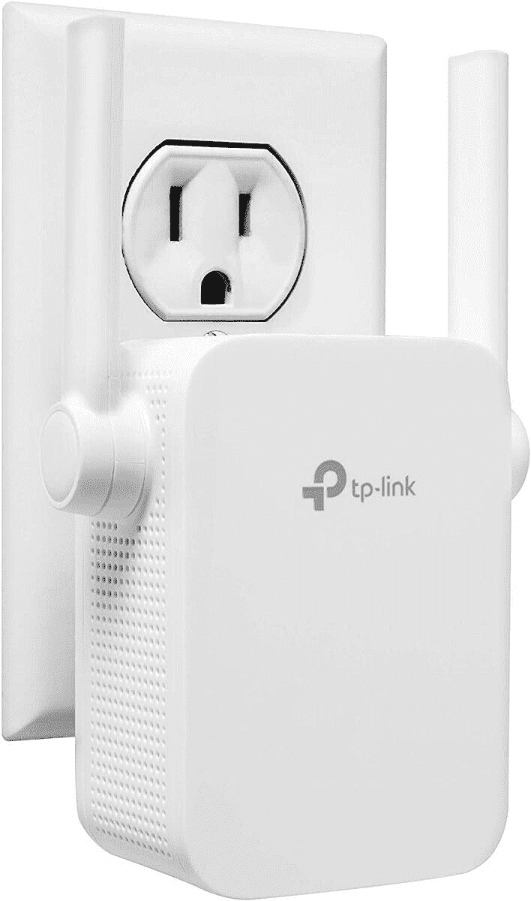

# 今天的技术交易:30 美元的 Galaxy Buds Live，15 美元的太阳能电池备份！

> 原文：<https://www.xda-developers.com/top-5-deals-september-29/>

在寻找交易时，我看到一些疯狂的产品，但我不得不说，这部[肆罗系列电视](https://deals.dell.com/en-us/mpp/productdetail/5k1h)是我见过的最奇怪、最酷的产品之一。从很多方面来看，它本质上是一部巨大的智能手机，你可以切换到纵向模式观看移动内容，然后切换回横向模式观看媒体。这很令人兴奋，尽管我不知道这是否是我特别想在家里看到的东西。它正在打折，包括一张价值 600 美元的戴尔礼品卡，所以这可能是您的电视。

别再说电视了。今天的顶级技术交易包括太阳能备用电池的巨大折扣，三星 Galaxy Buds Live 的 20 美元折扣，等等！

如果你一直在寻找动物穿越任天堂 Switch 的特别版，它们目前在百思买有库存[。和通常的开关一样，不能保证它们会长期有货，而且一整天都有进货和缺货的可能。继续检查，如果你看到有，就抓一个！](https://shop-links.co/1719758482417742451)

## 谷歌 Pixel 4 XL，七五折

如果你想搭上谷歌智能手机的列车，那么[谷歌 Pixel 4 XL](https://www.amazon.com/dp/B07YMNVXVV?tag=xda-400de58-20&ascsubtag=UUxdaUeUpU30016&asc_refurl=https%3A%2F%2Fwww.xda-developers.com%2Ftop-5-deals-september-29%2F&asc_campaign=Short-Term) 可能是你的好选择。在亚马逊，你可以节省 25%的建议零售价，使总额下降到 750 美元。售价也可以作为 5 个月付款计划的一部分，对任何人开放，而不仅仅是亚马逊 Prime Rewards 持卡人。这是一个未锁定的像素 4 XL，应该与所有美国运营商。

 <picture></picture> 

Google Pixel 4 XL (Unlocked)

## 三星 Galaxy Buds Live 优惠 30 美元

Galaxy Buds Live 不到两个月前才推出，但您已经可以在豆子上节省一些钱了。在易贝，你可以花 140 美元买到一对 Buds Live，比 MSRP 便宜 30 美元。[我们最近对 Galaxy Buds Live 的评论](https://www.xda-developers.com/samsung-galaxy-buds-live-review/)称赞了独特的豆状设计和主动降噪功能(尽管并不完美)。如果你在市场上寻找新芽，也许银河芽生活将是你的选择？

 <picture></picture> 

Samsung Galaxy Buds Live

##### 三星 Galaxy Buds 直播

三星最近发布的耳塞降价 30 美元？没有比这更好的了！有五种颜色可供选择，开始享受豆形耳塞的生活。芽生活也有积极的噪音消除！

## 三星 Galaxy Tab S6 Lite 售价 280 美元

想要一台平板电脑，但并不真的需要 edge？如果你只是需要一个带笔的平板电脑来完成基本任务，那么你可以选择售价 280 美元的三星 Galaxy Tab S6 Lite，比建议零售价低 70 美元。这款平板电脑配备了非常有用的 S Pen，一次充电可持续 13 个小时，并且具有可以通过 [a MicroSD 卡](https://www.amazon.com/gp/product/B07P7M6K35?tag=xda-400de58-20&ascsubtag=UUxdaUeUpU30016&asc_refurl=https%3A%2F%2Fwww.xda-developers.com%2Ftop-5-deals-september-29%2F&asc_campaign=Short-Term)轻松扩展的内存。不用倾家荡产你就满足了！

 <picture></picture> 

Galaxy Tab S6 Lite (64GB Wi-Fi)

##### 三星 Galaxy Tab S6 Lite

今天就用 Galaxy Tab S6 Lite 为自己买一台便宜但高端的平板电脑吧！这款平板电脑非常适合基本的工作任务和观看媒体，附带的 S Pen 使其成为笔记型电脑和艺术家的绝佳预算选择。

## Aduro Solar 6000mAh 双备用电池，售价 15 美元

太阳能电池包是一个很好的应急物品。如果你家没电了，就让太阳给你手机充电吧！在伍特！，你可以[在 Aduro 太阳能备用电池](https://www.anrdoezrs.net/links/100122946/type/dlg/sid/UUxdaUeUpU30016/https://electronics.woot.com/offers/aduro-6000mah-dual-usb-solar-backup-battery)上节省高达 81%的费用，总费用降至 15 美元。6000mAh 应该根据电池容量为您的手机充电一次或两次，这非常适合您外出或停电时需要您的设备来应对紧急情况。如果你有亚马逊 Prime，你还可以享受免费送货。

 <picture></picture> 

Aduro PowerUp Solar 6000mAh Backup Battery

##### Aduro PowerUp Solar 6000mAh 备用电池

用太阳能电池包为紧急情况做好准备。购买一个 Aduro 太阳能备用电池，只需 15 美元，还能节省很多钱。有多种颜色和优质航运可用，为什么不抓住一个？

## TP-Link N300 Wi-Fi 扩展器，售价 18 美元

如果你住在更大的公寓或家里，你会知道“死亡地带”，那是家里无线网络不太好的令人沮丧的地方。这是蹩脚的，但你可以用 Wi-Fi 扩展器帮助解决死区问题！TP-Link 的 N300 扩展器[目前在亚马逊](https://www.amazon.com/TP-Link-Extender-External-Antennas-TL-WA855RE/dp/B0195Y0A42?tag=xda-400de58-20&ascsubtag=UUxdaUeUpU30016&asc_refurl=https%3A%2F%2Fwww.xda-developers.com%2Ftop-5-deals-september-29%2F&asc_campaign=Short-Term)售价 18 美元，它可以连接你的路由器和无线网络...让它走得更远！把它放在盲区附近(而不是盲区)应该有助于解决你的连接问题。

 <picture></picture> 

TP-Link N300 WiFi Extender

##### TP-Link N300 WiFi 扩展器

## 更多技术交易

寻找更多的技术交易？下面我们为你准备了！