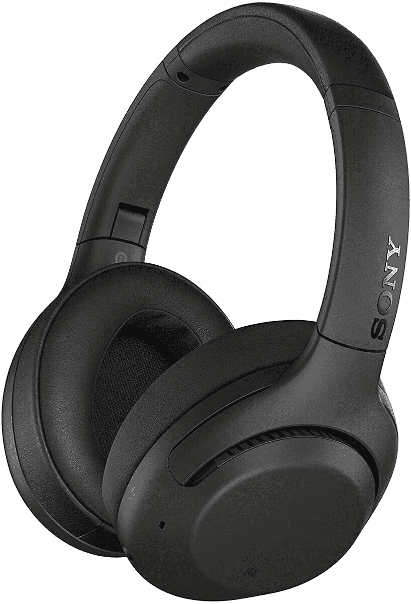
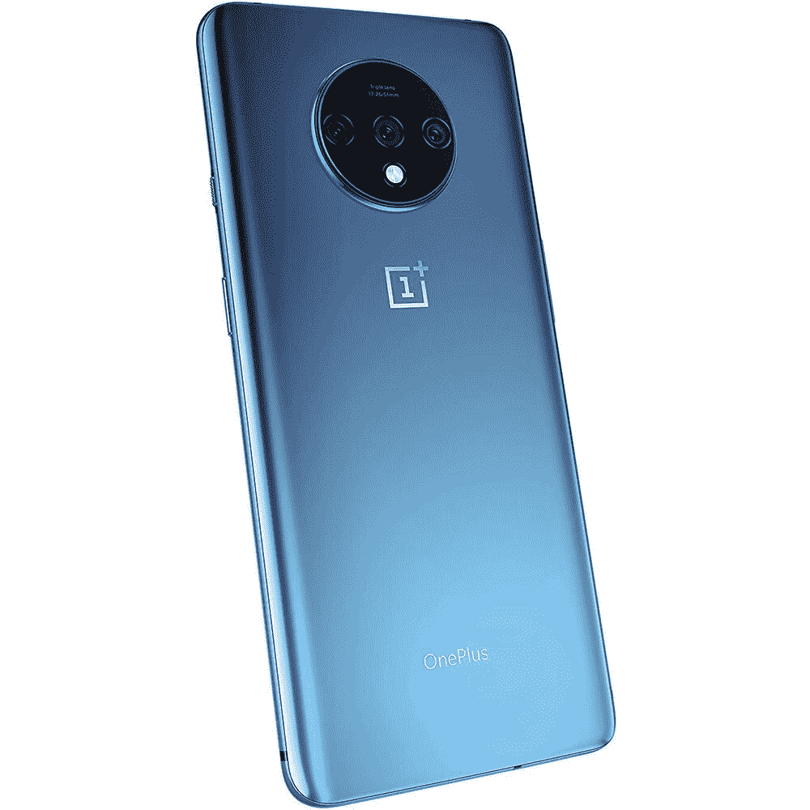
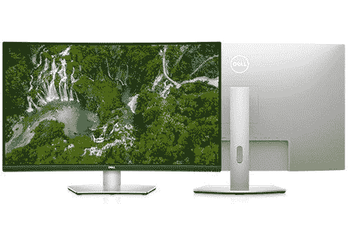
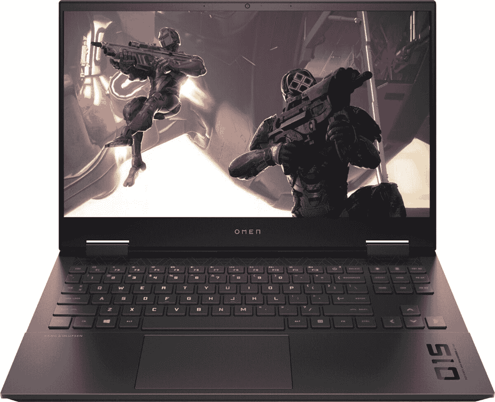

# 今天的热门交易:一加 7T 售价 400 美元，32 英寸 4K 曲面显示器优惠 150 美元！

> 原文：<https://www.xda-developers.com/top-5-deals-september-3/>

啊，星期四。我们已经接近周末了，但还没到那一步。但是，不管今天是星期几，总有一些事情能让我们振作起来。也许你会在这个周末沉浸在 GeForce NOW 的最新发布中。我想我只会玩一些已经积压的游戏，而不是自己去找一些新游戏来上瘾。另外，如果你是一加诺德公司的老板，我们有一些[最佳一加诺德案例](https://www.xda-developers.com/best-oneplus-nord-cases-skins/)的综述。保护好你的手机——你永远不知道什么时候你会把它掉在地上。

今天的技术交易包括 2TB 外置硬盘的优惠价格，戴尔 4K 曲面显示器优惠 150 美元，等等！

## 索尼 WHXB900N 降噪耳机，售价 178 美元

我不是音响发烧友，但即使是我也知道索尼在音频领域处于领先地位，他们的 [WHXB900N 耳机](https://www.amazon.com/dp/B07RM8WQ8G?tag=xda-3gu6p2r-20&ascsubtag=UUxdaUeUpU29695&asc_refurl=https%3A%2F%2Fwww.xda-developers.com%2Ftop-5-deals-september-3%2F&asc_campaign=Short-Term)是市场上最好的耳机之一。这些蓝牙耳机提供了令人难以置信的噪音消除技术，但如果你需要听到你周围的世界，在你谈话时触摸耳机的右杯将取消噪音消除。这些都是高品质的耳机，随着建议零售价降低 70 美元，现在是挑选它们的好时机。

 <picture></picture> 

Sony WHXB900N Noise Cancelling Headphones

##### 索尼 WHXB900N 降噪耳机

是时候用最好的耳机来犒劳自己了。WHXB900N 采用噪音消除技术，电池续航时间长达 30 小时，并且可以在轻轻敲击杯子时调低音乐，因此物有所值。

## 东芝 Canvio Advance 2TB 便携式外置硬盘，售价 58 美元

外置硬盘对于数据保护至关重要。为了安全起见，我会定期将台式机和笔记本电脑上的所有东西都备份到一个大的外置硬盘上，并把它放在一个防火的锁箱里。是的，云技术意味着这可能有点多，但安全总比遗憾好！现在在亚马逊，你可以花 58 美元买到一个大容量的 2TB 东芝外置硬盘。对于大多数备份来说，这应该足够了，但如果你需要一些东西来存储大量的电影、音乐或游戏，4TB 的[型号也以 88 美元](https://www.amazon.com/Toshiba-Advance-Portable-External-HDTC920XR3AA/dp/B07KQWSD55?th=1&tag=xda-3gu6p2r-20&ascsubtag=UUxdaUeUpU29695&asc_refurl=https%3A%2F%2Fwww.xda-developers.com%2Ftop-5-deals-september-3%2F&asc_campaign=Short-Term)出售。

 <picture></picture> 

Toshiba Canvio Advance 2TB Portable External Hard Drive

##### 东芝 Canvio Advance

东芝的非常红的外部硬盘驱动器有 2TB 的存储空间和 USB 3.0 连接。如果你想备份你的数据并做好最坏的打算，这是一个不错的选择。

## 一加 7T 128GB 智能手机(未锁定)售价 400 美元

手机很贵。我想这可能是我整个月对你说的最明显的话了。但这也意味着，当你看到一款未上锁的[一加 7T 128GB 智能手机](http://xda.tv/OnePlus7TDealBH)降价 200 美元时，它真的值得一看。虽然你可能需要等待几天才能发货(B & H 正在等待更多的库存)，但由于 7T 拥有如此大的内部存储空间和三个后置摄像头，这是一个高质量的预算手机选择。

 <picture></picture> 

OnePlus 7T 128GB Smartphone (Unlocked)

##### 一加 7T

这款一加 7T 智能手机有蓝色和银色可选，是一款非常划算的手机。7T 运行 Windows 10，采用高通 Snapdragon855 Plus 芯片组，三后置摄像头将确保您拍摄高质量的照片。

## 32 英寸戴尔 S3221QS 曲面显示器，售价 381 美元

曲面显示器是现在的趋势。曲面显示器具有更加身临其境的视角，非常适合观看电影和玩游戏，合适的显示器甚至可以复制双显示器设置。[戴尔的 32 英寸曲面 4K UHD 显示器](http://xda.tv/DellS3221QS4KmonitorDeal)具备所有这些功能，而且还不止这些，现在售价 381 美元，比标价低 150 美元。《4K 箴言报》也支持 HDR！

 <picture></picture> 

32 inch Dell S3221QS Curved Monitor

##### 戴尔 S3221QA 32 英寸曲面显示器

使用戴尔的 S3221QS，以低廉的价格升级到曲面显示器续航时间。这款适用于 HDR UHD 4K 的显示器将提供前所未有的身临其境的视觉体验。

## 惠普欧米 EN 15.6 游戏笔记本电脑，售价 1250 美元

当然，随着每个人都回到学校，虚拟地工作，许多人将需要笔记本电脑来处理工作量。但是，当你可以同时拥有生产力和出色的游戏体验时，为什么要满足于只能很好地处理生产力应用的东西呢？[惠普的“奥姆 EN 15.6”游戏笔记本电脑](http://xda.tv/HPOmenGamingLaptopBestBuy)在百思买降价 200 美元，总价格降至 1250 美元。这款笔记本电脑内置 16GB 内存、512GB 固态硬盘和 NVIDIA GeForce RTX 2060。总而言之，一台坚固的游戏笔记本电脑！

 <picture></picture> 

HP OMEN 15.6 Gaming Laptop

##### 惠普预兆 15

想要一台游戏笔记本电脑，但又不想尝试组装？凭借 GeForce RTX 2060 和 512GB 固态硬盘，Omen 游戏笔记本电脑将满足您的需求。

## 更多技术交易

寻找更多优惠？别再看了: