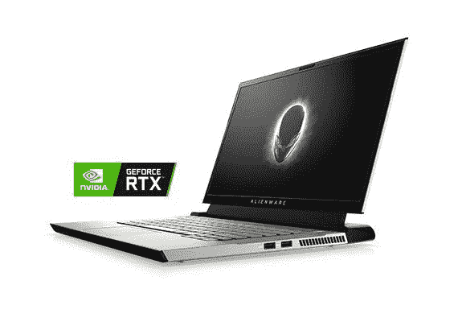
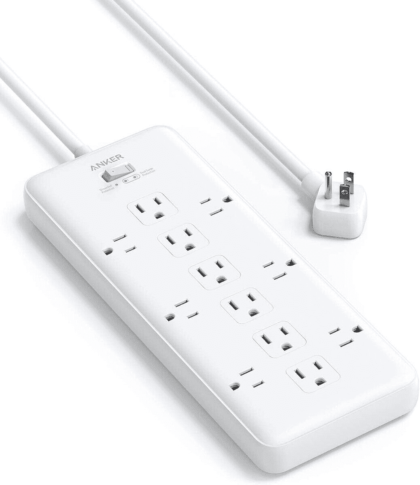
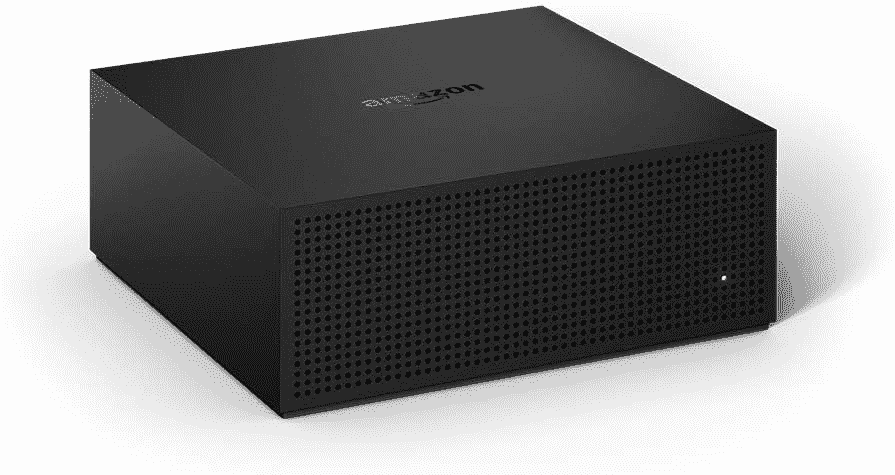
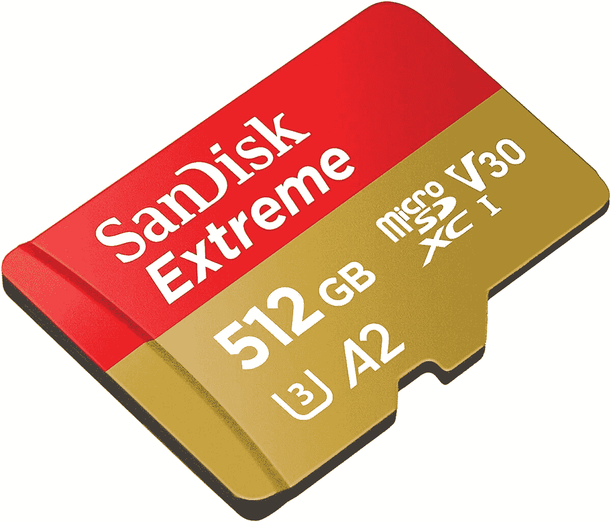

# 顶级技术交易:外星人笔记本电脑优惠 33%，Fire 电视改版优惠 100 美元！

> 原文：<https://www.xda-developers.com/top-5-deals-september-30/>

啊，九月底。这个月过得真快！当然，我对 10 月份感到兴奋——在我住的佛罗里达州，这是事情最终开始降温的时候，万圣节就在眼前。随着亚马逊优惠日和目标交易日(10 月 13 日和 14 日)的宣布，交易和假日购物的大日子也提前开始了。考虑到 2020 年的情况，这可能是一件好事！

但是，仅仅因为假日购物季节即将开始，并不意味着现在没有交易可以利用！今天的顶级技术交易包括 Fire TV 重铸 100 美元，超级强大的外星人笔记本电脑 33%的折扣，等等！

## 沃特的电子产品销售

谁不喜欢在家里舒适地浏览一些有趣的电子产品呢？Woot 的电子产品特卖会持续到周一，但是在最好的商品售罄之前，你会想看看今天有什么优惠。你可以在诸如[谷歌家庭迷你](https://www.anrdoezrs.net/links/100122946/type/dlg/sid/UUxdaUeUpU30030/https://electronics.woot.com/offers/google-home-mini-2-pack-chalk-3?ref=w_cnt_wp_0_1)、 [4K 智能电视](https://www.anrdoezrs.net/links/100122946/type/dlg/sid/UUxdaUeUpU30030/https://electronics.woot.com/offers/jvc-lt-ma877-4k-ultra-hd-smart-tv-14)等商品上获得很大的折扣。此外，如果你有亚马逊 Prime(你真的应该在即将到来的 Prime 日得到它)，所有这些可怕的交易都将免费运送。

 <picture></picture> 

Woot! Electronics Fall-Tastic Deals

##### JVC LT-MA877 4K 电视

正在寻找精选电子产品的大幅折扣，但尚未找到？Woot 可能就是那个适合你的人！一直持续到 10 月 5 日或售完为止，你可以在各种电子产品上节省一大笔钱。不过，动作要快，因为股票是有限的。

## 外星人 m15 R2 游戏笔记本电脑，33%的折扣

在戴尔，你可以以 33%的价格买到超级动力外星人 m15 R2 笔记本电脑。这使价格降到了 2200 美元。如果你对这个价格感到震惊，让我告诉你，它是值得的。首先，这款笔记本电脑没有*也没有*将显卡集成到处理器中(这对游戏来说无疑不是最好的)，而是 GeForce RTX 2080。m15 R2 也有 16GB 的内存和第九代英特尔处理器。这不仅仅是一台游戏笔记本电脑-它是一台顶级的游戏笔记本电脑，可以使用数年。m15 R2 不仅仅是一个值得购买的产品，更是一项值得投资的产品。

 <picture></picture> 

Alienware m15 R2 Gaming Laptop

##### 戴尔外星人 m15 R2

这款高端游戏笔记本电脑打 33 折！配备专用显卡(笔记本电脑少见)，16GB 内存，1TB 硬盘，你不会后悔这次购买。

## 售价 25 美元的 Anker PowerExtend 条

听着，我们都喜欢这里的科技和电子产品，但简单地说，你需要一个地方来插上所有这些东西。如果你一直在市场上寻找一种新的电涌保护器，那么很难找到一种适合你所有插头的东西，实际上具有电涌保护功能，并且不会随机熔化或着火。 [Anker PowerExtend 带](https://www.amazon.com/dp/B089SPWMW8?tag=xda-4fa121p-20&ascsubtag=UUxdaUeUpU30030&asc_refurl=https%3A%2F%2Fwww.xda-developers.com%2Ftop-5-deals-september-30%2F&asc_campaign=Short-Term)就是所有这些，有 12 个端口(其中一半面向侧面，这样你就可以安装大的适配器)，并且只有 25 美元。抓住一个，即使你认为你不需要它-相信我，你需要它。

 <picture></picture> 

PowerExtend Strip 12 Outlets with Flat Plug

##### 带扁平插头的 PowerExtend 条形 12 插座

确保您可以使用 Anker 的 12 端口电涌保护器将其全部插入。目前 25 美元，一半的端口面向外，以插入那些讨厌的长方形适配器，而没有覆盖一半的端口。这是一个电子重型家庭的必需品！

## 黄金日早期交易:消防电视重铸，100 美元的折扣

你听到这个消息了吗？黄金日就要到了，而且来得很快。也是两天，10 月 13 日和 14 日。但在经典的亚马逊时尚中，你已经可以利用早期的交易，例如重新制作的 130 美元的 Fire TV，100 美元的 MSRP。这个小设备可以让你录制长达 75 小时的电视直播，稍后在 [Fire TV](https://www.amazon.com/dp/B086VR9J8Q?tag=xda-4fa121p-20&ascsubtag=UUxdaUeUpU30030&asc_refurl=https%3A%2F%2Fwww.xda-developers.com%2Ftop-5-deals-september-30%2F&asc_campaign=Short-Term) 或移动设备上观看——与其他服务不同，它没有月费。直到今天我才知道 DVR 也有这个功能！当然，作为一个早期 Prime Day 交易，你需要成为亚马逊 Prime 会员才能利用它，但你可以在这里[注册。](https://www.amazon.com/amazonprime?tag=xda-4fa121p-20&ascsubtag=UUxdaUeUpU30030&asc_refurl=https%3A%2F%2Fwww.xda-developers.com%2Ftop-5-deals-september-30%2F&asc_campaign=Short-Term)

 <picture></picture> 

Fire TV Recast

##### 亚马逊 Fire TV 重铸

黄金日很快就要到了，但是你已经可以利用这些优惠了！以 100 美元的价格获得 Fire TV 的重新制作，并拥有无需月租费的 DVR 服务来录制您的现场体育和新闻。再也不会错过一场比赛！

## SanDisk 512GB Extreme microSDXC 售价 110 美元

微型 SD 卡。你需要它们。SanDisk 有一些在打折。你可以花 110 美元买到 512GB 的 Extreme microSD，比建议零售价低 45%。这一款非常适合你本周早些时候购买的闪亮新交换机，160MB/s 的读取速度确保你的游戏不会断断续续，加载速度也很快。microSD 也是防水的...嗯，是不错，但我不建议把任何电子产品放在水里。今天就抢一个！

 <picture></picture> 

SanDisk 512GB Extreme microSDXC

##### SanDisk Extreme microSD 卡

如果你的交换机或平板电脑需要一个 microSD，那么 SanDisk 的 Extreme 系列是更好的选择之一。提供抵抗元素和 160 兆字节/秒的读取速度，你不会对这个小存储卡失望。

## 更多技术交易

寻找更多的技术交易？下面我们为你准备了！今天是从 Woot 获得 Aduro 太阳能备用电池的最后一天！，所以不要再睡在这个上面了。