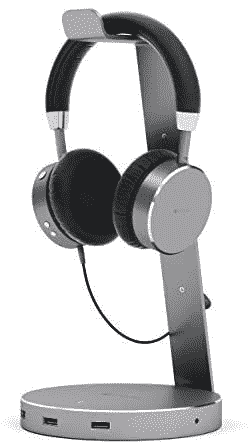
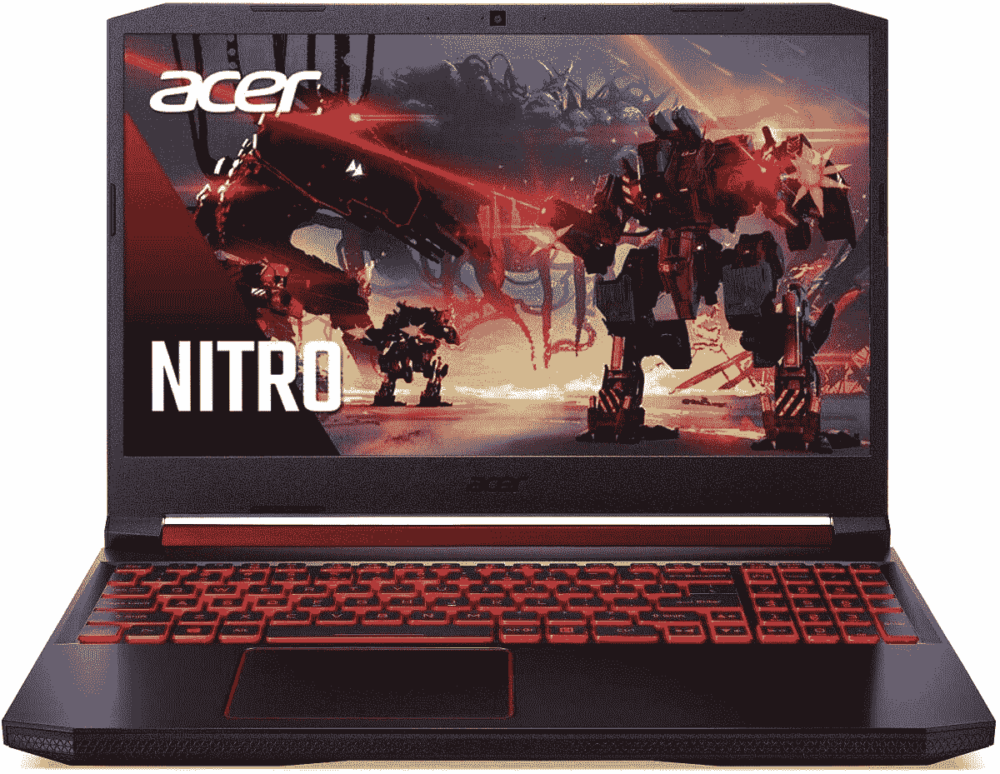
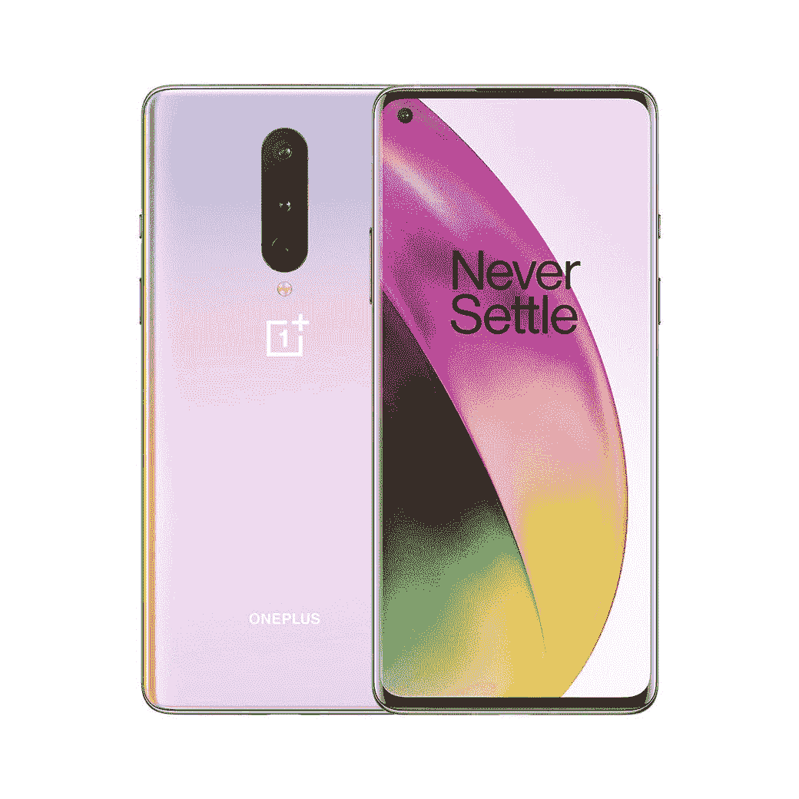
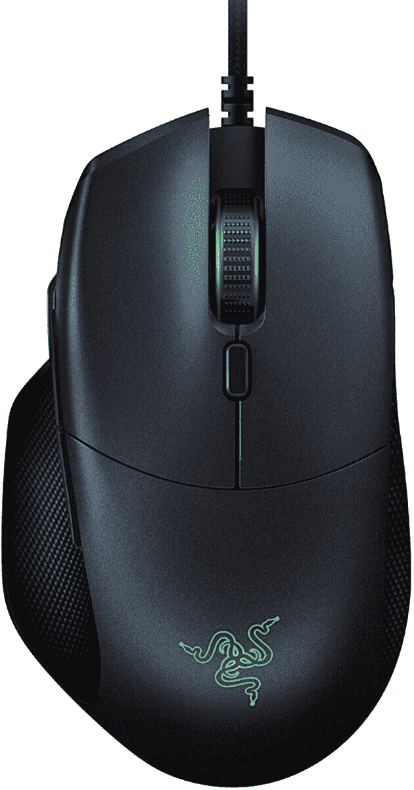

# 今天的顶级技术交易:30 美元的 Razer 鼠标，900 美元的 Acer 游戏笔记本电脑！

> 原文：<https://www.xda-developers.com/top-5-deals-september-4/>

今天是星期五！谢天谢地。这似乎是一个黑幕，但为 Android 手机推出的工作开关模拟器，但不幸的是，它需要一个特定的控制器才能工作，所以你不能用它在你的手机上玩《荒野之息》...还没有。不过，如果你已经有了一台任天堂 Switch，你可能会想要预订[超级马里奥 3D 全明星](https://www.amazon.com/SW-2000-Nintendo-Switch/dp/B08G3MN6KP?tag=xda-7g3lkal-20&ascsubtag=UUxdaUeUpU29713&asc_refurl=https%3A%2F%2Fwww.xda-developers.com%2Ftop-5-deals-september-4%2F&asc_campaign=Short-Term)，这将有一个有限的实体版本，将在几周内推出。玩玩 FOMO 总能让我打开钱包...

无论如何，今天的顶级技术交易包括一加 8 优惠 100 美元，摩托罗拉出色的 G8 动力解锁仅 170 美元，Satechi 的劳动节销售，等等！

## Moto G8 Power(未锁定)售价 170 美元

你知道，手边有个备用电话总是好的。谁知道你的主手机什么时候会出现电池问题，或者需要维修呢？做好准备，在亚马逊上以 170 美元的价格买到这款解锁的 [Moto G8 Power](https://www.amazon.com/Moto-Power-Unlocked-International-Camera/dp/B087CBMKSC?tag=xda-7g3lkal-20&ascsubtag=UUxdaUeUpU29713&asc_refurl=https%3A%2F%2Fwww.xda-developers.com%2Ftop-5-deals-september-4%2F&asc_campaign=Short-Term) 手机，这比其当前的建议零售价低了 70 美元。这不是最强大的手机，但它拥有你一天所需的所有基本功能，并且充电速度很快。注意这是国际 GSM 电话！

 <picture></picture> 

Moto G8 Power (Unlocked)

##### 摩托罗拉摩托 G8 动力

Moto G8 Power 配备 5000 毫安时快速充电电池、高通骁龙 665 处理器和四摄像头系统，是一款不错的经济型手机选择。这是一部国际 GSM 电话，所以它不能与 CDMA 运营商一起工作。在购买之前，请确保您能够使用它！

## Satechi 劳动节销售提供 15%的折扣

从现在起到 9 月 7 日，如果您在结账时使用代码 **SATLDAY15** ，您可以在所有 [Satechi 的商品](https://www.amazon.com/stores/node/2530353011?tag=xda-7g3lkal-20&ascsubtag=UUxdaUeUpU29713&asc_refurl=https%3A%2F%2Fwww.xda-developers.com%2Ftop-5-deals-september-4%2F&asc_campaign=Short-Term)上享受八五折优惠。这就是我喜欢的劳动节大甩卖！Satechi 为你的技术和移动设备提供了很好的配件，所以绝对值得浏览[他们的商店页面](https://www.amazon.com/stores/node/2530353011?tag=xda-7g3lkal-20&ascsubtag=UUxdaUeUpU29713&asc_refurl=https%3A%2F%2Fwww.xda-developers.com%2Ftop-5-deals-september-4%2F&asc_campaign=Short-Term)，看看是否有你需要的东西。我个人推荐？这款[带 USB 3.0 端口的耳机支架](https://www.amazon.com/Satechi-Aluminum-Headphone-Stand-Holder/dp/B019PI9QD4?tag=xda-7g3lkal-20&ascsubtag=UUxdaUeUpU29713&asc_refurl=https%3A%2F%2Fwww.xda-developers.com%2Ftop-5-deals-september-4%2F&asc_campaign=Short-Term)和这款[看起来很结实的充电线](https://www.amazon.com/Satechi-USB-C-Charging-Type-C-Devices/dp/B07PLL9784?tag=xda-7g3lkal-20&ascsubtag=UUxdaUeUpU29713&asc_refurl=https%3A%2F%2Fwww.xda-developers.com%2Ftop-5-deals-september-4%2F&asc_campaign=Short-Term)！

 <picture></picture> 

Satechi Labor Day Sale

##### Satechi USB-C 至 USB-C 电缆

Satechi 为您的电脑和移动设备提供优质配件。在收银台使用代码 **SATLDAY15** 在他们的商店购买任何东西都可以享受 15%的折扣。你必须在 9 月 7 日之前进货！

## Acer Nitro 5 游戏笔记本电脑售价 900 美元，今日仅售

如果你一直想要一台游戏笔记本电脑，但真的不想支付 1000 美元以上，今天和今天是你获得 Acer Nitro 5 游戏笔记本电脑的唯一机会。亚马逊的每日黄金盒交易之一将 15.6 英寸游戏笔记本电脑的价格提高到了 900 美元。凭借 NVIDIA GeForce RTX 2060 显卡、16GB DDR4 RAM 和 144Hz 显示屏，当您拿起这个宝贝时，您甚至不会错过您的游戏桌面。

 <picture></picture> 

Acer Nitro 5 Gaming Laptop

##### Acer Nitro 5

你寻找一台好的但低于 1000 美元的游戏笔记本电脑已经结束，因为 Acer Nitro 5 游戏笔记本电脑就是它。但是，你只有一天的时间来取 900 美元，所以不要拖延！

## 700 美元的一加 8

一加的座右铭是永不满足，那么为什么要满足于支付全价呢？退房时使用优惠券代码 **OPLD100OFF** ，你可以以 700 美元的价格获得一加 8 号的[星际辉光模型，比建议零售价低 100 美元。](http://xda.tv/OnePlus8Deal)[我们的评论](https://www.xda-developers.com/oneplus-8-xda-review/)称一加 8 与一加 7T 有一些相似的功能，但通过降低 100 美元的要价，这款非常漂亮的手机现在值得一看。太糟糕了，代码不能与冰川绿色的手机模型，以及。

 <picture></picture> 

OnePlus 8 (Interstellar Glow)

##### 一加 8 号(星际辉光)

永远不要满足于支付全价！如果你在结账时使用代码 **OPLD100OFF** 的话，一加 8 的星际辉光型号可以优惠 100 美元。

## 售价 30 美元的 Razer Basilisk 基本游戏鼠标

直到我真正进入电脑游戏，我才意识到一个像样的鼠标是多么重要。没有什么比因为你的鼠标失去蓝牙连接或遭受神秘延迟而在皇家战役中丧生更令人沮丧的了。现在就用 [Razer Basilisk Essential 游戏鼠标](https://www.amazon.com/dp/B0793CFYTT?tag=xda-7g3lkal-20&ascsubtag=UUxdaUeUpU29713&asc_refurl=https%3A%2F%2Fwww.xda-developers.com%2Ftop-5-deals-september-4%2F&asc_campaign=Short-Term)来解决这些问题吧，今天就降价 20 美元！这款别致的鼠标有一个 6400 DPI 的传感器，七个可编程按钮，可以满足您的任何需求，当然，它还会发光。谁不爱一些 RGB 的美好？

 <picture></picture> 

Razer Basilisk Essential Gaming Mouse

##### 雷蛇蛇怪必备

售价 30 美元的 Razer Basilisk Essential 游戏鼠标有七个可编程按钮，一个有趣的 RGB 调色板和一个用于 FPS 游戏的 DPI 开关。在卖完之前抓住这一个！

## 更多技术交易

寻找更多的技术交易？下面我们为你准备了！事实上，[戴尔 Inspiron 灵越 15 7000](http://xda.tv/DellInspiron157000DealBestBuy) 自我们周三推出以来又下降了 50 美元！与此同时，[一加 7T](http://xda.tv/OnePlus7TDealBH) 已经上涨了 50 美元，但仍然低了 150 美元，所以 B & H Photo 的价格比你在其他地方能找到的都要好。