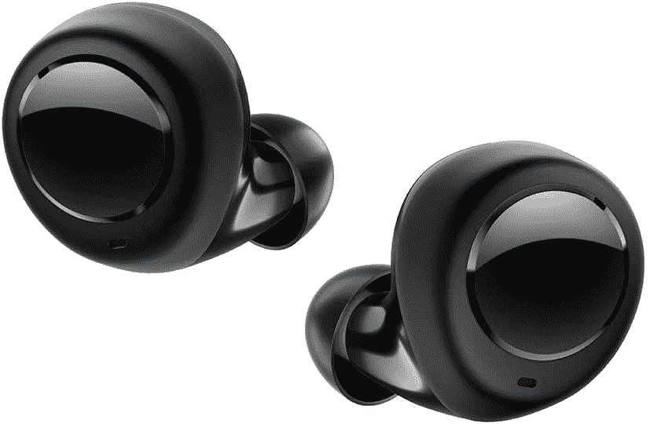
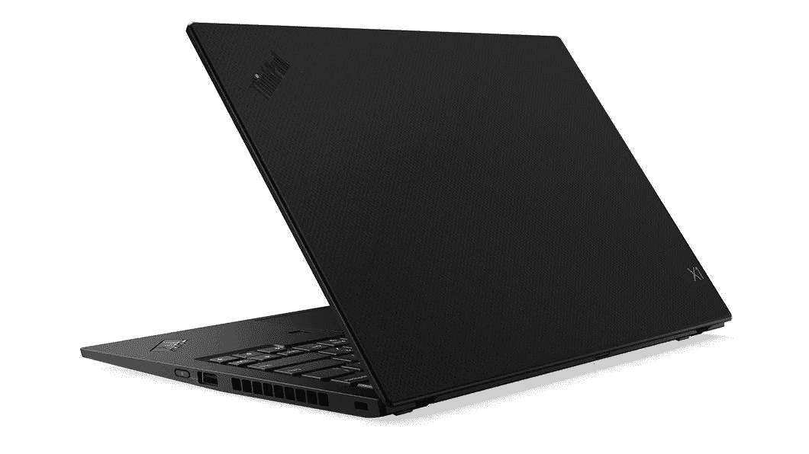
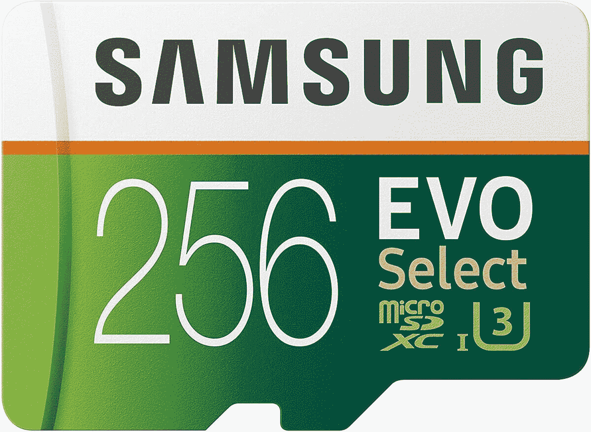

# 今天最热门的科技产品:ThinkPad X1 售价 874 美元，网络摄像头售价 21 美元，等等

> 原文：<https://www.xda-developers.com/top-5-deals-september-7/>

祝我们的美国读者劳动节快乐！你喜欢这个长周末吗？即使你在工作，像这样的假期你也可以指望一件事-一些很棒的交易！这包括 XDA 开发者仓库的[牛逼交易。不要错过这些，因为这些优惠价格只持续到一天结束。另外，【Spotify 正在测试的新功能](https://www.xda-developers.com/these-bestselling-deals-from-the-xda-shop-are-extra-discounted-for-labor-day/)看起来很棒。希望它们能很快推出。

今天的顶级技术交易包括联想 ThinkPad X1 Carbon Gen 7 的巨大折扣，21 美元 2K 网络摄像头等等！

顺便说一句，今天是[赛特笠的劳动节特卖](https://www.amazon.com/stores/node/2530353011?tag=xda-52alufa-20&ascsubtag=UUxdaUeUpU29739&asc_refurl=https%3A%2F%2Fwww.xda-developers.com%2Ftop-5-deals-september-7%2F&asc_campaign=Short-Term)的最后一天！请务必在结账时使用代码 **SATLDAY15** 为您的订单节省 15%的费用。

## 亚马逊 Echo Buds 售价 90 美元

如果你投资了亚马逊生态系统(也许即使你没有)，好消息是- [亚马逊的 Echo Buds 降价 40 美元](https://www.amazon.com/gp/product/B07F6VM1S3?tag=xda-52alufa-20&ascsubtag=UUxdaUeUpU29739&asc_refurl=https%3A%2F%2Fwww.xda-developers.com%2Ftop-5-deals-september-7%2F&asc_campaign=Short-Term)，从 130 美元降至 90 美元。这些 buds 的卖点是，你可以使用 Alexa 来控制它们，这给了你一个免提选项来控制音乐和其他功能。Echo Buds 没有最持久的电池，一次充电可以播放 5 个小时的音乐，但这取决于你来决定哪些功能值得拥有！

 <picture></picture> 

Echo Buds

##### 亚马逊回声芽

Echo Buds 为 Alexa 提供支持，并具有舒适的贴合性和防汗性，适合锻炼。减价 40 美元，这些是你一直在等的耳塞吗？

## 14 英寸联想 ThinkPad X1 Carbon Gen 7 售价 874 美元

联想指出，他们的 ThinkPad X1 是“为高性能而设计的”，我不认为他们在吹牛。 [ThinkPad X1 Carbon Gen 7](http://xda.tv/LenovoLaptopDeal) 的基本型号配备了 14 英寸显示器、8 GB 内存和 256 英寸固态硬盘。通过使用代码 **CLEAR8** ，你可以以 874 美元的价格买到这个型号，比笔记本电脑的建议零售价低了 755 美元。当然，如果你需要更多的功能，你可以在结账前升级你需要的笔记本电脑的部件——你仍然可以使用代码来保存。

 <picture></picture> 

ThinkPad X1 Carbon Gen 7 (14-inch)

##### 联想 ThinkPad X1 Carbon Gen 7

## Walfront 的 2K 网络摄像头售价 21 美元，代码即将到期

自隔离开始以来，网络摄像头的需求一直非常高，随着一些工作和学校要求在会议和课堂上使用网络摄像头，这种需求也在增加。如果你正在努力拥有一个质量不错、不会倾家荡产的网络摄像头， [Walfront 的 2K 网络摄像头](https://www.amazon.com/gp/product/B08CWWLMLV?tag=xda-52alufa-20&ascsubtag=UUxdaUeUpU29739&asc_refurl=https%3A%2F%2Fwww.xda-developers.com%2Ftop-5-deals-september-7%2F&asc_campaign=Short-Term)可能是答案。除了 2K 之外，网络摄像头还具有双麦克风，可以降低背景噪音和隐私保护罩。通过在页面上剪下优惠券，并在结账时输入代码 **X2RS8Z64** ，这个网络摄像头仅售 21 美元。它不是最高科技或最强大的网络摄像头，但它肯定可以用于缩放通话和谷歌视频聊天！

 <picture></picture> 

Walfront 2K Webcam

##### Walfront 2K 网络摄像头

它可能不是罗技，但 Walfront 的网络摄像头可以完成这项工作(我已经很久没有价格合理的罗技网络摄像头了)。剪下优惠券，在结账时使用代码 **X2RS8Z64** ，但是动作要快——代码马上就要过期了！

## 售价 65 美元的雷蛇北海巨妖游戏耳机

它非常非常环保，但也非常棒！在 Target，你可以以 65 美元的价格买到雷蛇北海巨妖游戏耳机，比 80 美元的建议零售价低 15 美元。麦克风内置了噪音消除技术，耳罩看起来既能提供出色的声音，又很舒适。由于设计原因，它们可能不是理想的“工作会议”耳机，但它们绝对会是出色的游戏设备！

 <picture></picture> 

Razer Kraken Gaming Headset

##### 雷蛇北海巨妖

凭借身临其境的音频和可以消除背景噪音的麦克风，Razer 北海巨妖耳机是一项不错的投资。只希望你喜欢绿色！

## 三星 EVO Select 256GB microSD，优惠 18 美元

如果你需要一点额外的空间来放你的智能手机或任天堂 Switch，但并不真的需要 1TB 的空间，那么[三星 EVO Select 256GB](https://www.amazon.com/gp/product/B0887P21Z2?tag=xda-52alufa-20&ascsubtag=UUxdaUeUpU29739&asc_refurl=https%3A%2F%2Fwww.xda-developers.com%2Ftop-5-deals-september-7%2F&asc_campaign=Short-Term) 可能更适合你。现在，它在亚马逊上便宜 18 美元，所以你只需花 32 美元就能买到 microSD。当然，三星是一个值得信赖的品牌，所以你不需要担心质量问题。

 <picture></picture> 

Samsung EVO Select 256GB microSDXC

##### 三星 EVO Select microSD

需要空间，但不是*那么多*空间？这款三星 EVO Select 256GB microSD 售价 32 美元。它 100MB/s 的读取速度和 90MB/s 的写入速度不会让你失望！

## 更多技术交易

寻找更多的技术交易？下面我们为你准备了！SanDisk 1TB MicroSD 的价格上涨了 25 美元，但仍然低了 190 美元，所以购买还是值得的。另一方面，[戴尔曲面显示器](http://xda.tv/DellS3221QS4KmonitorDeal)下降了约 5 美元。如果你等到现在才拿起它，现在你可以用额外的储蓄犒劳自己一杯咖啡！